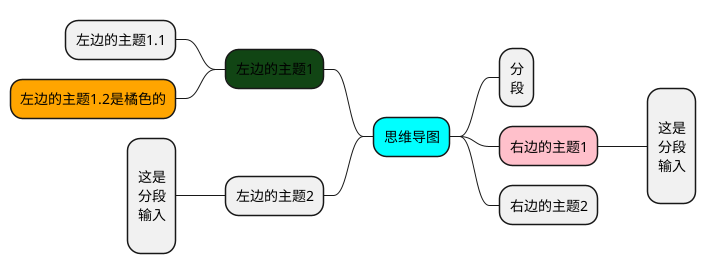
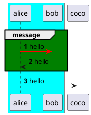
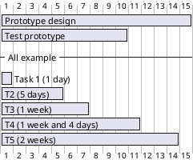
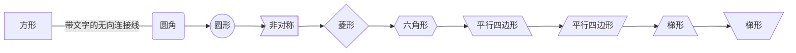
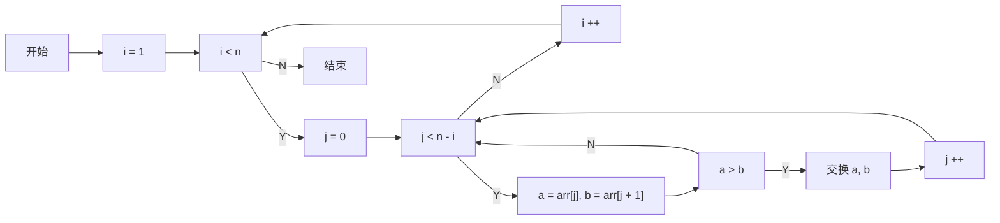
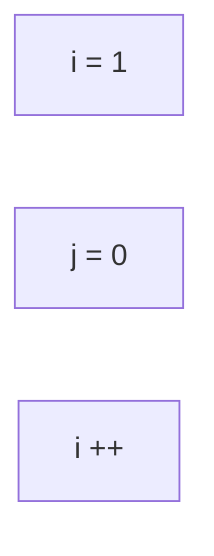
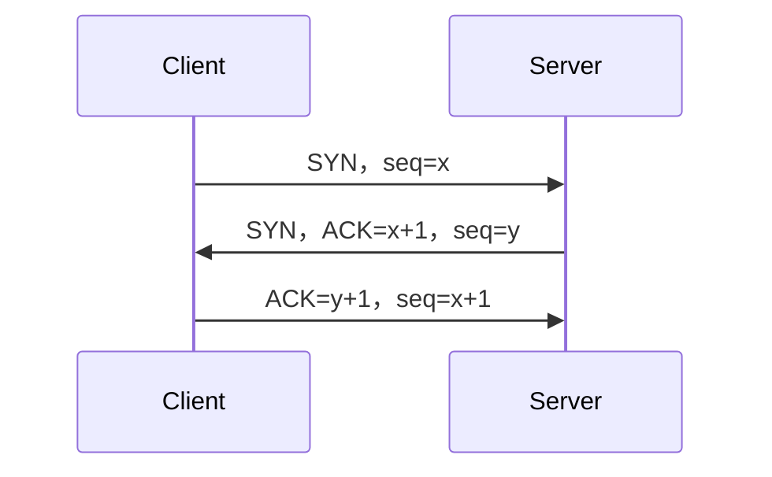

# PlantUML
注意:在vscode中安装plantuml插件后，编辑plantuml时会提示有问题，这可能是插件问题导致的，实际预览是正常的，github不支持plantuml图预览
## 思维导图
表达发散性思维的有效图形思维工具

## 时序图
时序图，又名序列图、循序图，是一种UML交互图。它通过描述对象之间发送消息的时间顺序显示多个对象之间的动态协作。它可以表示用例的行为顺序，当执行一个用例行为时，其中的每条消息对应一个类操作或状态机中引起转换的触发事件。

## 甘特图
甘特图又称为横道图、条状图(Bar chart)。其通过条状图来显示项目、进度和其他时间相关的系统进展的内在关系随着时间进展的情况。

# mermaid
## 流程图
​所有流程图都由节点、几何形状和边、箭头或线组成。mermaid代码定义了这些节点和边的制作和交互方式。它还支持不同类型的箭头、多方向箭头以及与子图的链接。

## 时序图
