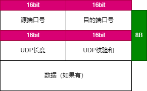
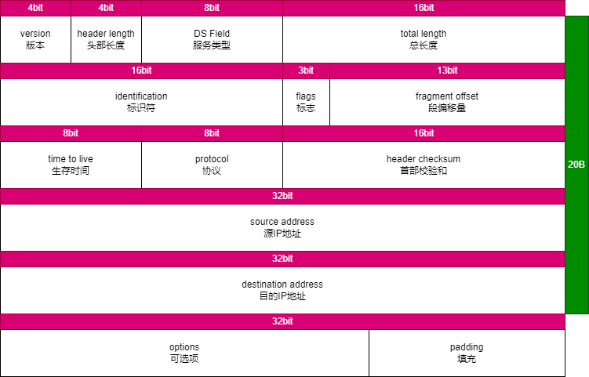

# 数据通信网络基础

## 通信与网络

### 网络通信基本概念

**通信**：人与人、人与物、物与物之间通过某种媒介和行为进行的信息传递与交流

**网络通信**：终端设备之间通过计算机网络进行的通信

**信息传递过程**：虚拟的信息传递与真实的物品传递过程有许多相似之处

**常见术语**：

* 数据载荷

* 报文
 
* 头部
 
* 尾部
 
* 封装：对数据加上头尾部，形成新的报文的过程
 
* 解封装：去掉报文的头尾部，获取数据的过程
 
* 网关：提供协议转换、路由选择、数据交换等功能的网络设备
 
* 路由器：为报文选择传递路径的网络设备

* 终端设备
 
* PDU：协议数据单元

### 数据通信基本概念

数据通信网络：由路由器、交换机、防火墙、无线控制器、无线接入点，以及个人电脑、网络打印机、服务器等设备构成的通信网络

功能：数据通信网络最基本的功能是实现数据互通

**网络设备**：

1. 交换机：距离终端用户最近的设备，用于终端用户介入网络，对数据帧进行交换等，有二层和三层交换机

2. 路由器：网络层设备，可以在因特网中进行数据报文转发。路由器根据所收到的报文的目的地之选择一条合适的路径，将报文传送到下一个路由器或目的地，路径中最后的路由器负责将报文送交目的主机

* 实现同类型网络或异种类型网络之间的通信
* 隔离广播域

* 维护路由表、运行路由协议

* 路径（路由信息）选择、IP报文转发

* 广域网介入、网络地址转换
* 连接通过交换机组成的二层网络
3. 防火墙：网络安全设备，用于控制两个网络之间的安全通信。它通过监测、限制、更改跨越防火墙的数据流，尽可能地对外部屏蔽网络内部的信息、结构和运行状况，以此来实现对网络的安全保护

* 隔离不同安全级别的网络 
* 实现不同安全级别网络间的访问控制（安全策略） 
* 用户身份认证 
* 实现远程接入功能 
* 实现数据加密以及虚拟专用网业务 
* 执行网络地址转换 
* 其他安全功能

4. 无线设备：无线胖AP、无线瘦AP、AC

## 网络类型与网络拓扑

### 网络类型

根据地理覆盖范围划分：局域网（LAN）、城域网（MAN）、广域网（WAN）

### 网络拓扑

概念：用传输介质（例如双绞线、光纤等）互联各种设备所呈现的结构化布局，用于描述网络的逻辑结构

形态：星型、总线型、环形、树形、全网状网络和部分网状网络

## 网络工程与网络工程师

网络工程：在信息系统工程方法和完善的组织机构指导下，根据网络应用的需求，按照计算机网络系统的标准、规范和技术，规划设计可行性方案，将计算机网络硬件设备、软件和技术系统地集成在一起，以成为满足用户需求、高性价比的网络系统的组建工作

网络工程师：在网络工程领域，掌握专业的网络技术，具备一定的职业技能及职业素养，具有一定项目实施经验，能够在项目现场与客户或者其他项目干系人充分沟通，根据客户的需求及环境因素指定实施方案及项目计划，并充分调动各方资源保证项目按时、保质保量落地，以及在项目实施后对干系人进行培训及工程文档交付的职业

# 网络参考模型

## 应用和数据

### 应用和数据的定义背景

应用：应用的存在，是为了满足人们的各种需求，比如访问网页，在线游戏，在线视频等。伴随着应用会产生信息，比如文本、图片

数据：在计算机领域，数据是各种信息的载体。大部分应用程序所产生的数据需要在不同的设备间传递

## 网络参考模型与标准协议

### OSI参考模型

应用层：对应用程序提供接口

表示层：进行数据格式的转换，以确保一个系统产生的应用层数据能够被另外一个系统的应用层识别和理解

会话层：在通信双方之间简历、管理和终止会话

传输层：建立、维护和取消一次段导弹的数据传输过程。控制传输节奏的快慢，调整数据的排序等

网络层：定义逻辑地址，实现数据从原到目的地址的转发

数据链路层：将分组数据封装成帧，在数据链路上实现数据的点到点、或点到多点方式的直接通信，差错检测

物理层：在媒介上传输比特流，提供机械和电气的规约

### TCP/IP参考模型与标准协议

因为OSI协议栈比较复杂，且tcp和ip两大协议在业界被广泛使用，所以TCP/IP参考模型成为了互联网的主流参考模型

TCP/IP常见协议：

1. 应用层：
* Telnet(23 TCP)：远程登录协议，提供远程管理服务
* FTP(20（传输数据），21（传输控制信息） TCP)：文件传输协议，提供互联网文件资源共享服务，采用C/S架构
* TFTP(69 TCP)：文件传输协议，提供简单的文件传输服务
* SNMP
* HTTP(80 TCP)：超文本传输协议，提供浏览网页服务，采用C/S架构 
* SMTP(25 TCP)：简单右键传输协议，提供互联网电子邮件服务
* DNS
* DHCP

2. 传输层：
* 传输层协议接收来自应用层协议的数据，封装相应的传输层头部，帮助其建立端到端的连接。传输层的PDU被称为段
* 传输层的PDU是由应用层数据加伤源端口和目的端口得来的
* TCP：面向连接的、可靠的传输层通信协议
* UDP：无连接的传输层协议
* 客户端使用的源端口一般随机分配，目标端口则由服务器的应用指定
* 源端口号一般为系统中未使用的，且大于1023
* 目的端口号为服务端开启的应用（服务）所侦听的端口，如HTTP缺省的端口为80

3. 网络层：ICMP，IGMP，IP
* 传输层负责简历主机之间进程与进程之间的连接，而网络层则负责数据从一台主机到另外一台主机之间的传递。网络层的PDU被称为包
* 网络层为网络中的设备提供逻辑地址，负责数据包的寻径和转发，常见的协议有IPv4、IPv6、ICMP、ICMP等
* 网络层需要维护路由信息，称为路由表
* 此层最重要的字段是源IP及目的IP

4. 数据链路层：PPPoE，Ethernet，PPP
* 位于网络层与物理层之间，可以向网络层的IP、IPv6等协议提供服务。数据链路层的PDU被称为帧，以太网是最常见的数据链路层协议
* ARP：地址解析协议，根据已知的IP地址解析获得其对应的MAC地址* 
* 此层要加上帧校验（FSC）

5. 物理层
* 数据到达物理层后，物理层会根据物理介质的不同，将数字信号转换成光信号、电信号或电磁波信号。物理层的PDU被称为比特流
* 常见传输介质：双绞线、光纤、串口线缆、无线路由器
* 此层传输比特流

## 数据通信过程

1. 发送方数据封装：数据，段，包，帧，位

2. 中间网络数据传输

3. 接收方数据解封装：位，帧，包，段，数据
# 网络常用协议

## 传输层

### TCP协议

<div align="center">


</div>

**字段解释**：
源/目的端口号：表示数据从哪个进程来，到哪个进程去

序号：TCP将每个字节的数据都进行了编号称为序列号，接收端收到数据之后要发送确认序号给发送端。序号用于对字节流进行编址，例如序号是301，表示第一个字节的编号为301，携带的数据长度是100，下一个报文的编号就是401

确认序号：期望收到的下一个报文段的序号，B收到A发来的一个报文段，序号是301，携带的数据长度是300，那么B发送给A的确认序号就是601

4位头部长度：表示TCP头部有多少个4字节，所以TCP头部最大长度为15*4=60字节

6个标志位：

* URG：紧急指针是否有效
* ACK：确认号是否有效
* PSH：提示接收端应用程序立刻从缓冲区读走- 
* RST：要求对方重新建立连接，携带RST的标识的报文称为复位报文段
* SYN：请求建立连接，携带SYN标识的报文称为同步报文段
* FIN：结束标识，告诉对端本端关闭。

16位窗口大小：无需等待确认应答而可以继续发送数据的最大值

16位校验和：发送端填充，CRC校验，接收端校验不通过，认为数据有问题。校验和包含TCP首部和TCP数据部分。

16位紧急指针：标识那部分数据是紧急数据

**三次握手**：

TCP/IP三次握手是建立TCP连接时所必需的过程。三次握手的目的是确保双方的通信连接是可靠的，以提高数据传输的可靠性。以下是TCP/IP三次握手的过程：

* 客户端向服务端发送SYN请求报文，其中SYN标志位被设为1，客户端进入SYN_SEND状态。

* 服务端收到SYN请求报文后，如果同意请求，则会向客户端发送一个带有SYN和ACK标识位的应答报文(确认号为客户端的序列号+1)，服务端进入SYN_RECV状态。

* 客户端收到带有SYN和ACK标识位的应答报文后，会向服务端发送一个确认报文，其中确认序号为服务端的序列号+1。客户端进入ESTABLISHED状态，服务端也进入ESTABLISHED状态，此时，连接建立成功，可以开始数据传输。
  


**四次挥手**：

* 主动关闭方发送FIN报文段：表示主动关闭方已经没有数据要发送给被关闭方了。
* 被动关闭方收到FIN报文段并发回ACK报文段：表示被动关闭方已经知主动关闭方没有要发送的数据了，并且可以关闭连接了。
* 被动关闭方也发送FIN报文段：表示被动关闭方也没有数据要发送给主关闭方了。
* 主动关闭方收到FIN报文段并发回ACK报文段：表示主动关闭方也知道动关闭方没有要发送的数据了，连接可以关闭了。


**窗口滑动机制**：

TCP的窗口滑动是指传输数据时，发送方和接收方维护一个滑动窗口来控制数据流量的传输。发送方在传送数据时，必须等待接收方对已发送数据的确认，才能继续发送数据。接收方在接收到数据时，必须向发送方发送确认，表示已经正确接收了相应的数据。以下是TCP窗口滑动的过程：

* 发送方首先会发送一段数据，并将发送的数据等待接收方的确认。在等待确认期间，发送方维护一个发送窗口，以决定可以发送多少数据。一旦发送数据并等待确认，该数据就会成为发送方滑动窗口中的一部分。

* 接收方在接收数据时，维护一个接收窗口，并发送确认消息。接收方的窗口大小是指接收方为等待确认的数据所分配的缓冲区的大小。当接收方向发送方发送确认时，确认号包含了对已成功接收数据的序列号。

* 发送方在收到接收方的确认后，会将已成功接收的数据从滑动窗口中删除，并根据接收方的窗口大小，更新自己的窗口大小。随着时间的推移，发送方的窗口可能会向前滑动，以允许发送更多数据。


**流量控制机制**:

TCP/IP的流量控制是通过滑动窗口来实现的，滑动窗口指的是接收方在通信时告诉发送方自己还能接收多少字节的数据的一个窗口大小。发送方需要根据接收方的窗口大小来控制发送的速度，这样即可实现流量控制。

当接收方窗口变小时，发送方需要立刻减少发送的数据量，以便避免拥塞导致的数据包丢失。因此TCP使用连续的序列号来标识接收方所期望的顺序，如果发送方的数据超出接收方的窗口，则会被丢弃。


### UDP协议

<div align="center">



</div>

## 网络层

### ARP协议

是网络层协议，工作基于数据链路层

<div align="center">


</div>

**字段解释**：

* 以太网目的地址（6Byte）：当发送 ARP 请求时此处全为1(FF: FF: FF: FF: FF: FF)，即为广播地址。当发送 ARP 响应时，此处即为目的端 MAC地址。-
* 以太网源地址（6Byte）：发送 ARP 请求的 MAC 地址，为本机 MAC 地址。
* 帧类型（2Byte）：表示的是后面的数据类型，ARP 请求和 ARP 应答这个值为 0x0806 。
* 硬件类型（2Byte）：硬件地址不只以太网一种，是以太网类型时此值为1。 
* 协议类型（2Byte）：要映射的协议地址的类型，要对IPv4地址进行映射，此值为0x0800。
* 硬件地址长度（1Byte）：即为 MAC 地址长度 6 Byte。
* 协议地址长度（1Byte）：即为 IP 地址长度 4 Byte。
* 操作（2Byte）：值为1，表示进行ARP请求；值为2，表示进行ARP应答；值为3，表示进行RARP请求；值为4，表示进行RARP应答。
* 发送者硬件地址（6Byte）：这是本机的 MAC 地址，与第二个字段相同。
* 发送者 IP 地址（4Byte）：这是本机的 IP 地址。
* 目标硬件地址（6Byte）：在发送 ARP 请求时，还不知道目的端的 MAC 地址，所以此处全为 0 ( 00:00:00:00:00:00 )。当发送 ARP 请求报文是，此处即为目的端 MAC 地址。
* 目标 IP 地址（4Byte）：目标端 IP 地址。

### ICMP协议

常用于测试网络连通性的协议，常用命令有： `ping` ， `tracert`

### IP协议

<div align="center">



</div>

**字段解释**:

* 版本（Version）：这个字段指定了使用的IP协议版本，通常是IPv4或IPv6。

* 头部长度（Header Length）：这个字段指定了IP头部的长度。IP头部通常是20个字节，但是如果选项字段被用到了，那么头部长度可以会更大。这个字节只有4bit，实际应用中，为了使其能表示20-60这个范围，约定俗成需要将其值乘以4

* 服务类型（Type of Service）：这个字段可以用来指定IP包的服务类型。这个字段包括了对不同数据流的不同服务质量的定义，如低延迟、高带宽和可靠传输等等。

* 总长度（Total Length）：这个字段指定了IP包的总长度，当IP层的数据包太大时，可能需要进行分片操作。

* 标识（Identification）：这个字段唯一标识IP包并用于将分片的数据包重新组合。

* 标志（Flags）：这个字段被用来标识分片。一个标志位用于表示是否还有更多的分片存在，另一个标志位用于表示当前分片是不是第一个分片。

* 片偏移（Fragment Offset）：这个字段指定了当前IP分片相对于整个数据包的偏移量。

* 生存时间（Time to Live）：这个字段指定了IP包在到达目标之前可以转发的最大路由数，每经过一个路由器，此值会减少一。

* 协议（Protocol）：这个字段指定了IP包所使用的传输层协议，如TCP、UDP和ICMP等等。

* 头部校验和（Header Checksum）：这个字段是一个用于检测IP数据包头部有没有变动的校验和，如果有变动则需要舍弃这个IP包。

* 源地址（Source Address）：这个字段指定了发送IP包的原始IP地址。

* 目的地址（Destination Address）：这个字段指定了接收IP包的IP地址。

**IP地址**：
* 一个ipv4地址由32bit
* 通常使用点分十进制表示
* 地址范围0.0.0.0-255.255.255.255
* 分为**网络位**（标识一个网络）和**主机位**（标识主机）
* 分类：A类（第一位必须为0,掩码为8），B类（前两位必须为10，掩码为16），C类（前三位必须为110，掩码为24），D类（前四位必须为1110），E类（前5位必须为1111）。ABC类用于主机使用，D类用于组播，E类用于研究
* 主机位全为0，称为网络地址，主机位全为1，称为广播地址，剩下的是主机可用的ip地址，所以，一个网段内可用的ip地址数量为$2^n-2$
* 私网ip：ABC三类地址中各预留了一些地址用于私网
  * A类：10.0.0.0-10.255.255.255
  * B类：172.16.0.0-172.31.255.255
  * C类：192.168.0.0-192.168.255.255
* 划分子网：规划地址使用，起到节约网络地址的作用，使用可变长子网掩码（VLSM）
* 配置接口的ip：`ip address g0/0/0 1.1.1.1 24`
* 配置回环接口的ip：

```
//回环口是路由器或交换机上的虚拟接口，类似PC上的127.0.0.1
interface  loopback 0   //定义回环口
ip address 1.1.1.2 32   //回环口的掩码必须为32
```

# ip路由基础
## 路由概述
### 背景
ip地址唯一标识了网络中的一个节点，每个IP地址都拥有自己的网段，各个网段可能分布在网络的不同区域

为实现ip寻址，分布在不同区域的网络之间要能互相通信
### 什么是路由
路由是知道报文转发的路径信息，通过路由可以确认转发ip报文的路径

路由器设备是依据路由转发报文到目的网段的网络设备，最常见的路由设备是路由器

路由器维护者一张路由表，保存路由信息
### 路由信息介绍
* 目的网络/掩码
  * 目的网络：标识目的网段
  * 掩码：与目的地址共同标识一个网段
* 出接口：数据包转发时的路由器接口
* 下一跳：数据包接收时的路由器接口地址或主机地址
### 路由表
* 路由器通过各种方式发现路由
* 路由器选择最优的路由条目放入路由表中
* 路由表指导设备对ip报文的转发
* 路由器通过对路由表的管理实现对路径信息的管理

目的网络/掩码|下一跳|出接口
:-----:|:-----:|:-----:
11.0.0.0/8|2.2.2.2|g0/0/0


### 路由信息的获取方式
1. 直连路由：由设备自动生成，指向本地直连网络

* 直连路由指向本地直联网络的路由，由设备自动生成
* 当路由器为路由转发的最后一跳路由器时，ip报文匹配直连路由，路由器转发ip报文到目的主机
* 使用直连路由进行路由转发时，报文的目的ip和路由器接口欧在同一个网段之下
* 并不是所有接口生成的直连路由都会出现在路由表中，直连路由出现在路由表中的前提是该接口的物理转台、协议状态都为UP
2. 静态路由：由网络管理员手工配置的路由条目
3. 动态路由：路由器运行动态路由协议学习到的路由
### 如何选择最优路由
1. 查看ip路由表的命令：`display ip routing-table`
2. 各个字段的含义

* Destination/Mask：表示此路由的目的网络地址与网络掩码。将目的地址和子网掩码“逻辑与”后可得到目的主机或路由器所在网段的地址。例如：目的地址为 1.1.1.1，掩码为255.255.255.0 的主机或路由器所在网段的地址为 1.1.1.0。

* Proto（Protocol）：该路由的协议类型，也即路由器是通过什么协议获知该路由的。
* Pre（Preference）：表示此路由的路由协议优先级。针对同一目的地，可能存在不同下一跳、出接口等多条路由，这些不同的路由可能是由不同的路由协议发现的，也可以是手工配置的静态路由。优先级最高（数值最小）者将成为当前的最优路由。 
* Cost：路由开销。当到达同一目的地的多条路由具有相同的路由优先级时，路由开销最小的将成为当前的最优路由。
* NextHop：表示对于本路由器而言，到达该路由指向的目的网络的下一跳地址。该字段指明了数据转发的下一个设备。
* Interface：表示此路由的出接口。指明数据将从本路由器的哪个接口转发出去

3. 路由优先级

当路由器从多种不同的途径获知到达同一个目的网段的路由（这些路由的目的网络地址及网络掩码均相同）时，路由器会比较这些路由的优先级，优选优先级值最小的路由。

路由来源的优先级值（Preference）越小代表加入路由表的优先级越高。

拥有最高优先级的路由将被添加进路由表。

常见路由协议的默认优先级：

路由来源|路由内容|默认优先级
:-----:|:-----:|:-----:
直连|直连路由|0
静态|静态路由|60
动态路由|OSPF内部|10
动态路由|OSPF外部|150
1. 路由度量值

当路由器通过某种路由协议发现了多条到达同一个目的网络的路由时（拥有相同的路由优先级），度量值将作为路由优选的依据之一。路由度量值表示到达这条路由所指目的地址的代价

一些常用的度量值有：跳数、带宽、时延、代价、负载、可靠性等

度量值数值越小越优先，度量值最小路由将会被添加到路由表中

度量值很多时候被称为开销（Cost）

### 路由转发方式

最长匹配原则：当路由器收到一个 IP 数据包时，会将数据包的目的 IP 地址与自己本地路由表中的所有路由表项进行逐位（Bit-By-Bit）比对，直到找到匹配度最长的条目，这就是最长前缀匹配机制
## 静态路由
### 静态路由的应用场景
静态路由由网络管理员手动配置，配置方便，对系统要求低，适用于拓扑结构简单并且稳定的小型网络。

缺点是不能自动适应网络拓扑的变化，需要人工干预

配置方式：
```
//关联下一跳ip的方式
ip route-static ip-address mask nexthop-address

//关联出接口的方式
ip route-static ip-address mask interface-type interface-number

//关联出接口和下一跳的方式
ip route-static ip-address mask interface-type interface-number [nexthop-address]

在创建静态路由时，可以同时指定出接口和下一跳。对于不同的出接口类型，也可以只指定出接口或只指定下一跳。
对于点到点接口（如串口），必须指定出接口。
对于广播接口（如以太网接口）和 VT（Virtual-template）接口，必须指定下一跳

//创建静态路由时可以手动设置优先级
ip route-static ip-address mask nexthop-address preference xx
```
### 缺省路由

缺省路由是一种特殊的路由，当报文没有在路由表中找到匹配的具体路由表项时才使用的路由。如果报文的目的地址不能与路由表的任何目的地址相匹配，那么该报文将选取缺省路由进行转发

缺省路由在路由表中的形式为 0.0.0.0/0，缺省路由也被叫做默认路由

缺省路由应用场景：缺省路由一般用于企业网络出口，配置一条缺省路由让出口设备能够转发前往 Internet 上任意地址的 IP 报文
## 动态路由
静态路由的缺点是不能自动适应网络拓扑的变化，需要人工干预。

动态路由协议有自己的路由算法，能够自动适应网络拓扑的变化，适用于具有一定数量三层设备的网络。
### 动态路由协议分类
1. 根据路由信息传递的内容、计算路由的算法，可以将动态路由协议分为两大类
* 距离矢量协议（Distance-Vector Protocol）：RIP
* 链路状态协议（Link-State Protocol）：OSPF、IS-IS、BGP 使用一种基于距离矢量算法修改后的算法，该算法被称为路径矢量（Path Vector）算法。因此在某些场合下，BGP 也被称为路径矢量路由协议。

2. 根据工作范围不同，又可以分为
* 内部网关协议 IGP（Interior Gateway Protocol）:在一个自治系统内部运行。RIP、OSPF、ISIS 为常见的 IGP 协议。
* 外部网关协议 EGP（Exterior Gateway Protocol）：运行于不同自治系统之间。BGP 是目前最常用的 EGP 协议。

## 路由高级特性
### 路由递归
路由必须有直连的下一跳才能够指导转发，但是路由生成时下一跳可能不是直连的，因此需要计算出一个直连的下一跳和对应的出接口，这个过程就叫做路由递归。路由递归也被称为路由迭代。
### 等价路由
路由表中存在等价路由之后，前往该目的网段的 IP 报文路由器会通过所有有效的接口、下一跳转发，这种转发行为被称为负载分担

等价路由的来源相同、开销相同
### 浮动路由
静态路由支持配置时手动指定优先级，可以通过配置目的地址/掩码相同、优先级不同、下一跳不同的静态路由，实现转发路径的备份

浮动路由是主用路由的备份，保证链路故障时提供备份路由。主用路由下一跳可达时该备份路由不会出现在路由表

浮动路由的配置：
```
//手动配置路由优先级
ip route-static ip-address mask nexthop-address preference priority-number
```
### CIDR
CIDR（classless inter-domain routing，无类别域间路由）采用 IP 地址加掩码长度来标识网络和子网，而不是按照传统 A、B、C 等类型对网络地址进行划分。

CIDR 容许任意长度的掩码长度，将 IP 地址看成连续的地址空间，可以使用任意长度的前缀分配，多个连续的前缀可以聚合成一个网络，该特性可以有效减少路由表条目数量。
### 路由汇总
需求：
* 对于一个大规模的网络来说，路由器或其他具备路由功能的设备势必需要维护大量的路由表项，为了维护臃肿的路由表，这些设备就不得不耗费大量的资源。同时，由于路由表的规模变大，会导致路由器在查表转发时效率降低。因此在保证网络中的路由器到各网段都具备 IP 可达性的同时，需要减小设备的路由表规模。一个网络如果具备科学的 IP 编址，并且进行合理的规划，是可以利用多种手段减小设备路由表规模的。一个非常常见而又有效的办法就是使用路由汇总（Route Summarization）。路由汇总又被称为路由聚合（Route Aggregation），是将一组有规律的路由汇聚成一条路由，从而达到减小路由表规模以及优化设备资源利用率的目的，我们把汇聚之前的这组路由称为精细路由或明细路由，把汇聚之后的这条路由称为汇总路由或聚合路由。
  
简介
* 路由汇总将一组具有相同前缀的路由汇聚成一条路由，从而达到减小路由表规模以及优化设备资源利用率的目的。路由汇总采用了 CIDR 的思想：将相同前缀的地址聚合成一个。我们把汇聚之前的这组路由称为精细路由或明细路由，把汇聚之后的这条路由称为汇总路由或聚合路由。
  
计算
* 基于一系列连续的、有规律的 IP 网段，如果需计算相应的汇总路由，且确保得出的汇总路由刚好“囊括”上述 IP 网段，则需保证汇总路由的掩码长度尽可能长。诀窍在于：将明细路由的目的网络地址都换算成二进制，然后排列起来，找出所有目的网络地址中“相同的比特位”。

问题
* 一般来说一条路由，无论是静态的或者是动态的，都需要关联到一个出接口，路由的出接口指的是设备要到达一个目的网络时的出站接口。路由的出接口可以是该设备的物理接口，例如百兆、千兆以太网接口，也可以是逻辑接口，例如 VLAN 接口（VLAN Interface），或者隧道（Tunnel）接口等。在众多类型的出接口中，有一种接口非常特殊，那就是 Null（无效）接口，这种类型的接口只有一个编号，也就是 0。Null0 是一个系统保留的逻辑接口，当网络设备在转发某些数据包时，如果使用出接口为 Null0 的路由，那么这些报文将被直接丢弃，就像被扔进了一个黑洞里，因此出接口为 Null0 的路由又被称为黑洞路由。配置方法是：`ip route-static ip-address mask Null0`
## OSPF协议
### 概述

由于静态路由由网络管理员手工配置，因此当网络发生变化时，静态路由需要手动调整，这制约了静态路由在现网大规模的应用

静态路由是由工程师手动配置和维护的路由条目，命令行简单明确，适用于小型或稳定的网络。

静态路由有以下问题：
* 无法适应规模较大的网络：随着设备数量增加，配置量急剧增加
* 无法动态响应网络变化：网络发生变化，无法自动收敛网络，需要工程师手动修改

动态路由协议因其灵活性高、可靠性好、易于扩展等特点被广泛应用于现网。在动态路由协议之中，OSPF（Open Shortest Path First，开放式最短路径优先）协议是使用场景非常广泛的动态路由协议之一
###  动态路由协议的分类

1. 根据路由信息传递的内容、计算路由的算法，可以将动态路由协议分为两大类
* 距离矢量协议（Distance-Vector Protocol）：RIP
* 链路状态协议（Link-State Protocol）：OSPF、IS-IS、BGP 使用一种基于距离矢量算法修改后的算法，该算法被称为路径矢量（Path Vector）算法。因此在某些场合下，BGP 也被称为路径矢量路由协议。

2. 根据工作范围不同，又可以分为
* 内部网关协议 IGP（Interior Gateway Protocol）:在一个自治系统内部运行。RIP、OSPF、ISIS 为常见的 IGP 协议。
* 外部网关协议 EGP（Exterior Gateway Protocol）：运行于不同自治系统之间。BGP 是目前最常用的 EGP 协议。

### 距离矢量路由协议

运行距离矢量路由协议的路由器周期性的泛洪自己的路由表。通过路由的交互，每台路由器都从相邻的路由器学习到路由，并且加载进自己的路由表中。

对于网络中的所有路由器而言，路由器并不清楚网络的拓扑，只是简单的知道要去往某个目的方向在哪里，距离有多远。这即是距离矢量算法的本质。
### 链路状态路由协议 - LSA 泛洪

与距离矢量路由协议不同，链路状态路由协议通告的的是链路状态而不是路由表。运行链路状态路由协议的路由器之间首先会建立一个协议的邻居关系，然后彼此之间开始交互

LSA（Link State Advertisement，链路状态通告）。

链路状态通告，可以简单的理解为每台路由器都产生一个描述自己直连接口状态（包括接口的开销、与邻居路由器之间的关系等）的通告。
### 链路状态路由协议 - LSDB 组建

每台路由器都会产生 LSAs，路由器将接收到的 LSAs 放入自己的 LSDB（Link State DataBase，链路状态数据库）。路由器通过 LSDB，掌握了全网的拓扑。
### 链路状态路由协议 - SPF 计算

每台路由器基于 LSDB，使用 SPF（Shortest Path First，最短路径优先）算法进行计算。每台路由器都计算出一棵以自己为根的、无环的、拥有最短路径的“树”。有了这棵“树”，路由器就已经知道了到达网络各个角落的优选路径。

SPF 是 OSPF 路由协议的一个核心算法，用来在一个复杂的网络中做出路由优选的决策。
### 链路状态路由协议 - 路由表生成

最后，路由器将计算出来的优选路径，加载进自己的路由表（Routing Table）
###  OSPF 简介
* OSPF 是典型的链路状态路由协议，是目前业内使用非常广泛的 IGP 协议之一。
* 目前针对 IPv4 协议使用的是 OSPF Version 2（RFC2328）；针对 IPv6 协议使用 OSPF Version 3（RFC2740）。如无特殊说明本章后续所指的 OSPF 均为 OSPF Version 2。
* 运行 OSPF 路由器之间交互的是 LS（Link State，链路状态）信息，而不是直接交互路由。LS 信息是 OSPF 能够正常进行拓扑及路由计算的关键信息。
* OSPF 路由器将网络中的 LS 信息收集起来，存储在 LSDB 中。路由器都清楚区域内的网络拓扑结构，这有助于路由器计算无环路径。
* 每台 OSPF 路由器都采用 SPF 算法计算达到目的地的最短路径。路由器依据这些路径形成路由加载到路由表中。
* OSPF 支持 VLSM（Variable Length Subnet Mask，可变长子网掩码），支持手工路由汇总。
* 多区域的设计使得 OSPF 能够支持更大规模的网络。

### OSPF基础术语
1. 区域：
* OSPF Area 用于标识一个 OSPF 的区域。
* 区域是从逻辑上将设备划分为不同的组，每个组用区域号（Area ID）来标识。
* area0称为骨干区域

2. Router-ID：
* Router-ID（Router Identifier，路由器标识符），用于在一个 OSPF 域中唯一地标识一台路由器。
* Router-ID 的设定可以通过手工配置的方式，或使用系统自动配置的方式。
* 在实际项目中，通常会通过手工配置方式为设备指定 OSPF Router-ID。请注意必须保证在OSPF 域中任意两台设备的 Router-ID 都不相同。通常的做法是将 Router-ID 配置为与该设备某个接口（通常为 Loopback 接口）的 IP 地址一致。
* 自动配置的优先级：如果有loopback，就是用loopback地址，如果没有，就选择路由器接口ip地址最大的接口地址为RID，这个选择是非抢占式的，这意味着需要重启进程才能改变RID
* 手动配置的优先级大于自动配置，进程下配置的RID优先级大于全局配置的RID，这种方式也是非抢占式的
3. 度量值

* OSPF 使用 Cost（开销）作为路由的度量值。每一个激活了 OSPF 的接口都会维护一个接口Cost 值，缺省时$$接口 Cost 值=100 Mbps/接口带宽$$ 其中 100 Mbit/s 为 OSPF 指定的缺省参考值，该值是可配置的。
* 笼统地说，一条 OSPF 路由的 Cost 值可以理解为是从目的网段到本路由器沿途所有入接口的Cost 值累加

### OSPF 协议报文类型
OSPF 有五种类型的协议报文。这些报文在 OSPF 路由器之间交互中起不同的作用
1. Hello：周期性发送，从来发现和卫华OSPF邻居关系
2. Database Description：描述本地LSDB的摘要信息，用于两台设备进行数据库同步
3. Link State Request：用于向对方请求所需要的LSA。设备只有在OSPF邻居双方成功交换DD报文后才会向对方发出LSR报文
4. Link State Update：用于向对方发送其所需要的LSA
5. Link State ACK：用来对收到的LSA进行确认

### OSPF 三大表项
1. 邻居表
* OSPF 在传递链路状态信息之前，需先建立 OSPF 邻居关系。
* OSPF 的邻居关系通过交互 Hello 报文建立。
* OSPF 邻居表显示了 OSPF 路由器之间的邻居状态，使用 `display ospf peer` 查看。
* OSPF 邻居表有很多关键信息，例如可以查看对端设备的 Router ID 和接口地址
2. LSDB 表
* LSDB 会保存自己产生的及从邻居收到的 LSA 信息，本例中 R1 的 LSDB 包含了三条 LSA。
* Type 标识 LSA 的类型，AdvRouter 标识发送 LSA 的路由器。
* 使用命令行 `display ospf lsdb` 查看 LSDB 表。
3. OSPF 路由表
* OSPF 路由表和路由器路由表是两张不同的表项。
* OSPF 路由表包含 Destination、Cost 和 NextHop 等指导转发的信息。
* 使用命令 display ospf routing 查看 OSPF 路由表。
### OSPF 协议工作原理
* 关于 OSPF 路由器之间的关系有两个重要的概念，邻居关系和邻接关系。
* 考虑一种简单的拓扑，两台路由器直连。在双方互联接口上激活 OSPF，路由器开始发送及侦听 Hello 报文。在通过 Hello 报文发现彼此后，这两台路由器便形成了邻居关系。
* 邻居关系的建立只是一个开始，后续会进行一系列的报文交互，例如前文提到的DD、LSR、LSU 和 LS ACK 等。当两台路由器 LSDB 同步完成，并开始独立计算路由时，这两台路由器形成了邻接关系
### OSPF 邻接关系建立流程
1. 当一台 OSPF 路由器收到其他路由器发来的首个 Hello 报文时会从初始 Down 状态切换为 Init状态。
当 OSPF 路由器收到的 Hello 报文中的邻居字段包含自己的 Router ID 时，从 Init 切换 2-way 状态。

2. 邻居状态机从 2-way 转为 Exstart 状态后开始主从关系选举：
R1 向 R2 发送的第一个 DD 报文内容为空，其 Seq 序列号假设为 X。
R2 也向 R1 发出第一个 DD 报文，其 Seq 序列号假设为 Y。
选举主从关系的规则是比较 Router ID，越大越优。R2 的 Router ID 比 R1 大，因此 R2 成为真正的主设备。主从关系比较结束后，R1 的状态从 Exstart 转变为 Exchange。
R1 邻居状态变为 Exchange 后，R1 发送一个新的 DD 报文，包含自己 LSDB 的描述信息，其序列号采用主设备 R2 的序列号。R2 收到后邻居状态从 Exstart 转变为 Exchange。
R2 向 R1 发送一个新的 DD 报文，包含自己 LSDB 的描述信息，序列号为 Y+1。
R1 作为从路由器需要对主路由 R2 发送的每个 DD 报文进行确认，回复报文的序列号与主路由 R2 一致。
发送完最后一个 DD 报文后，R1 将邻居状态切换为 Loading。

3. 邻居状态转变为 Loading 后，R1 向 R2 发送 LSR 报文，请求那些在 Exchange 状态下通过DD 报文发现的，但是在本地 LSDB 中没有的 LSA。
R2 收到后向 R1 回复 LSU。在 LSU 报文中包含被请求的 LSA 的详细信息。
R1 收到 LSU 报文后，向 R2 回复 LS ACK 报文，确认已接收到，确保信息传输的可靠性。

此过程中 R2 也会向 R1 发送 LSA 请求。当两端 LSDB 完全一致时，邻居状态变为 Full，表示成功建立邻接关系

总结：当路由器交换完LSDB后,临接状态即建立完成。状态转变伴随着5种报文的转发：`hello,dd,lsr,lsu,lsack`，状态转变过程：`init>2way>exstart>exchange>loading>full`，还有一个状态down表示邻居关系解除。2way对应邻居 full对应邻接
### OSPF 网络类型

OSPF 的有四种网络类型：
1. Broadcast
2. NBMA
3. P2MP
4. P2P
### DR 与 BDR 的背景

MA（Multi-Access）多路访问网络有两种类型：广播型多路访问网络（BMA）及非广播型多路访问网络（NBMA）。以太网（Ethernet）是一种典型的广播型多路访问网络。

在 MA 网络中，如果每台 OSPF 路由器都与其他的所有路由器建立 OSPF 邻接关系，便会导致网络中存在过多的 OSPF 邻接关系，增加设备负担，也增加了网络中泛洪的 OSPF 报文数量。当拓扑出现变更，网络中的 LSA 泛洪可能会造成带宽的浪费和设备资源的损耗
### DR 与 BDR
为优化 MA 网络中 OSPF 邻接关系，OSPF 指定了三种 OSPF 路由器身份，DR（Designated Router，指定路由器）、BDR（Backup Designated Router，备用指定路由器）和DRother 路由器。

只允许 DR、BDR 与其他 OSPF 路由器建立邻接关系。DRother 之间不会建立全毗邻的OSPF 邻接关系，双方停滞在 2-way 状态。

BDR 会监控 DR 的状态，并在当前 DR 发生故障时接替其角色。

选举规则：OSPF DR 优先级更高的接口成为该 MA 的 DR，如果优先级相等（默认为 1），则具有更高的 OSPF Router-ID 的路由器（的接口）被选举成 DR，并且 DR 具有非抢占性
### OSPF 域与单区域

OSPF 域（Domain）：一系列使用相同策略的连续 OSPF 网络设备所构成的网络。

OSPF 路由器在同一个区域（Area）内网络中泛洪 LSA。为了确保每台路由器都拥有对网络拓扑的一致认知，LSDB 需要在区域内进行同步。

如果 OSPF 域仅有一个区域，随着网络规模越来越大，OSPF 路由器的数量越来越多，这将导致诸多问题：

LSDB 越来越庞大，同时导致 OSPF 路由表规模增加。路由器资源消耗多，设备性能下降，影响数据转发。

基于庞大的 LSDB 进行路由计算变得困难。

当网络拓扑变更时，LSA 全域泛洪和全网 SPF 重计算带来巨大负担。
### OSPF 多区域

OSPF 引入区域（Area）的概念，将一个 OSPF 域划分成多个区域，可以使 OSPF 支撑更大规模组网。

OSPF 多区域的设计减小了 LSA 泛洪的范围，有效的把拓扑变化的影响控制在区域内，达到网络优化的目的。

在区域边界可以做路由汇总，减小了路由表规模。

多区域提高了网络扩展性，有利于组建大规模的网络。

区域的分类：区域可以分为骨干区域与非骨干区域。骨干区域即 Area0，除 Area0 以外其他区域都称为非骨干区域。

多区域互联原则：基于防止区域间环路的考虑，非骨干区域与非骨干区域不能直接相连，所有非骨干区域必须与骨干区域相连。
###  OSPF 路由器类型

OSPF 路由器根据其位置或功能不同，有这样几种类型：
* 区域内路由器（Internal Router）
* 区域边界路由器 ABR（Area Border Router）
* 骨干路由器（Backbone Router）
* 自治系统边界路由器 ASBR（AS Boundary Router）
# 以太网基础
## 以太网协议介绍
### 以太网协议

* 以太网是当今现有局域网（Local Area Network, LAN）采用的最通用的通信协议标准，该标准定义了在局域网中采用的电缆类型和信号处理方法。
* 以太网是建立在 CSMA/CD (Carrier Sense Multiple Access/Collision Detection，载波监听多路访问/冲突检测)机制上的广播型网络
* 以太网是建立在 CSMA/CD 机制上的广播型网络。冲突的产生是限制以太网性能的重要因素，早期的以太网设备如集线器 HUB 是物理层设备，不能隔绝冲突扩散，限制了网络性能的提高
* 交换机做为一种能隔绝冲突的二层网络设备，极大的提高了以太网的性能，并替代 HUB 成为主流的以太网设备。但是交换机对网络中的广播数据流量不做任何限制，这也影响了网络的性能。
### 冲突域

冲突域是指连接在同一共享介质上的所有节点的集合，冲突域内所有节点竞争同一带宽，一个节点发出的报文（无论是单播、组播、广播），其余节点都可以收到。

在共享网络，以太网络使用 CSMA/CD 技术，避免冲突问题。CSMA/CD 的基本工作过程如下：

1. 终端设备不停的检测共享线路的状态。
2. 如果线路空闲则发送数据。
3. 如果线路不空闲则一直等待。
4. 如果有另外一个设备同时发送数据，两个设备发送的数据必然产生冲突，导致线路上的信号不稳定。
5. 终端设备检测到这种不稳定之后，马上停止发送自己的数据。
6. 终端设备发送一连串干扰脉冲，然后等待一段时间之后再进行发送数据。发送干扰脉冲的目的是为了通知其他设备，特别是跟自己在同一个时刻发送数据的设备，线路上已经产生了冲突。
7. CSMA/CD 的工作原理可简单总结为：先听后发，边发边听，冲突停发，随机延迟后重发
### 广播域

广播报文所能到达的整个访问范围称为二层广播域，简称广播域，同一广播域内的主机都能收到广播报文

全 1MAC 地址 FF-FF-FF-FF-FF-FF 为广播地址，所有节点都会处理目的地址为广播地址的数据帧，该数据帧所能到达的整个访问范围称为二层广播域，简称广播域
### 以太网卡

网络接口卡 (Network Interface Card, NIC)也称为“网卡”，是计算机、交换机、路由器等网络设备与外部网络世界相连的关键部件

网卡有很多类型，本章节我们提及的都指以太网接口卡，简称以太网卡或以太卡。我们所说的交换机也均为以太网交换机，则交换机上每个转发数据的网口所使用的网卡都是以太网卡

## 交换机的工作原理

二层交换机工作在数据链路层，它对数据帧的转发是建立在 MAC 地址基础之上的。交换机不同的接口发送和接收数据是独立的，各接口属于不同的冲突域，因此有效地隔离了网络中的冲突域。

二层交换设备通过学习以太网数据帧的源 MAC 地址来维护 MAC 地址与接口的对应关系（保存 MAC 与接口对应关系的表称为 MAC 地址表），通过其目的 MAC 地址来查找 MAC 地址表决定向哪个接口转发。
## mac地址表

每台交换机中都有一个 MAC 地址表，存放了 MAC 地址与交换机端口编号之间的映射关系

MAC 地址表记录了交换机学习到的其他设备的 MAC 地址与接口的对应关系。交换机在转发数据帧时，根据数据帧的目的 MAC 地址查询 MAC 地址表。如果 MAC 地址表中包含与该帧目的 MAC 地址对应的表项，则直接通过该表项中的出接口转发该报文；如果 MAC 地址表中没有包含该帧目的 MAC 地址对应的表项时，交换机将采取泛洪方式在除接收接口外的所有接口发送该报文。
## 交换机的 3 种数据帧处理行为

交换机会通过传输介质进入其端口的每一个帧都进行转发操作，交换机的基本作用就是用来转发数据帧。

交换机对帧的处理行为一共有三种：泛洪（Flooding），转发（Forwarding），丢弃（Discarding）

* 泛洪：交换机把从某一端口进来的帧通过所有其它的端口转发出去（注意，“所有其它的端口”是指除了这个帧进入交换机的那个端口以外的所有端口）。
* 转发：交换机把从某一端口进来的帧通过另一个端口转发出去（注意，“另一个端口”不能是这个帧进入交换机的那个端口）。
* 丢弃：交换机把从某一端口进来的帧直接丢弃。

### 泛洪

如果从传输介质进入交换机的某个端口的帧是一个单播帧，交换机会去 MAC 表查这个帧的目的 MAC 地址。如果查不到这个 MAC 地址，则交换机将对该单播帧执行泛洪操作。

如果从传输介质进入交换机的某个端口的帧是一个广播帧，交换机不会去查 MAC 地址表，而是直接对该广播帧执行泛洪操作
### 转发

如果从传输介质进入交换机的某个端口的帧是一个单播帧，则交换机会去 MAC 表查这个帧的目的 MAC 地址。如果查到了这个 MAC 地址表，则比较这个 MAC 地址在 MAC 地址表中对应的端口编号是不是这个帧从传输介质进入交换机的那个端口的端口编号。如果不是，则交换机执行转发操作（将该帧送至该帧目的 MAC 地址在 MAC 地址表中对应的那个端口，并从那个端口发送出去）
### 丢弃

如果从传输介质进入交换机的某个端口的帧是一个单播帧，则交换机会去 MAC 表查这个帧的目的 MAC 地址。如果查到了这个 MAC 地址表，则比较这个 MAC 地址在 MAC 地址表中对应的端口编号是不是这个帧从传输介质进入交换机的那个端口的端口编号。如果是，则交换机将对该帧执行丢弃操作
# VLAN 原理与配置
## 什么是VLAN
### 传统以太网的问题

1. 一个交换网络其实就是一个广播域
2. 广播域越大，网络安全问题和垃圾流量问题就越严重

### 虚拟局域网 (VLAN, Virtual LAN)

为了解决广播域带来的问题，人们引入了 VLAN (Virtual Local Area Network)，即虚拟局域网技术。

通过在交换机上部署 VLAN，可以将一个规模较大的广播域在逻辑上划分成若干个不同的、规模较小的广播域，由此可以有效地提升网络的安全性，同时减少垃圾流量，节约网络资源。

1. VLAN 的特点：
一个 VLAN 就是一个广播域，所以在同一个 VLAN 内部，计算机可以直接进行二层通信；而不同 VLAN 内的计算机，无法直接进行二层通信，只能进行三层通信来传递信息，即广播报文被限制在一个 VLAN 内。VLAN 的划分不受地域的限制。
2. VLAN 的好处：
灵活构建虚拟工作组：用 VLAN 可以划分不同的用户到不同的工作组，同一工作组的用户也不必局限于某一固定的物理范围，网络构建和维护更方便灵活。限制广播域：广播域被限制在一个 VLAN 内，节省了带宽，提高了网络处理能力。增强局域网的安全性：不同 VLAN 内的报文在传输时是相互隔离的，即一个 VLAN 内的用户不能和其它 VLAN 内的用户直接通信。提高了网络的健壮性：故障被限制在一个 VLAN 内，本 VLAN 内的故障不会影响其他 VLAN的正常工作
## VLAN的基本原理
### VLAN标签

要使交换机能够分别不同VLAN的报文，需要在报文中添加VLAN信息的字段

IEEE 802.1Q协议规定，在以太网数据帧中加入4个字节的VLAN标签，又称为VLAN tag

交换机识别出某个帧是属于哪个 VLAN 后，会在这个帧的特定位置上添加一个标签。这个标签明确地标明了这个帧是属于哪个 VLAN 的。其他交换机收到这个带标签的数据帧后，就能轻而易举地直接根据标签信息识别出这个帧属于哪个 VLAN。

IEEE 802.1Q 定义了这种带标签的数据帧的格式。满足这种格式的数据帧称为 IEEE 802.1Q数据帧，也称 VLAN 数据帧
### VLAN 数据帧

在一个 VLAN 交换网络中，以太网帧主要有以下两种形式：
1. 有标记帧（Tagged 帧）：IEEE 802.1Q 协议规定，在以太网数据帧的目的 MAC地址和源 MAC 地址字段之后、协议类型字段之前加入 4 个字节的 VLAN 标签（又称 VLAN Tag，简称 Tag）的数据帧。
2. 无标记帧（Untagged 帧）：原始的、未加入 4 字节 VLAN 标签的数据帧。VLAN 数据帧中的主要字段：
3. TPID：2 字节，Tag Protocol Identifier（标签协议标识符），表示数据帧类型。取值为 0x8100 时表示 IEEE 802.1Q 的 VLAN 数据帧。如果不支持 802.1Q 的设备收到这样的帧，会将其丢弃。各设备厂商可以自定义该字段的值。当邻居设备将 TPID 值配置为非 0x8100 时，为了能够识别这样的报文，实现互通，必须在本设备上修改 TPID 值，确保和邻居设备的 TPID 值配置一致。
4. PRI：3 bit，Priority，表示数据帧的优先级，用于 QoS。取值范围为 0～7，值越大优先级越高。当网络阻塞时，交换机优先发送优先级高的数据帧。
5. CFI：1 bit，Canonical Format Indicator（标准格式指示位），表示 MAC 地址在不同的传输介质中是否以标准格式进行封装，用于兼容以太网和令牌环网。CFI 取值为 0 表示 MAC 地址以标准格式进行封装，为 1 表示以非标准格式封装。在以太网中，CFI 的值为 0。
5. VID：12 bit，VLAN ID，表示该数据帧所属 VLAN 的编号。VLAN ID 取值范围是 0～4095。由于 0 和 4095 为协议保留取值，所以 VLAN ID 的有效取值范围是 1～4094。交换机利用 VLAN 标签中的 VID 来识别数据帧所属的 VLAN，广播帧只在同一 VLAN 内转发，这就将广播域限制在一个 VLAN 内。
6. 如何识别带 VLAN 标签的数据帧：数据帧的 Length/Type = 0x8100。

注意：计算机无法识别 Tagged 数据帧，因此计算机处理和发出的都是 Untagged 数据帧；为了提高处理效率，交换机内部处理的数据帧一律都是 Tagged 帧。
### VLAN的实现

两台之间的链路要承载多个 VLAN 的数据，需要一种基于 VLAN 的数据“标记”手段，以便对不同 VLAN 的数据帧进行区分。

IEEE 802.1Q 标准（也被称为 Dot1Q）定义了该“标记”方法。该标准对传统的以太网数据帧进行修改，在帧头中插入 802.1Q Tag，而在该 Tag 中，便可以写入 VLAN 信息。
### VLAN 的划分方式

计算机发出的数据帧不带任何标签。对已支持 VLAN 特性的交换机来说，当计算机发出的Untagged 帧一旦进入交换机后，交换机必须通过某种划分原则把这个帧划分到某个特定的VLAN 中去。

VLAN 的划分包括如下 5 种方法：

1. 基于接口划分：根据交换机的接口来划分 VLAN。网络管理员预先给交换机的每个接口配置不同的 PVID，当一个数据帧进入交换机时，如果没有带 VLAN 标签，该数据帧就会被打上接口指定 PVID 的标签，然后数据帧将在指定 VLAN 中传输。

* 划分原则
将 VLAN ID 配置到交换机的物理接口上，从某一个物理接口进入交换机的、由终端计算机发送的 Untagged 数据帧都被划分到该接口的 VLAN ID 所表明的那个 VLAN。

* 特点：
这种划分原则简单而直观，实现容易，是目前实际的网络应用中最为广泛的划分 VLAN 的方式。

当计算机接入交换机的端口发生了变化时，该计算机发送的帧的 VLAN 归属可能会发生变化。每个交换机的接口都应该配置一个 PVID，到达这个端口的 Untagged 帧将一律被交换机划分到 PVID 所指代的 VLAN。默认情况下，PVID 的值为 1
1. 基于 MAC 地址划分：根据数据帧的源 MAC 地址来划分 VLAN。网络管理员预先配置 MAC 地址和 VLAN ID 映射关系表，当交换机收到的是 Untagged 帧时，就依据该表给数据帧添加指定 VLAN 的标签，然后数据帧将在指定 VLAN 中传输
2. 基于 IP 子网划分：根据数据帧中的源 IP 地址和子网掩码来划分 VLAN。网络管理员预先配置 IP 地址和 VLAN ID 映射关系表，当交换机收到的是 Untagged 帧，就依据该表给数据帧添加指定 VLAN 的标签，然后数据帧将在指定 VLAN 中传输
3. 基于协议划分：根据数据帧所属的协议（族）类型及封装格式来划分 VLAN。网络管理员预先配置以太网帧中的协议域和 VLAN ID 的映射关系表，如果收到的是Untagged 帧，就依据该表给数据帧添加指定 VLAN 的标签，然后数据帧将在指定 VLAN 中传输。
4. 基于策略划分：根据配置的策略划分 VLAN，能实现多种组合的划分方式，包括接口、MAC 地址、IP 地址等。网络管理员预先配置策略，如果收到的是 Untagged 帧，且匹配配置的策略时，给数据帧添加指定 VLAN 的标签，然后数据帧将在指定 VLAN 中传输
### 以太网二层接口类型
1. Access 接口

上文已经介绍了交换机如何识别数据帧属于哪个 VLAN 以及 VLAN 的划分方式，那交换机对于 Untagged 帧和 Tagged 帧又是如何处理的呢？

* Access 接口特点：
仅允许 VLAN ID 与接口 PVID 相同的数据帧通过。
* Access 接口接收数据帧：
当 Access 接口从链路上收到一个 Untagged 帧，交换机会在这个帧中添加上 VID 为 PVID 的Tag，然后对得到的 Tagged 帧进行转发操作（泛洪、转发、丢弃）。

当 Access 接口从链路上收到一个 Tagged 帧，交换机会检查这个帧的 Tag 中的 VID 是否与PVID 相同。如果相同，则对这个 Tagged 帧进行转发操作；如果不同，则直接丢弃这个Tagged 帧。
* Access 接口发送数据帧：
当一个 Tagged 帧从本交换机的其他接口到达一个 Access 接口后，交换机会检查这个帧的Tag 中的 VID 是否与 PVID 相同：如果相同，则将这个 Tagged 帧的 Tag 进行剥离，然后将得到的 Untagged 帧从链路上发送出去；如果不同，则直接丢弃这个 Tagged 帧。

配置方式：
```
//创建vlan
vlan 10

//进入接口
interface g0/0/0

//定义接口类型
port link-type access

//将接口加入vlan10(设置PVID)
port default vlan 10
```
2. Trunk 接口
对于 Trunk 接口，除了要配置 PVID 外，还必须配置允许通过的 VLAN ID 列表，其中 VLAN 1 是默认存在的。

* Trunk 接口特点：
Trunk 接口仅允许 VLAN ID 在允许通过列表中的数据帧通过。

Trunk 接口可以允许多个 VLAN 的帧带 Tag 通过，但只允许一个 VLAN 的帧从该类接口上发出时不带 Tag（即剥除 Tag）。
* Trunk 接口接收数据帧：
当 Trunk 接口从链路上收到一个 Untagged 帧，交换机会在这个帧中添加上 VID 为 PVID 的Tag，然后查看 PVID 是否在允许通过的 VLAN ID 列表中。如果在，则对得到的 Tagged 帧进行转发操作；如果不在，则直接丢弃得到的 Tagged 帧

当 Trunk 接口从链路上收到一个 Tagged 帧，交换机会检查这个帧的 Tag 中的 VID 是否在允许通过的 VLAN ID 列表中。如果在，则对这个 Tagged 帧进行转发操作；如果不在，则直接丢弃这个Tagged 帧。
* Trunk 接口发送数据帧：
当一个 Tagged 帧从本交换机的其他接口到达一个 Trunk 接口后，如果这个帧的 Tag 中的VID 不在允许通过的 VLAN ID 列表中，则该 Tagged 帧会被直接丢弃。

当一个 Tagged 帧从本交换机的其他接口到达一个 Trunk 接口后，如果这个帧的 Tag 中的VID 在允许通过的 VLAN ID 列表中，则会比较该 Tag 中的 VID 是否与接口的 PVID 相同：如果相同，则交换机会对这个 Tagged 帧的 Tag 进行剥离，然后将得到的 Untagged 帧从链路上发送出去；如果不同，则交换机不会对这个 Tagged 帧的 Tag 进行剥离，而是直接将它从链路上发送出去

配置方式：
```
//配置接口
port link-type trunk

//设置允许列表
port trunk allow-pass vlan {vlan-id1 [to vlan-id2] | all}

//(可选)配置trunk接口的缺省vlan
port trunk pvid vlan vlan-id
```
3.  Hybrid 接口
对于 Hybrid 接口，除了要配置 PVID 外，还存在两个允许通过的 VLAN ID 列表，一个是Untagged VLAN ID 列表，另一个是 Tagged VLAN ID 列表，其中 VLAN 1 默认在Untagged VLAN 列表中。这两个允许通过列表中的所有 VLAN 的帧都是允许通过这个Hybrid 接口的。
* Hybrid 接口特点：
Hybrid 接口仅允许 VLAN ID 在允许通过列表中的数据帧通过。

Hybrid 接口可以允许多个 VLAN 的帧带 Tag 通过，且允许从该类接口发出的帧根据需要配置某些 VLAN 的帧带 Tag、某些 VLAN 的帧不带 Tag。

与 Trunk 最主要的区别就是，能够支持多个 VLAN 的数据帧，不带标签通过。
* Hybrid 接口接收数据帧：
当 Hybrid 接口从链路上收到一个 Untagged 帧，交换机会在这个帧中添加上 VID 为 PVID 的Tag，然后查看 PVID 是否在 Untagged 或 Tagged VLAN ID 列表中。如果在，则对得到的Tagged 帧进行转发操作；如果不在，则直接丢弃得到的 Tagged 帧。

当 Hybrid 接口从链路上收到一个 Tagged 帧，交换机会检查这个帧的 Tag 中的 VID 是否在Untagged 或 Tagged VLAN ID 列表中。如果在，则对这个 Tagged 帧进行转发操作；如果不在，则直接丢弃这个 Tagged 帧。
* Hybrid 接口发送数据帧：
当一个 Tagged 帧从本交换机的其他接口到达一个 Hybrid 接口后，如果这个帧的 Tag 中的VID 既不在 Untagged VLAN ID 列表中，也不在 Tagged VLAN ID 列表中，则该 Tagged 帧会被直接丢弃。

当一个 Tagged 帧从本交换机的其他接口到达一个 Hybrid 接口后，如果这个帧的 Tag 中VID 在 Untagged VLAN ID 列表中，则交换机会对这个 Tagged 帧的 Tag 进行剥离，然后将得到的 Untagged 帧从链路上发送出去

当一个 Tagged 帧从本交换机的其他接口到达一个 Hybrid 接口后，如果这个帧的 Tag 中的VID 在 Tagged VLAN ID 列表中，则交换机不会对这个 Tagged 帧的 Tag 进行剥离，而是直接将它从链路上发送出去

配置方式：
```
//配置接口
port link-type hybrid

//在接口视图下，配置 Hybrid 类型接口加入的 VLAN，这些 VLAN 的帧以 Untagged 方式通过接口
port hybrid untagged vlan  vlan {vlan-id1 [to vlan-id2] | all}

//在接口视图下，配置 Hybrid 类型接口加入的 VLAN，这些 VLAN 的帧以 Tagged 方式通过接口
port hybrid tagged  vlan {vlan-id1 [to vlan-id2] | all}

//(可选)配置trunk接口的缺省vlan
port hybrid pvid vlan vlan-id
```
4. 接口划分注意事项：access只需要考虑PVID，trunk和hybrid需要考虑PVID和允许列表

## 生成树
### 概述
1. 技术背景：

随着局域网规模的不断扩大，越来越多的交换机被用来实现主机之间的互连。

为了解决单点故障问题，交换机在互连时一般都会使用冗余链路来实现备份。冗余链路虽然增强了网络的可靠性，但是也会产生环路，而环路会带来一系列的问题，继而导致通信质量下降和通信业务中断等问题。

在现实中，除了冗余链路会引起环路，还有一些人为错误导致的环路
2. 二层环路带来的问题

* 广播风暴
  * 根据交换机的转发原则，如果交换机从一个端口上接收到的是一个广播帧，或者是一个目的MAC 地址未知的单播帧，则会将这个帧向除源端口之外的所有其他端口转发。如果交换网络中有环路，则这个帧会被无限转发，此时便会形成广播风暴，网络中也会充斥着重复的数据帧
* MAC 地址表漂移
  * 交换机是根据所接收到的数据帧的源地址和接收端口生成 MAC 地址表项的。它的表现是同一个MAC地址在交换机的不同接口之间来回切换。比如说，对于MAC地址A，我先通过0/1口学到，有通过0/2口学到，再通过0/1口学到，然后又通过0/2口学到。它的表现形式就是，交换机会不停的报日志，它会报一个MAC地址，在交换机的不同接口之间来回切换。

3. 初识生成树协议

在以太网中，二层网络的环路会带来广播风暴，MAC 地址表震荡，重复数据帧等问题，为解决交换网络中的环路问题，提出了 STP。

STP 通过构造一棵树来消除交换网络中的环路。

运行 STP 算法，判断网络中存在环路的地方并阻断冗余链路，将环路网络修剪成无环路的树型网络，从而避免了数据帧在环路网络中的增生和无穷循环

在网络中部署生成树后，交换机之间会进行生成树协议报文的交互并进行无环拓扑计算，最终将网络中的某个（或某些）接口进行阻塞（Block），从而打破环路
4. 生成树能够动态响应网络拓扑变化调整阻塞接口

交换机上运行的生成树协议会持续监控网络的拓扑结构，当网络拓扑结构发生变化时，生成树能感知到这些变化，并且自动做出调整。

因此，生成树既能解决二层环路问题，也能为网络的冗余性提供一种方案
5. 二层及三层环路

* 二层环路主要因为网络中部署了二层冗余环境，或人为的误接线缆导致，可以通过借助特定的协议或机制实现二层防环；
* 三层环路主要因为路由环路，可以通过动态路由协议防环和 IP 报文头部中的 TTL字段用于防止报文被无止尽地转发。

6. 生成树协议在园区网络中的应用位置

生成树协议应用于园区网络的二层网络中，进行链路备份和消除环路
7. STP 概述
STP 是一个用于局域网中消除环路的协议。

运行该协议的设备通过彼此交互信息而发现网络中的环路，并对某些接口进行阻塞以消除环路。

STP 在网络中运行后会持续监控网络的状态，当网络出现拓扑变更时，STP 能够感知并且进行自动响应，从而使得网络状态适应新的拓扑结构，保证网络可靠性。

由于局域网规模的不断增长，生成树协议已经成为了当前最重要的局域网协议之一。
###  STP 的基本概念及工作原理
1. STP 的基本概念：桥 ID

在 STP 中，每一台交换机都有一个标示符，叫做 Bridge ID 或者桥 ID，桥 ID 由 16 位的桥优先级（Bridge Priority）和 48 位的 MAC 地址构成。在 STP 网络中，桥优先级是可以配置的，取值范围是 0～65535，默认值为 32768,可以修改但是修改值必须为 4096 的倍数。**优先级最高的设备（数值越小越优先）会被选举为根桥。**如果优先级相同，则会比较 MAC 地址，MAC 地址越小则越优先。

一个桥ID的格式举例：`32768.mac`
2. STP 的基本概念：根桥
树形的网络结构必须有树根，于是 STP 引入了根桥（Root Bridge）概念。

对于一个 STP 网络，根桥在全网中只有一个，它是整个网络的逻辑中心，但不一定是物理中心。根桥会根据网络拓扑的变化而动态变化。

网络收敛后，根桥会按照一定的时间间隔产生并向外发送配置 BPDU，其他设备仅对该报文进行处理，传达拓扑变化记录，从而保证拓扑的稳定
3. STP 的基本概念：Cost
交换机的每个端口都有一个端口开销（Port Cost）参数，此参数表示该端口在 STP 中的开销值。默认情况下端口的开销和端口的带宽有关，带宽越高，开销越小。

华为交换机支持多种 STP 的路径开销计算标准，提供多厂商场景下最大程度的兼容性。缺省情况下，华为交换机使用 IEEE 802.1t 标准来计算路径开销
4. STP 的基本概念：Cost 计算方法
接口 Cost 是已经激活了 STP 的接口所维护的一个开销值，该值存在默认值，与接口的速率有关联，并且设备使用不同的算法时，相同的接口速率对应不同的 Cost 值
5. STP 的基本概念：RPC
从一个非根桥到达根桥的路径可能有多条，每一条路径都有一个总的开销值，此开销值是该路径上所有接收 BPDU 端口的端口开销总和（即 BPDU 的入方向端口），称为路径开销。

非根桥通过对比多条路径的路径开销，选出到达根桥的最短路径，这条最短路径的路径开销被称为RPC，并生成无环树状网络。根桥的根路径开销是 0
6. STP 的基本概念：Port ID

运行 STP 交换机的每个端口都有一个端口 ID，端口 ID 由端口优先级和端口号构成。端口优先级取值范围是 0 到 240，步长为 16，即取值必须为 16 的整数倍。缺省情况下，端口优先级是 128。端口 ID 可以用来确定端口角色
7. STP 的基本概念：BPDU

为了计算生成树，交换机之间需要交换相关的信息和参数，这些信息和参数被封装在 BPDU中。

BPDU 有两种类型：配置 BPDU 和 TCN BPDU。

配置 BPDU 包含了桥 ID、路径开销和端口 ID 等参数。STP 协议通过在交换机之间传递配置BPDU 来选举根交换机，以及确定每个交换机端口的角色和状态。在初始化过程中，每个桥都主动发送配置 BPDU。在网络拓扑稳定以后，只有根桥主动发送配置 BPDU，其他交换机在收到上游传来的配置 BPDU 后，才会发送自己的配置 BPDU。

TCN BPDU 是指下游交换机感知到拓扑发生变化时向上游发送的拓扑变化通知
8. 配置 BPDU 的报文格式

为了计算生成树，交换机之间需要交换相关的信息和参数，这些信息和参数被封装在 BPDU中。

BPDU 有两种类型：配置 BPDU 和 TCN BPDU。

配置 BPDU 包含了桥 ID、路径开销和端口 ID 等参数。STP 协议通过在交换机之间传递配置BPDU 来选举根交换机，以及确定每个交换机端口的角色和状态。在初始化过程中，每个桥都主动发送配置 BPDU。在网络拓扑稳定以后，只有根桥主动发送配置 BPDU，其他交换机在收到上游传来的配置 BPDU 后，才会发送自己的配置 BPDU。

TCN BPDU 是指下游交换机感知到拓扑发生变化时向上游发送的拓扑变化通知

1. 配置 BPDU 的比较原则
* STP 操作：
  1. 选举一个根桥。
  2. 每个非根交换机选举一个根端口。
  3. 每个网段选举一个指定端口。
  4. 阻塞非根、非指定端口。

* STP 中定义了三种端口角色：指定端口，根端口和预备端口。
  * 指定端口是交换机向所连网段转发配置 BPDU 的端口，每个网段有且只能有一个指定端口。一般情况下，根桥的每个端口总是指定端口。
  * 根端口是非根交换机去往根桥路径最优的端口。在一个运行 STP 协议的交换机上最多只有一个根端口，但根桥上没有根端口。
  * 如果一个端口既不是指定端口也不是根端口，则此端口为预备端口。预备端口将被阻塞。

10. 配置 BPDU 的转发过程

交换机在刚启动时都认为自己是根桥，互相发送配置 BPDU 进行 STP 运算

11.STP 的计算过程 (1)

* 什么是根桥？
  * 根桥是 STP 树的根节点。
  * 要生成一棵 STP 树，首先要确定出一个根桥。
  * 根桥是整个交换网络的逻辑中心，但不一定是它的物理中心。
  * 当网络的拓扑发生变化时，根桥也可能发生变化。（抢占）
* 选举过程：
  * STP 交换机初始启动之后，都会认为自己是根桥，并在发送给其他交换机的 BPDU 中宣告自己为根桥。因此，此时 BPDU 中的根桥 ID 为各自设备的网桥 ID。
  * 当交换机收到网络中其他设备发送来的 BPDU 后，会比较 BPDU 中的根桥 ID 和自己的 BID。
  * 交换机不断交互 BPDU，同时对 BID 进行比较，最终选举一台 BID 最小的交换机作为根桥，其他的则为非根桥。
  * 注意：根桥的角色可抢占。当有更优的 BID 的交换机加入网络时，网络会重新进行 STP 计算，选出新的根桥。

12. STP 的计算过程 (2)
* 什么是根端口？
  * 一个非根桥设备上会有多个端口与网络相连，为了保证从某台非根桥设备到根桥设备的工作路径是最优且唯一的，就必须从该非根桥设备的端口中确定出一个被称为“根端口”的端口，由根端口来作为该非根桥设备与根桥设备之间进行报文交互的端口。
  * 在选举出根桥后，根桥仍然持续发送 BPDU，而非根桥将持续不断的收到根桥发送的 BPDU。因此，在所有非根桥上选举一个距离根桥“最近”的端口（根端口），在网络收敛后，根端口将不断的收到来自根桥的 BPDU。即：根端口保证了交换机与根桥之间工作路径的唯一性和最优性。
  * 注意：一个非根桥设备上，最多只能有一个根端口。
* 选举过程：
  * 交换机有多个端口接入网络，各个端口都会收到 BPDU 报文，报文中会携带“RootID、RPC、BID、PID”等关键字段，端口会针对这些字段进行 PK。
  * 首先比较根路径开销（RPC），STP 协议把根路径开销作为确定根端口的重要依据。RPC 值越小，越优选，因此交换机会选 RPC 最小的端口作为根端口。
  * 当 RPC 相同时，比较上行交换机的 BID，即比较交换机各个端口收到的 BPDU 中的 BID，值越小，越优选，因此交换机会选上行设备 BID 最小的端口作为根端口。
  * 当上行交换机 BID 相同时，比较上行交换机的 PID，即比较交换机各个端口收到的 BPDU 中的 PID，值越小，越优先，因此交换机会选上行设备 PID 最小的端口作为根端口。
  * 当上行交换机的 PID 相同时，则比较本地交换机的 PID，即比较本端交换机各个端口各自的PID，值越小，越优先，因此交换机会选端口 PID 最小的端口作为根端口。

13.  STP 的计算过程 (3)
* 什么是指定端口？
  * 网络中的每个链路与根桥之间的工作路径必须是唯一的且最优的。当一个链路有两条及以上的路径通往根桥时（该链路连接了不同的交换机，或者该链路连接了同一台交换机的不同端口），与该链路相连的交换机（可能不止一台）就必须确定出一个唯一的指定端口。因此，每个链路（Link）选举一个指定端口，用于向这个链路发送 BPDU。
  * 注意：一般情况下，根桥上不存在任何根端口，只存在指定端口。
* 选举过程：
  * 指定端口也是通过比较 RPC 来确定的，选择 RPC 最小的作为指定端口，如果 RPC 相同，则比较 BID 和 PID。
  * 首先比较根路径开销（RPC），值越小，越优选，因此交换机会选 RPC 最小的端口作为指定端口。
  * 若 RPC 相等，则比较链路两端交换机的 BID，值越小，越优选，因此交换机会选 BID 最小的交换机的端口作为指定端口。
  * 若 BID 相等，则比较链路两端端口的 PID，值越小，越优选，因此交换机会选 PID 最小的交换机的端口作为指定端口。

14.  STP 的计算过程 (4)
* 什么是非指定端口（预备端口）？
  * 在确定了根端口和指定端口之后，交换机上所有剩余的非根端口和非指定端口统称为预备端口。
  * STP 会对这些非指定端口进行逻辑阻塞，即这些端口不能转发由终端计算机产生并发送的帧（用户数据帧）。
  * 一旦非指定端口被逻辑阻塞后，STP 树（无环路工作拓扑）就生成了。
* 注意：
  * 非指定端口可以接收并处理 BPDU。
  * 根端口和指定端口既可以接收和发送 BPDU，也可以转发用户数据帧

15. STP 的接口状态


1.  STP 的接口状态迁移

STP 的端口状态迁移机制，运行 STP 协议的设备上端口状态有 5 种：
* Forwarding：转发状态。端口既可转发用户流量也可转发 BPDU 报文，只有根端口或指定端口才能进入 Forwarding 状态。
* Learning：学习状态。端口可根据收到的用户流量构建 MAC 地址表，但不转发用户流量。增加 Learning 状态是为了防止临时环路。
* Listening：侦听状态。端口可以转发 BPDU 报文，但不能转发用户流量。
* Blocking：阻塞状态。端口仅仅能接收并处理 BPDU，不能转发 BPDU，也不能转发用户流量。此状态是预备端口的最终状态。
* Disabled：禁用状态。端口既不处理和转发 BPDU 报文，也不转发用户流量
17. 相关配置命令

```
//设置STP模式，此处为STP
stp mode stp

//显示STP摘要
display stp brief

//修改桥优先级
stp priority 0
```
# 实现vlan间通信
## 技术背景
实际网络部署中一般会将不同 IP 地址段划分到不同的 VLAN

同 VLAN 且同网段的 PC 之间可直接进行通信，无需借助三层转发设备，该通信方式被称为二层通信。

VLAN 之间需要通过三层通信实现互访，三层通信需借助三层设备

常见的三层设备：路由器、三层交换机、防火墙等。

将二层交换机与路由器的三层接口互联，由三层设备进行路由转发来实现通信。
## 使用路由器（物理接口、子接口）实现 VLAN 间通信
###  使用路由器物理接口
路由器三层接口作为网关，转发本网段前往其它网段的流量。

路由器三层接口无法处理携带 VLAN Tag 的数据帧，因此交换机上联路由器的接口需配置为Access。

路由器的一个物理接口作为一个 VLAN 的网关，因此存在一个 VLAN 就需要占用一个路由器物理接口。

路由器作为三层转发设备其接口数量较少，方案的可扩展性太差
### 使用路由器子接口（单臂路由）
子接口（Sub-Interface）是基于路由器以太网接口所创建的逻辑接口，以物理接口 ID+子接口 ID 进行标识，子接口同物理接口一样可进行三层转发。

子接口不同于物理接口，可以终结携带 VLAN Tag 的数据帧。

基于一个物理接口创建多个子接口，将该物理接口对接到交换机的 Trunk 接口，即可实现使用一个物理接口为多个 VLAN 提供三层转发服务。

步骤：
  * 启用子接口
  * 终结子接口
  * arp广播开启
  * 配ip
### 子接口处理流程
交换机连接路由器的接口类型配置为 Trunk，根据报文的 VLAN Tag 不同，路由器将收到的报文交由对应的子接口处理。

子接口终结 VLAN 的实质包含两个方面：
  * 对接口接收到报文，剥除 VLAN 标签后进行三层转发或其他处理。
  * 对接口发出的报文，又将相应的 VLAN 标签添加到报文中后再发送。

## 使用 VLANIF 技术实现 VLAN 间通信
### 三层交换机和 VLANIF 接口
三层交换机（Layer 3 Switch）除了具备二层交换机的功能，还支持通过三层接口（如VLANIF 接口）实现路由转发功能。

VLANIF 接口是一种三层的逻辑接口，支持 VLAN Tag 的剥离和添加，因此可以通过 VLANIF接口实现 VLAN 之间的通信。

VLANIF 接口编号与所对应的 VLAN ID 相同，如 VLAN 10 对应 VLANIF 10
### NAPT
NAPT（Network Address Port Translation，网络地址端口转换）：将 IP 数据报文头中的IP 地址、端口号转换为另一个 IP 地址、端口号的过程，主要用于实现内部网络（私有 IP 地址）访问外部网络（公有 IP 地址）的功能，NAPT 支持多个内部地址映射到同一个公有地址上，可以实现使用一个公有地址支持内网多个内部地址同时访问外部网络。
# ACL 原理与配置
## ACL 技术概述
### 技术背景
随着网络的飞速发展，网络安全和网络服务质量 QoS（Quality of Service）问题日益突出。

园区重要服务器资源被随意访问，园区机密信息容易泄露，造成安全隐患。

Internet 病毒肆意侵略园区内网，内网环境的安全性堪忧。

网络带宽被各类业务随意挤占，服务质量要求最高的语音、视频业务的带宽得不到保障，造成用户体验差。

以上种种问题，都对正常的网络通信造成了很大的影响。因此，提高网络安全性和服务质量迫在眉睫，我们需要对网络进行控制。比如，需要借助一个工具帮助实现一些流量的过滤。

某公司为保证财务数据安全，禁止研发部门访问财务服务器，总裁办公室不受限制
### ACL 概述
ACL 是由一系列 permit 或 deny 语句组成的、有序规则的列表。

ACL 是一个匹配工具，能够对报文进行匹配和区分。

ACL 应用：
  * 匹配 IP 流量
  * 在 Traffic-filter 中被调用
  * 在 NAT（Network Address Translation）中被调用
  * 在路由策略中被调用
  * 在防火墙的策略部署中被调用
  * 在 QoS 中被调用
  * 其他……

## ACL 的基本概念及其工作原理
### ACL 的组成
ACL 由若干条 permit 或 deny 语句组成。每条语句就是该 ACL 的一条规则，每条语句中的permit 或 deny 就是与这条规则相对应的处理动作

ACL 编号：在网络设备上配置 ACL 时，每个 ACL 都需要分配一个编号，称为 ACL 编号，用来标识 ACL。不同分类的 ACL 编号范围不同

规则：一个 ACL 通常由若干条“permit/deny”语句组成，每条语句就是该ACL 的一条规则

规则编号：每条规则都有一个相应的编号，称为规则编号，用来标识 ACL 规则。可以自定义，也可以系统自动分配。ACL 规则的编号范围是 0～4294967294，所有规则均按照规则编号从小到大进行排序

动作：每条规则中的 permit 或 deny，就是与这条规则相对应的处理动作。permit 指“允许”，deny 指“拒绝”，但是 ACL 一般是结合其他技术使用，不同的场景，处理动作的含义也有所不同

匹配项：ACL 定义了极其丰富的匹配项。例子中体现的源地址，ACL 还支持很多其他规则匹配项。例如，二层以太网帧头信息（如源 MAC、目的 MAC、以太帧协议类型）、三层报文信息（如目的地址、协议类型）以及四层报文信息（如 TCP/UDP 端口号）等
### 规则编号
规则编号：每条规则都有一个相应的编号，称为规则编号，用来标识 ACL 规则。可以自定义，也可以系统自动分配。

步长：系统自动为 ACL 规则分配编号时，每个相邻规则编号之间会有一个差值，这个差值称为“步长”。缺省步长为 5，所以规则编号就是 5/10/15…以此类推。

如果手工指定了一条规则，但未指定规则编号，系统就会使用大于当前 ACL 内最大规则编号且是步长整数倍的最小整数作为规则编号

步长可以调整，如果将步长改为 2，系统则会自动从当前步长值开始重新排列规则编号，规则编号就变成 2、4、6…
### 通配符
通配符是一个 32 比特长度的数值，用于指示 IP 地址中，哪些比特位需要严格匹配，哪些比特位无需匹配。

通配符通常采用类似网络掩码的点分十进制形式表示，但是含义却与网络掩码完全不同

例子：如果要精确匹配 192.168.1.1/24 这个 IP 地址对应的网段地址，通配符是多少？

可以得出：网络位需要严格匹配，主机位无所谓，因此通配符为“0.0.0.255”

如果想匹配 192.168.1.0/24 网段中的奇数 IP 地址，通配符该怎么写呢？

先来看一看，奇数 IP 地址都有哪些：

192.168.1.1、192.168.1.5、192.168.1.11……

后八位写成二进制：

192.168.1.00000001、192.168.1.00000101、192.168.1.00001011……

可以看出共同点：最后 8 位的高 7 位是任意值，最低位固定为 1，因此答案是：192.168.1.1 0.0.0.254（0.0.0.11111110）

这就得出了通配符的一个特点：通配符中的 1 或者 0 是可以不连续的。
### ACL 的分类与标识
1. 基于 ACL 规则定义方式的分类


1. 基于 ACL 标识方法的分类

<a></a>

### 基本 ACL&高级 ACL
基本 ACL：主要针对 IP 报文的源 IP 地址进行匹配，基本 ACL 的编号范围是 2000-2999

高级 ACL：可以根据 IP 报文中的源 IP 地址、目的 IP 地址、协议类型，TCP 或 UDP 的源目端口号等元素进行匹配，可以理解为：基本 ACL 是高级 ACL 的一个子集，高级 ACL 可以比基本 ACL 定义
出更精确、更复杂、更灵活的规则。
### ACL 的匹配规则
配置 ACL 的设备接收报文后，会将该报文与 ACL 中的规则逐条进行匹配，如果不能匹配上，就会继续尝试去匹配下一条规则。

一旦匹配上，则设备会对该报文执行这条规则中定义的处理动作，并且不再继续尝试与后续规
### ACL 的匹配顺序及匹配结果
一条 ACL 可以由多条“deny 或 permit”语句组成，每一条语句描述一条规则，这些规则可能存在包含关系，也可能有重复或矛盾的地方，因此 ACL 的匹配顺序是十分重要的。

华为设备支持两种匹配顺序：自动排序（auto 模式）和配置顺序（config 模式）。缺省的ACL 匹配顺序是 config 模式。

自动排序，是指系统使用“深度优先”的原则，将规则按照精确度从高到低进行排序，并按照精确度从高到低的顺序进行报文匹配。

配置顺序，系统按照 ACL 规则编号从小到大的顺序进行报文匹配，规则编号越小越容易被匹配。——这个就是前面提到的匹配顺序。

如果后面又添加了一条规则，则这条规则会被加入到相应的位置，报文仍然会按照从小到大的顺序进行匹配。

**形象比喻：战时城门守军**
### ACL 的匹配位置


### 入站 (Inbound)及出站 (Outbound)方向


# 网络地址转换
## NAT 概述
### NAT 产生背景
随着互联网用户的增多，IPv4 的公有地址资源显得越发短缺。

同时 IPv4 公有地址资源存在地址分配不均的问题，这导致部分地区的 IPv4 可用公有地址严重不足。

为解决该问题，使用过渡技术解决 IPv4 公有地址短缺就显得尤为必要
###  私网 IP 地址
公有地址：由专门的机构管理、分配，可以在 Internet 上直接通信的 IP 地址。

私有地址：组织和个人可以任意使用，无法在 Internet 上直接通信，只能在内网使用的 IP 地址。

A、B、C 类地址中各预留了一些地址专门作为私有 IP 地址：
  * A 类：10.0.0.0 ~ 10.255.255.255
  * B 类：172.16.0.0 ~ 172.31.255.255
  * C 类：192.168.0.0 ~ 192.168.255.255

### NAT 技术原理
NAT：对 IP 数据报文中的 IP 地址进行转换，是一种在现网中被广泛部署的技术，一般部署在网络出口设备，例如路由器或防火墙上。

NAT 的典型应用场景：在私有网络内部（园区、家庭）使用私有地址，出口设备部署 NAT，对于“从内到外”的流量，网络设备通过 NAT 将数据包的源地址进行转换（转换成特定的公有地址），而对于“从外到内的”流量，则对数据包的目的地址进行转换。

通过私有地址的使用结合 NAT 技术，可以有效节约公网 IPv4 地址
## 静态 NAT
静态 NAT：每个私有地址都有一个与之对应并且固定的公有地址，即私有地址和公有地址之间的关系是一对一映射。

支持双向互访：私有地址访问 Internet 经过出口设备 NAT 转换时，会被转换成对应的公有地址。同时，外部网络访问内部网络时，其报文中携带的公有地址（目的地址）也会被 NAT 设备转换成对应的私有地址
## 动态 NAT
动态 NAT：静态 NAT 严格地一对一进行地址映射，这就导致即便内网主机长时间离线或者不发送数据时，与之对应的公有地址也处于使用状态。为了避免地址浪费，动态 NAT 提出了地址池的概念：所有可用的公有地址组成地址池。

当内部主机访问外部网络时临时分配一个地址池中未使用的地址，并将该地址标记为“In Use”。当该主机不再访问外部网络时回收分配的地址，重新标记为“Not Use”。
## NAPT、Easy-IP
### NAPT 
动态 NAT 选择地址池中的地址进行地址转换时不会转换端口号，即 No-PAT（No-Port Address Translation，非端口地址转换），公有地址与私有地址还是 1:1 的映射关系，无法提高公有地址利用率。

NAPT（Network Address and Port Translation，网络地址端口转换）：从地址池中选择地址进行地址转换时不仅转换 IP 地址，同时也会对端口号进行转换，从而实现公有地址与私有地址的 1:n 映射，可以有效提高公有地址利用率
### Easy IP
Easy IP：实现原理和 NAPT 相同，同时转换 IP 地址、传输层端口，区别在于 Easy IP 没有地址池的概念，使用接口地址作为 NAT 转换的公有地址。

Easy IP 适用于不具备固定公网 IP 地址的场景：如通过 DHCP、PPPoE 拨号获取地址的私有网络出口，可以直接使用获取到的动态地址进行转换
### NAT Server
指定`公有地址:端口`与`私有地址:端口`的一对一映射关系，将内网服务器映射到公网，当私有网络中的服务器需要对公网提供服务时使用。

外网主机主动访问`公有地址:端口`实现对内网服务器的访问