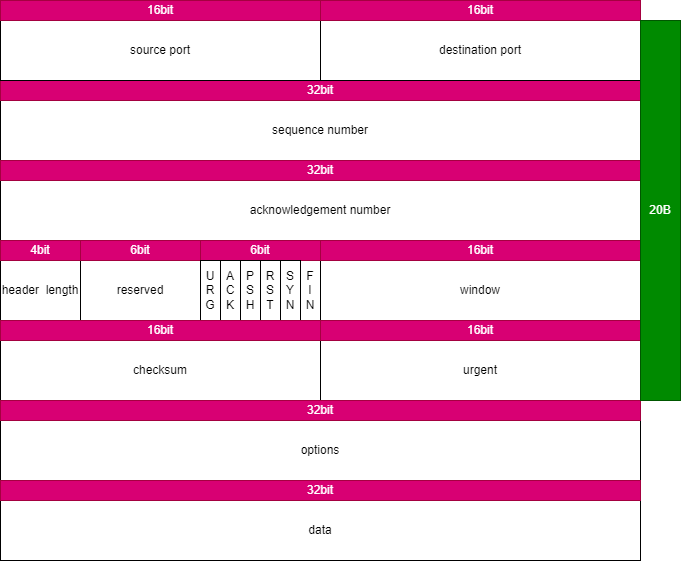

# 数据通信网络基础

## 通信与网络

### 网络通信基本概念

**通信**：人与人、人与物、物与物之间通过某种媒介和行为进行的信息传递与交流

**网络通信**：终端设备之间通过计算机网络进行的通信

**信息传递过程**：虚拟的信息传递与真实的物品传递过程有许多相似之处

**常见术语**：

* 数据载荷

* 报文
 
* 头部
 
* 尾部
 
* 封装：对数据加上头尾部，形成新的报文的过程
 
* 解封装：去掉报文的头尾部，获取数据的过程
 
* 网关：提供协议转换、路由选择、数据交换等功能的网络设备
 
* 路由器：为报文选择传递路径的网络设备

* 终端设备
 
* PDU：协议数据单元

### 数据通信基本概念

数据通信网络：由路由器、交换机、防火墙、无线控制器、无线接入点，以及个人电脑、网络打印机、服务器等设备构成的通信网络

功能：数据通信网络最基本的功能是实现数据互通

**网络设备**：

1. 交换机：距离终端用户最近的设备，用于终端用户介入网络，对数据帧进行交换等，有二层和三层交换机

2. 路由器：网络层设备，可以在因特网中进行数据报文转发。路由器根据所收到的报文的目的地之选择一条合适的路径，将报文传送到下一个路由器或目的地，路径中最后的路由器负责将报文送交目的主机

* 实现同类型网络或异种类型网络之间的通信
* 隔离广播域

* 维护路由表、运行路由协议

* 路径（路由信息）选择、IP报文转发

* 广域网介入、网络地址转换
* 连接通过交换机组成的二层网络
3. 防火墙：网络安全设备，用于控制两个网络之间的安全通信。它通过监测、限制、更改跨越防火墙的数据流，尽可能地对外部屏蔽网络内部的信息、结构和运行状况，以此来实现对网络的安全保护

* 隔离不同安全级别的网络 
* 实现不同安全级别网络间的访问控制（安全策略） 
* 用户身份认证 
* 实现远程接入功能 
* 实现数据加密以及虚拟专用网业务 
* 执行网络地址转换 
* 其他安全功能

4. 无线设备：无线胖AP、无线瘦AP、AC

## 网络类型与网络拓扑

### 网络类型

根据地理覆盖范围划分：局域网（LAN）、城域网（MAN）、广域网（WAN）

### 网络拓扑

概念：用传输介质（例如双绞线、光纤等）互联各种设备所呈现的结构化布局，用于描述网络的逻辑结构

形态：星型、总线型、环形、树形、全网状网络和部分网状网络

## 网络工程与网络工程师

网络工程：在信息系统工程方法和完善的组织机构指导下，根据网络应用的需求，按照计算机网络系统的标准、规范和技术，规划设计可行性方案，将计算机网络硬件设备、软件和技术系统地集成在一起，以成为满足用户需求、高性价比的网络系统的组建工作

网络工程师：在网络工程领域，掌握专业的网络技术，具备一定的职业技能及职业素养，具有一定项目实施经验，能够在项目现场与客户或者其他项目干系人充分沟通，根据客户的需求及环境因素指定实施方案及项目计划，并充分调动各方资源保证项目按时、保质保量落地，以及在项目实施后对干系人进行培训及工程文档交付的职业

# 网络参考模型

## 应用和数据

### 应用和数据的定义背景

应用：应用的存在，是为了满足人们的各种需求，比如访问网页，在线游戏，在线视频等。伴随着应用会产生信息，比如文本、图片

数据：在计算机领域，数据是各种信息的载体。大部分应用程序所产生的数据需要在不同的设备间传递

## 网络参考模型与标准协议

### OSI参考模型

应用层：对应用程序提供接口

表示层：进行数据格式的转换，以确保一个系统产生的应用层数据能够被另外一个系统的应用层识别和理解

会话层：在通信双方之间简历、管理和终止会话

传输层：建立、维护和取消一次段导弹的数据传输过程。控制传输节奏的快慢，调整数据的排序等

网络层：定义逻辑地址，实现数据从原到目的地址的转发

数据链路层：将分组数据封装成帧，在数据链路上实现数据的点到点、或点到多点方式的直接通信，差错检测

物理层：在媒介上传输比特流，提供机械和电气的规约

### TCP/IP参考模型与标准协议

因为OSI协议栈比较复杂，且tcp和ip两大协议在业界被广泛使用，所以TCP/IP参考模型成为了互联网的主流参考模型

TCP/IP常见协议：

1. 应用层：
* Telnet(23 TCP)：远程登录协议，提供远程管理服务
* FTP(20（传输数据），21（传输控制信息） TCP)：文件传输协议，提供互联网文件资源共享服务，采用C/S架构
* TFTP(69 TCP)：文件传输协议，提供简单的文件传输服务
* SNMP
* HTTP(80 TCP)：超文本传输协议，提供浏览网页服务，采用C/S架构 
* SMTP(25 TCP)：简单右键传输协议，提供互联网电子邮件服务
* DNS
* DHCP

2. 传输层：
* 传输层协议接收来自应用层协议的数据，封装相应的传输层头部，帮助其建立端到端的连接。传输层的PDU被称为段
* 传输层的PDU是由应用层数据加伤源端口和目的端口得来的
* TCP：面向连接的、可靠的传输层通信协议
* UDP：无连接的传输层协议
* 客户端使用的源端口一般随机分配，目标端口则由服务器的应用指定
* 源端口号一般为系统中未使用的，且大于1023
* 目的端口号为服务端开启的应用（服务）所侦听的端口，如HTTP缺省的端口为80

3. 网络层：ICMP，IGMP，IP
* 传输层负责简历主机之间进程与进程之间的连接，而网络层则负责数据从一台主机到另外一台主机之间的传递。网络层的PDU被称为包
* 网络层为网络中的设备提供逻辑地址，负责数据包的寻径和转发，常见的协议有IPv4、IPv6、ICMP、ICMP等
* 网络层需要维护路由信息，称为路由表
* 此层最重要的字段是源IP及目的IP

4. 数据链路层：PPPoE，Ethernet，PPP
* 位于网络层与物理层之间，可以向网络层的IP、IPv6等协议提供服务。数据链路层的PDU被称为帧，以太网是最常见的数据链路层协议
* ARP：地址解析协议，根据已知的IP地址解析获得其对应的MAC地址* 
* 此层要加上帧校验（FSC）

5. 物理层
* 数据到达物理层后，物理层会根据物理介质的不同，将数字信号转换成光信号、电信号或电磁波信号。物理层的PDU被称为比特流
* 常见传输介质：双绞线、光纤、串口线缆、无线路由器
* 此层传输比特流

## 数据通信过程

1. 发送方数据封装：数据，段，包，帧，位

2. 中间网络数据传输

3. 接收方数据解封装：位，帧，包，段，数据
# 网络常用协议

## 传输层

### TCP协议

<div align="center">



</div>

**字段解释**：
源/目的端口号：表示数据从哪个进程来，到哪个进程去

序号：TCP将每个字节的数据都进行了编号称为序列号，接收端收到数据之后要发送确认序号给发送端。序号用于对字节流进行编址，例如序号是301，表示第一个字节的编号为301，携带的数据长度是100，下一个报文的编号就是401

确认序号：期望收到的下一个报文段的序号，B收到A发来的一个报文段，序号是301，携带的数据长度是300，那么B发送给A的确认序号就是601

4位头部长度：表示TCP头部有多少个4字节，所以TCP头部最大长度为15*4=60字节

6个标志位：

* URG：紧急指针是否有效
* ACK：确认号是否有效
* PSH：提示接收端应用程序立刻从缓冲区读走- 
* RST：要求对方重新建立连接，携带RST的标识的报文称为复位报文段
* SYN：请求建立连接，携带SYN标识的报文称为同步报文段
* FIN：结束标识，告诉对端本端关闭。

16位窗口大小：无需等待确认应答而可以继续发送数据的最大值

16位校验和：发送端填充，CRC校验，接收端校验不通过，认为数据有问题。校验和包含TCP首部和TCP数据部分。

16位紧急指针：标识那部分数据是紧急数据

**三次握手**：

TCP/IP三次握手是建立TCP连接时所必需的过程。三次握手的目的是确保双方的通信连接是可靠的，以提高数据传输的可靠性。以下是TCP/IP三次握手的过程：

* 客户端向服务端发送SYN请求报文，其中SYN标志位被设为1，客户端进入SYN_SEND状态。

* 服务端收到SYN请求报文后，如果同意请求，则会向客户端发送一个带有SYN和ACK标识位的应答报文(确认号为客户端的序列号+1)，服务端进入SYN_RECV状态。

* 客户端收到带有SYN和ACK标识位的应答报文后，会向服务端发送一个确认报文，其中确认序号为服务端的序列号+1。客户端进入ESTABLISHED状态，服务端也进入ESTABLISHED状态，此时，连接建立成功，可以开始数据传输。
  


**四次挥手**：

* 主动关闭方发送FIN报文段：表示主动关闭方已经没有数据要发送给被关闭方了。
* 被动关闭方收到FIN报文段并发回ACK报文段：表示被动关闭方已经知主动关闭方没有要发送的数据了，并且可以关闭连接了。
* 被动关闭方也发送FIN报文段：表示被动关闭方也没有数据要发送给主关闭方了。
* 主动关闭方收到FIN报文段并发回ACK报文段：表示主动关闭方也知道动关闭方没有要发送的数据了，连接可以关闭了。


**窗口滑动机制**：

TCP的窗口滑动是指传输数据时，发送方和接收方维护一个滑动窗口来控制数据流量的传输。发送方在传送数据时，必须等待接收方对已发送数据的确认，才能继续发送数据。接收方在接收到数据时，必须向发送方发送确认，表示已经正确接收了相应的数据。以下是TCP窗口滑动的过程：

* 发送方首先会发送一段数据，并将发送的数据等待接收方的确认。在等待确认期间，发送方维护一个发送窗口，以决定可以发送多少数据。一旦发送数据并等待确认，该数据就会成为发送方滑动窗口中的一部分。

* 接收方在接收数据时，维护一个接收窗口，并发送确认消息。接收方的窗口大小是指接收方为等待确认的数据所分配的缓冲区的大小。当接收方向发送方发送确认时，确认号包含了对已成功接收数据的序列号。

* 发送方在收到接收方的确认后，会将已成功接收的数据从滑动窗口中删除，并根据接收方的窗口大小，更新自己的窗口大小。随着时间的推移，发送方的窗口可能会向前滑动，以允许发送更多数据。


**流量控制机制**:

TCP/IP的流量控制是通过滑动窗口来实现的，滑动窗口指的是接收方在通信时告诉发送方自己还能接收多少字节的数据的一个窗口大小。发送方需要根据接收方的窗口大小来控制发送的速度，这样即可实现流量控制。

当接收方窗口变小时，发送方需要立刻减少发送的数据量，以便避免拥塞导致的数据包丢失。因此TCP使用连续的序列号来标识接收方所期望的顺序，如果发送方的数据超出接收方的窗口，则会被丢弃。


### UDP协议

<div align="center">


</div>

## 网络层

### ARP协议

是网络层协议，工作基于数据链路层

<div align="center">


</div>

**字段解释**：

* 以太网目的地址（6Byte）：当发送 ARP 请求时此处全为1(FF: FF: FF: FF: FF: FF)，即为广播地址。当发送 ARP 响应时，此处即为目的端 MAC地址。-
* 以太网源地址（6Byte）：发送 ARP 请求的 MAC 地址，为本机 MAC 地址。
* 帧类型（2Byte）：表示的是后面的数据类型，ARP 请求和 ARP 应答这个值为 0x0806 。
* 硬件类型（2Byte）：硬件地址不只以太网一种，是以太网类型时此值为1。 
* 协议类型（2Byte）：要映射的协议地址的类型，要对IPv4地址进行映射，此值为0x0800。
* 硬件地址长度（1Byte）：即为 MAC 地址长度 6 Byte。
* 协议地址长度（1Byte）：即为 IP 地址长度 4 Byte。
* 操作（2Byte）：值为1，表示进行ARP请求；值为2，表示进行ARP应答；值为3，表示进行RARP请求；值为4，表示进行RARP应答。
* 发送者硬件地址（6Byte）：这是本机的 MAC 地址，与第二个字段相同。
* 发送者 IP 地址（4Byte）：这是本机的 IP 地址。
* 目标硬件地址（6Byte）：在发送 ARP 请求时，还不知道目的端的 MAC 地址，所以此处全为 0 ( 00:00:00:00:00:00 )。当发送 ARP 请求报文是，此处即为目的端 MAC 地址。
* 目标 IP 地址（4Byte）：目标端 IP 地址。

### ICMP协议

常用于测试网络连通性的协议，常用命令有： `ping` ， `tracert`

### IP协议

<div align="center">


</div>

**字段解释**:

* 版本（Version）：这个字段指定了使用的IP协议版本，通常是IPv4或IPv6。

* 头部长度（Header Length）：这个字段指定了IP头部的长度。IP头部通常是20个字节，但是如果选项字段被用到了，那么头部长度可以会更大。这个字节只有4bit，实际应用中，为了使其能表示20-60这个范围，约定俗成需要将其值乘以4

* 服务类型（Type of Service）：这个字段可以用来指定IP包的服务类型。这个字段包括了对不同数据流的不同服务质量的定义，如低延迟、高带宽和可靠传输等等。

* 总长度（Total Length）：这个字段指定了IP包的总长度，当IP层的数据包太大时，可能需要进行分片操作。

* 标识（Identification）：这个字段唯一标识IP包并用于将分片的数据包重新组合。

* 标志（Flags）：这个字段被用来标识分片。一个标志位用于表示是否还有更多的分片存在，另一个标志位用于表示当前分片是不是第一个分片。

* 片偏移（Fragment Offset）：这个字段指定了当前IP分片相对于整个数据包的偏移量。

* 生存时间（Time to Live）：这个字段指定了IP包在到达目标之前可以转发的最大路由数，每经过一个路由器，此值会减少一。

* 协议（Protocol）：这个字段指定了IP包所使用的传输层协议，如TCP、UDP和ICMP等等。

* 头部校验和（Header Checksum）：这个字段是一个用于检测IP数据包头部有没有变动的校验和，如果有变动则需要舍弃这个IP包。

* 源地址（Source Address）：这个字段指定了发送IP包的原始IP地址。

* 目的地址（Destination Address）：这个字段指定了接收IP包的IP地址。

**IP地址**：
* 一个ipv4地址由32bit
* 通常使用点分十进制表示
* 地址范围0.0.0.0-255.255.255.255
* 分为**网络位**（标识一个网络）和**主机位**（标识主机）
* 分类：A类（第一位必须为0,掩码为8），B类（前两位必须为10，掩码为16），C类（前三位必须为110，掩码为24），D类（前四位必须为1110），E类（前5位必须为1111）。ABC类用于主机使用，D类用于组播，E类用于研究
* 主机位全为0，称为网络地址，主机位全为1，称为广播地址，剩下的是主机可用的ip地址，所以，一个网段内可用的ip地址数量为$2^n-2$
* 私网ip：ABC三类地址中各预留了一些地址用于私网
  * A类：10.0.0.0-10.255.255.255
  * B类：172.16.0.0-172.31.255.255
  * C类：192.168.0.0-192.168.255.255
* 划分子网：规划地址使用，起到节约网络地址的作用，使用可变长子网掩码（VLSM）
* 配置接口的ip：`ip address g0/0/0 1.1.1.1 24`
* 配置回环接口的ip：

```
//回环口是路由器或交换机上的虚拟接口，类似PC上的127.0.0.1
interface  loopback 0   //定义回环口
ip address 1.1.1.2 32   //回环口的掩码必须为32
```

# ip路由基础
## 路由概述
### 背景
ip地址唯一标识了网络中的一个节点，每个IP地址都拥有自己的网段，各个网段可能分布在网络的不同区域

为实现ip寻址，分布在不同区域的网络之间要能互相通信
### 什么是路由
路由是知道报文转发的路径信息，通过路由可以确认转发ip报文的路径

路由器设备是依据路由转发报文到目的网段的网络设备，最常见的路由设备是路由器

路由器维护者一张路由表，保存路由信息
### 路由信息介绍
* 目的网络/掩码
  * 目的网络：标识目的网段
  * 掩码：与目的地址共同标识一个网段
* 出接口：数据包转发时的路由器接口
* 下一跳：数据包接收时的路由器接口地址或主机地址
### 路由表
* 路由器通过各种方式发现路由
* 路由器选择最优的路由条目放入路由表中
* 路由表指导设备对ip报文的转发
* 路由器通过对路由表的管理实现对路径信息的管理

目的网络/掩码|下一跳|出接口
:-----:|:-----:|:-----:
11.0.0.0/8|2.2.2.2|g0/0/0
### 路由信息的获取方式
1. 直连路由：由设备自动生成，指向本地直连网络

* 直连路由指向本地直联网络的路由，由设备自动生成
* 当路由器为路由转发的最后一跳路由器时，ip报文匹配直连路由，路由器转发ip报文到目的主机
* 使用直连路由进行路由转发时，报文的目的ip和路由器接口欧在同一个网段之下
* 并不是所有接口生成的直连路由都会出现在路由表中，直连路由出现在路由表中的前提是该接口的物理转台、协议状态都为UP
2. 静态路由：由网络管理员手工配置的路由条目
3. 动态路由：路由器运行动态路由协议学习到的路由
### 如何选择最优路由
1. 查看ip路由表的命令：`display ip routing-table`
2. 各个字段的含义

* Destination/Mask：表示此路由的目的网络地址与网络掩码。将目的地址和子网掩码“逻辑与”后可得到目的主机或路由器所在网段的地址。例如：目的地址为 1.1.1.1，掩码为255.255.255.0 的主机或路由器所在网段的地址为 1.1.1.0。

* Proto（Protocol）：该路由的协议类型，也即路由器是通过什么协议获知该路由的。
* Pre（Preference）：表示此路由的路由协议优先级。针对同一目的地，可能存在不同下一跳、出接口等多条路由，这些不同的路由可能是由不同的路由协议发现的，也可以是手工配置的静态路由。优先级最高（数值最小）者将成为当前的最优路由。 
* Cost：路由开销。当到达同一目的地的多条路由具有相同的路由优先级时，路由开销最小的将成为当前的最优路由。
* NextHop：表示对于本路由器而言，到达该路由指向的目的网络的下一跳地址。该字段指明了数据转发的下一个设备。
* Interface：表示此路由的出接口。指明数据将从本路由器的哪个接口转发出去

3. 路由优先级

当路由器从多种不同的途径获知到达同一个目的网段的路由（这些路由的目的网络地址及网络掩码均相同）时，路由器会比较这些路由的优先级，优选优先级值最小的路由。

路由来源的优先级值（Preference）越小代表加入路由表的优先级越高。

拥有最高优先级的路由将被添加进路由表。

常见路由协议的默认优先级：

路由来源|路由内容|默认优先级
:-----:|:-----:|:-----:
直连|直连路由|0
静态|静态路由|60
动态路由|OSPF内部|10
动态路由|OSPF外部|150
1. 路由度量值

当路由器通过某种路由协议发现了多条到达同一个目的网络的路由时（拥有相同的路由优先级），度量值将作为路由优选的依据之一。路由度量值表示到达这条路由所指目的地址的代价

一些常用的度量值有：跳数、带宽、时延、代价、负载、可靠性等

度量值数值越小越优先，度量值最小路由将会被添加到路由表中

度量值很多时候被称为开销（Cost）

### 路由转发方式

最长匹配原则：当路由器收到一个 IP 数据包时，会将数据包的目的 IP 地址与自己本地路由表中的所有路由表项进行逐位（Bit-By-Bit）比对，直到找到匹配度最长的条目，这就是最长前缀匹配机制
## 静态路由
### 静态路由的应用场景
静态路由由网络管理员手动配置，配置方便，对系统要求低，适用于拓扑结构简单并且稳定的小型网络。

缺点是不能自动适应网络拓扑的变化，需要人工干预

配置方式：
```
//关联下一跳ip的方式
ip route-static ip-address mask nexthop-address

//关联出接口的方式
ip route-static ip-address mask interface-type interface-number

//关联出接口和下一跳的方式
ip route-static ip-address mask interface-type interface-number [nexthop-address]

在创建静态路由时，可以同时指定出接口和下一跳。对于不同的出接口类型，也可以只指定出接口或只指定下一跳。
对于点到点接口（如串口），必须指定出接口。
对于广播接口（如以太网接口）和 VT（Virtual-template）接口，必须指定下一跳
```
### 缺省路由

缺省路由是一种特殊的路由，当报文没有在路由表中找到匹配的具体路由表项时才使用的路由。如果报文的目的地址不能与路由表的任何目的地址相匹配，那么该报文将选取缺省路由进行转发

缺省路由在路由表中的形式为 0.0.0.0/0，缺省路由也被叫做默认路由

缺省路由应用场景：缺省路由一般用于企业网络出口，配置一条缺省路由让出口设备能够转发前往 Internet 上任意地址的 IP 报文
## 动态路由
静态路由的缺点是不能自动适应网络拓扑的变化，需要人工干预。

动态路由协议有自己的路由算法，能够自动适应网络拓扑的变化，适用于具有一定数量三层设备的网络。
### 动态路由协议分类
1. 根据路由信息传递的内容、计算路由的算法，可以将动态路由协议分为两大类
* 距离矢量协议（Distance-Vector Protocol）：RIP
* 链路状态协议（Link-State Protocol）：OSPF、IS-IS、BGP 使用一种基于距离矢量算法修改后的算法，该算法被称为路径矢量（Path Vector）算法。因此在某些场合下，BGP 也被称为路径矢量路由协议。

2. 根据工作范围不同，又可以分为
* 内部网关协议 IGP（Interior Gateway Protocol）:在一个自治系统内部运行。RIP、OSPF、ISIS 为常见的 IGP 协议。
* 外部网关协议 EGP（Exterior Gateway Protocol）：运行于不同自治系统之间。BGP 是目前最常用的 EGP 协议。

## 路由高级特性
### 路由递归
路由必须有直连的下一跳才能够指导转发，但是路由生成时下一跳可能不是直连的，因此需要计算出一个直连的下一跳和对应的出接口，这个过程就叫做路由递归。路由递归也被称为路由迭代。
### 等价路由
路由表中存在等价路由之后，前往该目的网段的 IP 报文路由器会通过所有有效的接口、下一跳转发，这种转发行为被称为负载分担

等价路由的来源相同、开销相同
### 浮动路由
静态路由支持配置时手动指定优先级，可以通过配置目的地址/掩码相同、优先级不同、下一跳不同的静态路由，实现转发路径的备份

浮动路由是主用路由的备份，保证链路故障时提供备份路由。主用路由下一跳可达时该备份路由不会出现在路由表

浮动路由的配置：
```
//手动配置路由优先级
ip route-static ip-address mask nexthop-address preference priority-number
```
### CIDR
CIDR（classless inter-domain routing，无类别域间路由）采用 IP 地址加掩码长度来标识网络和子网，而不是按照传统 A、B、C 等类型对网络地址进行划分。

CIDR 容许任意长度的掩码长度，将 IP 地址看成连续的地址空间，可以使用任意长度的前缀分配，多个连续的前缀可以聚合成一个网络，该特性可以有效减少路由表条目数量。
### 路由汇总
需求：
* 对于一个大规模的网络来说，路由器或其他具备路由功能的设备势必需要维护大量的路由表项，为了维护臃肿的路由表，这些设备就不得不耗费大量的资源。同时，由于路由表的规模变大，会导致路由器在查表转发时效率降低。因此在保证网络中的路由器到各网段都具备 IP 可达性的同时，需要减小设备的路由表规模。一个网络如果具备科学的 IP 编址，并且进行合理的规划，是可以利用多种手段减小设备路由表规模的。一个非常常见而又有效的办法就是使用路由汇总（Route Summarization）。路由汇总又被称为路由聚合（Route Aggregation），是将一组有规律的路由汇聚成一条路由，从而达到减小路由表规模以及优化设备资源利用率的目的，我们把汇聚之前的这组路由称为精细路由或明细路由，把汇聚之后的这条路由称为汇总路由或聚合路由。
  
简介
* 路由汇总将一组具有相同前缀的路由汇聚成一条路由，从而达到减小路由表规模以及优化设备资源利用率的目的。路由汇总采用了 CIDR 的思想：将相同前缀的地址聚合成一个。我们把汇聚之前的这组路由称为精细路由或明细路由，把汇聚之后的这条路由称为汇总路由或聚合路由。
  
计算
* 基于一系列连续的、有规律的 IP 网段，如果需计算相应的汇总路由，且确保得出的汇总路由刚好“囊括”上述 IP 网段，则需保证汇总路由的掩码长度尽可能长。诀窍在于：将明细路由的目的网络地址都换算成二进制，然后排列起来，找出所有目的网络地址中“相同的比特位”。

问题
* 一般来说一条路由，无论是静态的或者是动态的，都需要关联到一个出接口，路由的出接口指的是设备要到达一个目的网络时的出站接口。路由的出接口可以是该设备的物理接口，例如百兆、千兆以太网接口，也可以是逻辑接口，例如 VLAN 接口（VLAN Interface），或者隧道（Tunnel）接口等。在众多类型的出接口中，有一种接口非常特殊，那就是 Null（无效）接口，这种类型的接口只有一个编号，也就是 0。Null0 是一个系统保留的逻辑接口，当网络设备在转发某些数据包时，如果使用出接口为 Null0 的路由，那么这些报文将被直接丢弃，就像被扔进了一个黑洞里，因此出接口为 Null0 的路由又被称为黑洞路由。配置方法是：`ip route-static ip-address mask Null0`