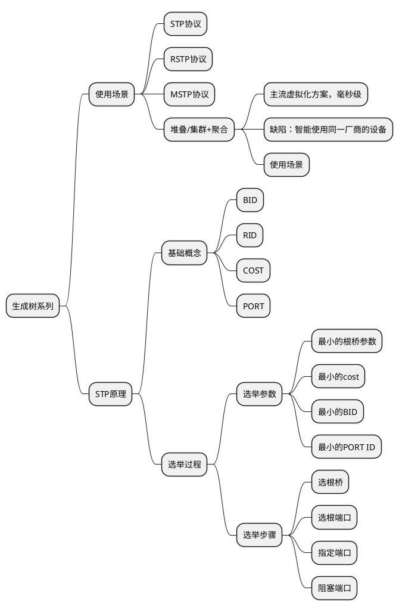

# RSTP
## STP
1. 作用：防止环路
2. 缺陷：

* 收敛慢，时间为30s到50s
* 浪费资源，会浪费阻塞端口

RSTP在STP基础上做出了优化:

收敛速度变快变成毫秒级
依旧会浪费阻塞端口
使用场景：中小型企业网络

```plantuml
@startmindmap

right side
+ 生成树系列

++ 使用场景
+++ STP协议
+++ RSTP协议
+++ MSTP协议
+++ 堆叠/集群+聚合
++++ 主流虚拟化方案，毫秒级
++++ 缺陷：智能使用同一厂商的设备
++++ 使用场景

++ STP原理
+++ 基础概念
++++ BID
++++ RID
++++ COST
++++ PORT

+++ 选举过程
++++ 选举参数
+++++ 最小的根桥参数
+++++ 最小的cost
+++++ 最小的BID
+++++ 最小的PORT ID

++++ 选举步骤
+++++ 选根桥
+++++ 选根端口
+++++ 指定端口
+++++ 阻塞端口
left side

@endmindmap
```

路径开销：A网桥要传递BPDU给下一个网桥B，其根路径开销为根桥到B网桥路径之和

根桥发送的BPDU开销值为0