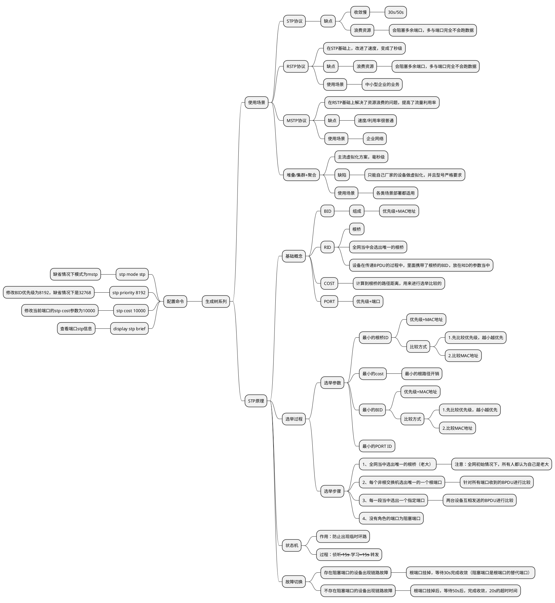

# RSTP
## STP

```plantuml
@startmindmap

right side

+ 生成树系列

++ 使用场景
+++ STP协议

++++ 缺点
+++++ 收敛慢
++++++ 30s/50s

+++++ 浪费资源
++++++ 会阻塞多余端口，多与端口完全不会跑数据


+++ RSTP协议

++++ 在STP基础上，改进了速度，变成了秒级

++++ 缺点
+++++ 浪费资源
++++++ 会阻塞多余端口，多与端口完全不会跑数据

++++ 使用场景
+++++ 中小型企业的业务


+++ MSTP协议

++++ 在RSTP基础上解决了资源浪费的问题，提高了流量利用率

++++ 缺点
+++++ 速度/利用率很普通

++++ 使用场景
+++++ 企业网络

+++ 堆叠/集群+聚合
++++ 主流虚拟化方案，毫秒级

++++ 缺陷
+++++ 只能自己厂家的设备做虚拟化，并且型号严格要求


++++ 使用场景
+++++ 各类场景部署都适用


++ STP原理
+++ 基础概念

++++ BID
+++++ 组成
++++++ 优先级+MAC地址

++++ RID
+++++ 根桥
+++++ 全网当中会选出唯一的根桥
+++++ 设备在传递BPDU的过程中，里面携带了根桥的BID，放在RID的参数当中

++++ COST
+++++ 计算到根桥的路径距离，用来进行选举比较的


++++ PORT
+++++ 优先级+端口

+++ 选举过程
++++ 选举参数
+++++ 最小的根桥ID
++++++ 优先级+MAC地址
++++++ 比较方式
+++++++ 1.先比较优先级，越小越优先
+++++++ 2.比较MAC地址

+++++ 最小的cost
++++++ 最小的根路径开销

+++++ 最小的BID
++++++ 优先级+MAC地址
++++++ 比较方式
+++++++ 1.先比较优先级，越小越优先
+++++++ 2.比较MAC地址

+++++ 最小的PORT ID

++++ 选举步骤
+++++ 1、全网当中选出唯一的根桥（老大）
++++++ 注意：全网初始情况下，所有人都认为自己是老大

+++++ 2、每个非根交换机选出唯一的一个根端口
++++++ 针对所有端口收到的BPDU进行比较

+++++ 3、每一段当中选出一个指定端口
++++++ 两台设备互相发送的BPDU进行比较

+++++ 4、没有角色的端口为阻塞端口

+++ 状态机
++++ 作用：防止出现临时环路
++++ 过程：侦听---15s---学习----15s---转发

+++ 故障切换
++++ 存在阻塞端口的设备出现链路故障
+++++ 根端口挂掉，等待30s完成收敛（阻塞端口是根端口的替代端口）

++++ 不存在阻塞端口的设备出现链路故障
+++++ 根端口挂掉后，等待50s后，完成收敛，20s的超时时间

left side

-- 配置命令
--- stp mode stp
---- 缺省情况下模式为mstp

--- stp priority 8192
---- 修改BID优先级为8192，缺省情况下是32768

--- stp cost 10000
---- 修改当前端口的stp cost参数为10000

--- display stp brief
---- 查看端口stp信息

@endmindmap
```