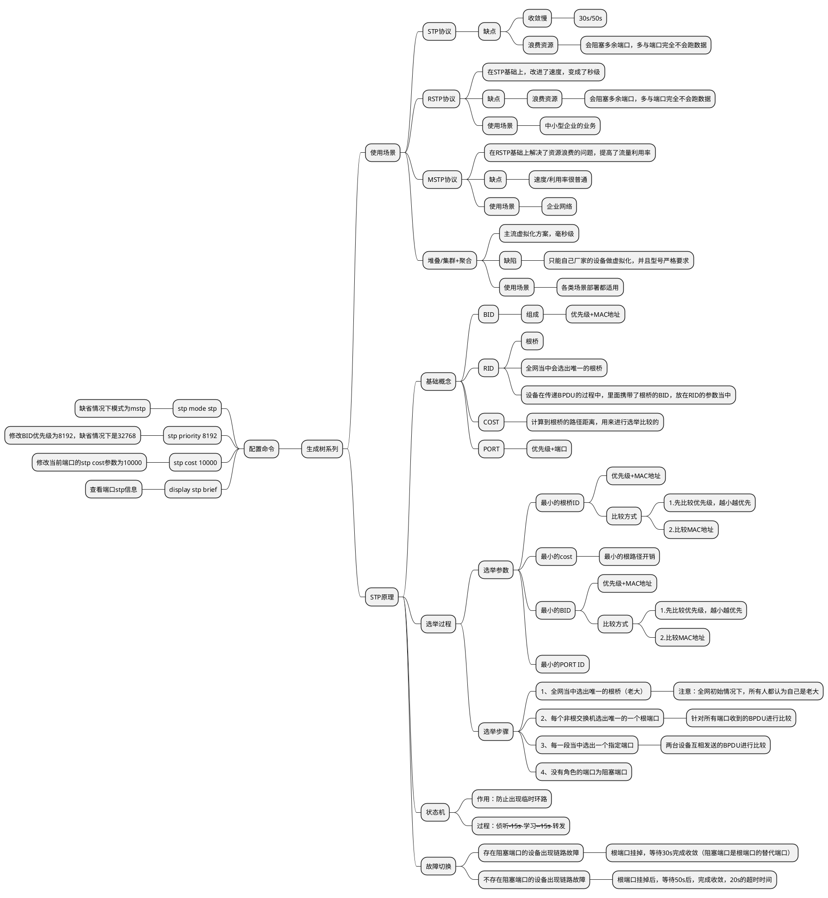

# RSTP
## STP

## RSTP 
### 概念
1. 在IEEE 802.1W中定义
2. 在许多方面对STP进行优化，收敛速度更快，而且兼容STP
3. 端口角色优化：增加两个端口角色

|RSTP端口角色|说明|备注|
|:-:|:-:|:-:|
|root port|根端口：去往根桥路径开销最小的端口||
|designed port|指定端口：向本网段转发配置消息的端口||
|alternate port|替代端口：学习其他网桥发送的BPDU报文而阻塞的端口|根端口的备份|
|backup port|备份端口：学习到自己发送的BPDU而阻塞的端口|指定端口的备份端口|

4. 端口状态优化：精简成3种状态

|STP端口状态|RSTP端口状态|学习mac地址|转发数据|
|:-:|:-:|:-:|:-:|
|Forwarding|Forwarding|是|是|
|Learning|Learning|是|否|
|Listening|Discarding|否|否|
|Blocking|Discarding|否|否|
|Disabled|Discarding|否|否|

5. 快速收敛机制
根端口快速切换：如果根端口失效，则最优的alternate端口成为根端口，进入forwarding状态

指定端口快速切换：如果指定端口失效，那么最优的backup端口将成为指定端口，进入forwarding状态

6. 边缘端口
边缘端口不参与RSTP计算，直接进入forwarding状态

但是，一旦边缘端口收到bpdu，就会丧失边缘端口属性，成为普通STP端口，并重新进行生成树计算，从而引起网络震荡
7. P/A机制：proposal/agreement
加快上游端口进入forwarding状态的速度

当一个端口被选举为指定端口后，会先进入discarding状态，然后通过P/A机制快速进入forwarding状态

P/A机制要求两台交换机之间链路必须是点到点的全双工模式，一旦P/A不成功，指定端口的选择就需要等待两个forward delay，协商过程与STP一样
8. 拓扑变更机制优化
RSTP拓扑变化唯一标准：一个非边缘端口切换到forwarding状态
9. RSTP对STP优化总结

|对比项|STP|RSTP|
|:-:|:-:|:-:|
|角色状态|5个|3个|
|端口角色|2个|4个|
|配置BPDU flag位使用|2位|4位|
|BPDU超时计时|maxage|hello\*3\*time factor|
|处理次优BPDU|等待超时|立即回应最优BPDU|
|稳定后BPDU发送方式|根桥发送|所有交换机|
|快速收敛|无|P/A机制|
|边缘端口|无|有|
|保护功能|无|4中保护机制|
# MSTP
## RSTP/STP的不足

1. 流量无法负载分担
2. 会产生二层次优路径

## MSTP协议概述

* MSTP是在IEEE 802.1S中定义的，兼容RSTP和STP，既可以快速收敛，又提供了数据转发的多个冗余路径，在数据转发过程中实现VLAN数据的负载均衡
* 可以将一个或多个VLAN实例（instance），再基于实例计算生成树，映射到同一个实例的VLAN共享同一棵生成树
## MSTP网络层次

1. MSTP把一个交换网络划分为多个域，每个域内生成多棵生成树，生成树之间互相独立

2. MST Region:多生成树域

* 由交换网络中的多台交换设备以及它们之间的网段构成
* 一个局域网内可以存在多个MST域，各个域之间在物理上直接或间接连接。可以通过MSTP配置命令把多台交换设备划分在同一个MST域中
* MSTP网络内包含一个或多个MST域，每个MST中包含一个或多个生成树实例

## MSTI

1. MSTI：多生成树实例

* 一个MSTP域中可以有多棵生成树，每棵生成树都称为一个MSTI
* MSTI使用instance id标识，华为设备取值为`0~4094`

2. VLAN映射表
MSTP域的属性，描述了VLAN和MSTI间的映射关系

## CST

* CST:公共生成树
* 是连接交换网络内所有的MST域的一棵生成树
* 如果把每个MST域看做一个节点，CST就是这些节点通过生成树协议计算生成的一棵生成树

## IST

* IST:内部生成树
* 是各MST域内的一棵生成树
* IST是一个特殊的MSTI，它的instance id为0

## CIST

* CIST:公共和内部生成树
* 通过生成树协议计算生成的，连接一个交换网络内所有交换设备的单生成树

## SST

1. SST:单生成树
2. 有两种情况：

* 运行生成树协议的交换设备只能属于一个生成树
* MSTP域中只有一个交换设备，这个交换设备构成单生成树

## MSTP网络中的交换机角色
1. 总根

是CIST的根桥

2. 域根

* 分为IST域根和MSTI域根
* IST域根：在MST域中IST生成树中距离总根最近的交换设备
* MSTI域根：每个多生成树实例的域根

3. 主桥

* 是IST Master，它是域内距离总根最近的交换设备
* 如果总根在MST域中，则总根为该域的主桥
# 链路聚合
## Eth-Trunk概念
1. Eth-Trunk是一种将多个以太网接口捆绑成一个逻辑接口的捆绑技术。
2. Eth-Trunk链路聚合模式：

* 手工负载分担模式
* LACP模式

## 手工负载分担模式
1. 当两台设备中至少有一台不支持LACP协议时，可使用手工负载分担模式的Eth-Trunk来增加设备间的带宽及可靠性。
2. 在手工负载分担模式下，加入Eth-Trunk的链路都进行数据的转发

## 配置手工负载分担模式
配置手工负载分担模式的步骤：

* 创建Eth-Trunk；
* 配置Eth-Trunk的工作模式；
* Eth-Trunk中加入成员接口

## LACP模式
LACP模式也称为M:N模式，其中M条链路处于活动状态转发数据，N条链路处于非活动状态作为备份链路

## 配置LACP模式
配置LACP模式的步骤：
* 创建Eth-Trunk；
* 配置Eth-Trunk的工作模式；
* Eth-Trunk中加入成员接口；
* （可选）配置系统LACP优先级；
* （可选）配置活动接口数上限阈值；
* （可选）配置接口LACP优先级；
* （可选）使能LACP抢占并配置抢占延时时间