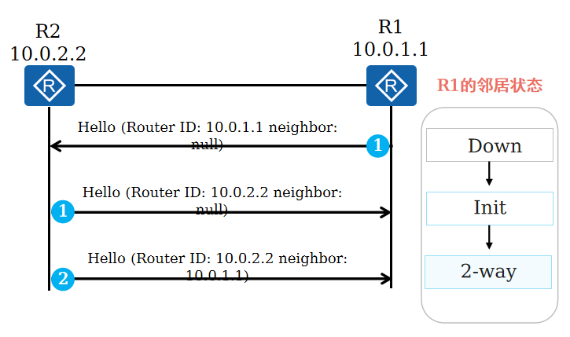
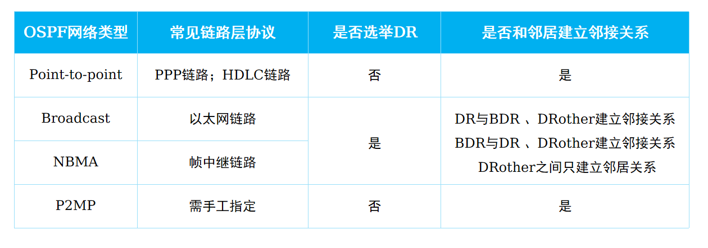
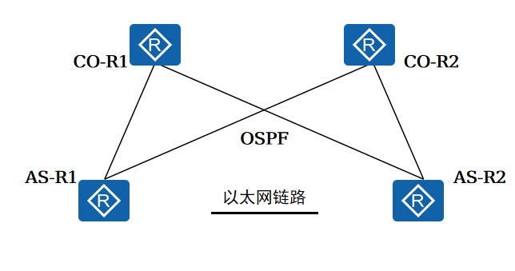

# RSTP
## STP

## RSTP 
### 概念
1. 在IEEE 802.1W中定义
2. 在许多方面对STP进行优化，收敛速度更快，而且兼容STP
3. 端口角色优化：增加两个端口角色

|RSTP端口角色|说明|备注|
|:-:|:-:|:-:|
|root port|根端口：去往根桥路径开销最小的端口||
|designed port|指定端口：向本网段转发配置消息的端口||
|alternate port|替代端口：学习其他网桥发送的BPDU报文而阻塞的端口|根端口的备份|
|backup port|备份端口：学习到自己发送的BPDU而阻塞的端口|指定端口的备份端口|

4. 端口状态优化：精简成3种状态

|STP端口状态|RSTP端口状态|学习mac地址|转发数据|
|:-:|:-:|:-:|:-:|
|Forwarding|Forwarding|是|是|
|Learning|Learning|是|否|
|Listening|Discarding|否|否|
|Blocking|Discarding|否|否|
|Disabled|Discarding|否|否|

5. 快速收敛机制
根端口快速切换：如果根端口失效，则最优的alternate端口成为根端口，进入forwarding状态

指定端口快速切换：如果指定端口失效，那么最优的backup端口将成为指定端口，进入forwarding状态

6. 边缘端口
边缘端口不参与RSTP计算，直接进入forwarding状态

但是，一旦边缘端口收到bpdu，就会丧失边缘端口属性，成为普通STP端口，并重新进行生成树计算，从而引起网络震荡
7. P/A机制：proposal/agreement
加快上游端口进入forwarding状态的速度

当一个端口被选举为指定端口后，会先进入discarding状态，然后通过P/A机制快速进入forwarding状态

P/A机制要求两台交换机之间链路必须是点到点的全双工模式，一旦P/A不成功，指定端口的选择就需要等待两个forward delay，协商过程与STP一样
8. 拓扑变更机制优化
RSTP拓扑变化唯一标准：一个非边缘端口切换到forwarding状态
9. RSTP对STP优化总结

|对比项|STP|RSTP|
|:-:|:-:|:-:|
|角色状态|5个|3个|
|端口角色|2个|4个|
|配置BPDU flag位使用|2位|4位|
|BPDU超时计时|maxage|hello\*3\*time factor|
|处理次优BPDU|等待超时|立即回应最优BPDU|
|稳定后BPDU发送方式|根桥发送|所有交换机|
|快速收敛|无|P/A机制|
|边缘端口|无|有|
|保护功能|无|4中保护机制|
# MSTP
## RSTP/STP的不足

1. 流量无法负载分担
2. 会产生二层次优路径

## MSTP协议概述

* MSTP是在IEEE 802.1S中定义的，兼容RSTP和STP，既可以快速收敛，又提供了数据转发的多个冗余路径，在数据转发过程中实现VLAN数据的负载均衡
* 可以将一个或多个VLAN实例（instance），再基于实例计算生成树，映射到同一个实例的VLAN共享同一棵生成树
## MSTP网络层次

1. MSTP把一个交换网络划分为多个域，每个域内生成多棵生成树，生成树之间互相独立

2. MST Region:多生成树域

* 由交换网络中的多台交换设备以及它们之间的网段构成
* 一个局域网内可以存在多个MST域，各个域之间在物理上直接或间接连接。可以通过MSTP配置命令把多台交换设备划分在同一个MST域中
* MSTP网络内包含一个或多个MST域，每个MST中包含一个或多个生成树实例

## MSTI

1. MSTI：多生成树实例

* 一个MSTP域中可以有多棵生成树，每棵生成树都称为一个MSTI
* MSTI使用instance id标识，华为设备取值为`0~4094`

2. VLAN映射表
MSTP域的属性，描述了VLAN和MSTI间的映射关系

## CST

* CST:公共生成树
* 是连接交换网络内所有的MST域的一棵生成树
* 如果把每个MST域看做一个节点，CST就是这些节点通过生成树协议计算生成的一棵生成树

## IST

* IST:内部生成树
* 是各MST域内的一棵生成树
* IST是一个特殊的MSTI，它的instance id为0

## CIST

* CIST:公共和内部生成树
* 通过生成树协议计算生成的，连接一个交换网络内所有交换设备的单生成树

## SST

1. SST:单生成树
2. 有两种情况：

* 运行生成树协议的交换设备只能属于一个生成树
* MSTP域中只有一个交换设备，这个交换设备构成单生成树

## MSTP网络中的交换机角色
1. 总根

是CIST的根桥

2. 域根

* 分为IST域根和MSTI域根
* IST域根：在MST域中IST生成树中距离总根最近的交换设备
* MSTI域根：每个多生成树实例的域根

3. 主桥

* 是IST Master，它是域内距离总根最近的交换设备
* 如果总根在MST域中，则总根为该域的主桥
# 链路聚合
## Eth-Trunk概念
1. Eth-Trunk是一种将多个以太网接口捆绑成一个逻辑接口的捆绑技术。
2. Eth-Trunk链路聚合模式：

* 手工负载分担模式
* LACP模式

## 手工负载分担模式
1. 当两台设备中至少有一台不支持LACP协议时，可使用手工负载分担模式的Eth-Trunk来增加设备间的带宽及可靠性。
2. 在手工负载分担模式下，加入Eth-Trunk的链路都进行数据的转发

## 配置手工负载分担模式
配置手工负载分担模式的步骤：

* 创建Eth-Trunk；
* 配置Eth-Trunk的工作模式；
* Eth-Trunk中加入成员接口

## LACP模式
LACP模式也称为M:N模式，其中M条链路处于活动状态转发数据，N条链路处于非活动状态作为备份链路

## LACP配置LACP模式
配置LACP模式的步骤：

* 创建Eth-Trunk；
* 配置Eth-Trunk的工作模式；
* Eth-Trunk中加入成员接口；
* （可选）配置系统LACP优先级；
* （可选）配置活动接口数上限阈值；
* （可选）配置接口LACP优先级；
* （可选）使能LACP抢占并配置抢占延时时间

## 负载分担

1. 基于包的负载分担

在使用Eth-Trunk转发数据时，由于聚合组两端设备之间有多条物理链路，如果每个数据帧在不同链路上转发，则有可能导致数据帧到达对端时间不一致，从而引发数据乱序

2. 基于流的负载分担

Eth-Trunk推荐采用流负载分担的方式，即一条相同的流负载到一条链路，这样既保证了同一数据流的数据帧在同一条物理链路转发，又实现了流量在聚合组内各种物理链路上的负载分担

这种分担模式可以选择按地址分类：源IP/源目IP/源MAC/源目MAC，默认是源目IP，可以通过`load-balence`来设置

# VLAN高级技术
## VLAN聚合
### VLAN聚合产生的技术背景

1. 在一般的三层交换机中，通常是采用一个VLAN对应一个VLANIF接口的方式实现广播域之间的互通，这在某些情况下导致了IP地址的浪费。

2. 因为一个VLAN对应的子网中，子网号、子网广播地址、子网网关地址不能用作VLAN内的主机IP地址，且子网中实际接入的主机可能少于可用IP地址数量，空闲的IP地址也会因不能再被其他VLAN使用而被浪费掉

### VLAN聚合概述

1. VLAN聚合（VLAN Aggregation，也称Super-VLAN）: 指在一个物理网络内，用多个VLAN（称为Sub-VLAN）隔离广播域，并将这些Sub-VLAN聚合成一个逻辑的VLAN（称为Super-VLAN），这些Sub-VLAN使用同一个IP子网和缺省网关，进而达到节约IP地址资源的目的。

2. Sub-VLAN：只包含物理接口，不能建立三层VLANIF接口，用于隔离广播域。每个Sub-VLAN内的主机与外部的三层通信是靠Super-VLAN的三层VLANIF接口来实现的。

3. Super-VLAN：只建立三层VLANIF接口，不包含物理接口，与子网网关对应。与普通VLAN不同，Super-VLAN的VLANIF接口状态取决于所包含Sub-VLAN的物理接口状态

### VLAN聚合的原理

每个Sub-VLAN对应一个广播域，多个Sub-VLAN和一个Super-VLAN关联，只给Super-VLAN分配一个IP子网，所有Sub-VLAN都使用Super-VLAN的IP子网和缺省网关进行三层通信

### VLAN聚合的应用

传统VLAN方式每一个VLAN需要划分不同的IP地址网段，在本例中需要耗费4个IP网段和产生4条路由条目；Super-VLAN方式只需要分配一个IP地址网段，下属二层VLAN共用同一个IP地址网段，共用同一个三层网关，同时VLAN之间保持二层隔离

### 相同Sub-VLAN内部通信

同一个Sub-VLAN之间属于同一个广播域，因此相同Sub-VLAN之间可以通过二层直接通信

### 不同Sub-VLAN之间通信举例

Super-VLAN VLANIF100开启ARP代理之后PC1和PC2之间通信过程如下：

1. PC1发现PC2与自己在同一网段，且自己ARP表无PC2对应表项，则直接发送ARP广播请求PC2的MAC地址。

2. 作为网关的Super-VLAN对应的VLANIF 100收到PC1的ARP请求，由于网关上使能Sub-VLAN间的ARP代理功能，则向Super-VLAN 100的所有Sub-VLAN接口发送一个ARP广播，请求PC2的MAC地址。

3. PC2收到网关发送的ARP广播后，对此请求进行ARP应答。

4. 网关收到PC2的应答后，就把自己的MAC地址回应给PC1，PC1之后要发给PC2的报文都先发送给网关，由网关做三层转发。

### Sub-VLAN与其他设备的二层通信

* 当Sub-VLAN与其他设备进行二层通信时，与普通的VLAN内二层通信无区别。

* 由于Super-VLAN不属于任何物理接口，即不会处理任何携带Super-VLAN标签的报文

## MUX VLAN
### MUX VLAN产生背景

在企业网络中，各个部门之间网络需要相互独立，通常用VLAN技术可以实现这一要求。如果企业规模很大，且拥有大量的合作伙伴，要求各个合作伙伴能够访问公司服务器，但是不能相互访问，这时如果使用传统的VLAN技术，不但需要耗费大量的VLAN ID，还增加了网络管理者的工作量同时也增加了维护量

MUX VLAN（Multiplex VLAN）提供了一种通过VLAN进行网络资源控制的机制

### MUX VLAN的基本概念

MUX VLAN分为Principal VLAN（主VLAN）和Subordinate VLAN（从VLAN），Subordinate VLAN又分为Separate VLAN（隔离型从VLAN）和Group VLAN（互通型从VLAN）

### MUX VLAN的应用

在交换机上，通过把部门A和部门B所在的VLAN分别设置为互通型从VLAN，把访客区所属的VLAN设置为隔离型从VLAN，把服务器所连接口所属VLAN设置为Principal VLAN，即主VLAN。并且所有从VLAN都与主VLAN绑定，从而实现如下网络设计要求：

* 部门A内的用户之间能够实现二层互通。
* 部门B内的用户之间能够实现二层互通。
* 部门A与部门B的用户之间二层隔离。
* 部门A和部门B的员工都能够通过二层访问服务器。
* 访客区内的任意PC除了能访问服务器之外，不能访问其他任意设备，包括其他访客。

## QinQ
### QinQ概述

* 随着以太网技术在网络中的大量部署，利用VLAN对用户进行隔离和标识受到很大限制。因为IEEE802.1Q中定义的VLAN Tag域只有12个比特，仅能表示4096个VLAN，无法满足城域以太网中标识大量用户的需求，于是QinQ技术应运而生。

* QinQ（802.1Q in 802.1Q）技术是一项扩展VLAN空间的技术，通过在802.1Q标签报文的基础上再增加一层802.1Q的Tag来达到扩展VLAN空间的功能。

* 如下图所示用户报文在公网上传递时携带了两层Tag，内层是私网Tag，外层是公网Tag

### QinQ封装结构

QinQ封装报文是在无标签的以太网数据帧的源MAC地址字段后面加上两个VLAN标签构成

* TPID（Tag Protocol Identifier，标签协议标识）表示帧类型。取值为0x8100时表示802.1Q Tag帧。如果不支持802.1Q的设备收到这样的帧，会将其丢弃。
* CFI （Canonical Format Indicator，标准格式指示位），表示MAC地址在不同的传输介质中是否以标准格式进行封装，用于兼容以太网和令牌环网

### QinQ工作原理

在公网的传输过程中，设备只根据外层VLAN Tag转发报文，并根据报文的外层VLAN Tag进行MAC地址学习，而用户的私网VLAN Tag将被当作报文的数据部分进行传输。即使私网VLAN Tag相同，也能通过公网VLAN Tag区分不同用户

### QinQ实现方式 - 基本QinQ 

基本QinQ的报文处理过程:（基于端口）

1. SW1收到VLAN ID为10和20的报文，将该报文发给SW2。
2. SW2收到该报文后，在该报文原有Tag的外侧再添加一层VLAN ID 为100的外层Tag。
3. 带着两层Tag的用户数据报文在网络中按照正常的二层转发流程转发。
4. SW3收到VLAN100的报文后，剥离报文的外层Tag（VLAN ID 为100）。将报文发送给SW4，此时报文只有一层Tag（VLAN ID 为10或20）。
5. SW4收到该报文，根据VLAN ID和目的MAC地址进行相应的转发。

### QinQ实现方式 - 灵活QinQ

灵活QinQ的报文处理过程：（基于流分类）

1. SW1收到VLAN ID为10和20的报文，将该报文转发给SW2。
2. SW2收到VLAN ID为10的报文后，添加一层VLAN ID 为100 的外层Tag；SW2收到VLAN ID为20的报文后，添加一层VLAN ID为200的外层Tag。
3. 带着两层Tag的用户数据报文在网络中按照正常的二层转发流程转发。
4. SW3收到报文后，剥离报文的外层Tag（VLAN ID 为100或200）。将报文发送给SW4，此时报文只有一层Tag（VLAN ID 为10或20）。
5. SW4收到报文，根据VLAN ID和目的MAC地址进行相应的转发。

# VRRP
## 单网关面临的问题

当网关Router出现故障时，本网段内以该设备为网关的主机都不能与Internet进行通信

## VRRP概述

通过把几台路由设备联合组成一台虚拟的“路由设备”，使用一定的机制保证当主机的下一跳路由设备出现故障时，及时将业务切换到备份路由设备，从而保持通讯的连续性和可靠性

## VRRP的基本概念 (1)

* VRRP路由器：运行VRRP协议的路由器，如R1和R2。VRRP是配置在路由器的接口上的，而且也是基于接口来工作的。
* VRID：一个VRRP组（VRRP Group）由多台协同工作的路由器（的接口）组成，使用相同的VRID（Virtual Router Identifier，虚拟路由器标识符）进行标识。属于同一个VRRP组的路由器之间交互VRRP协议报文并产生一台虚拟“路由器”。一个VRRP组中只能出现一台Master路由器。 

## VRRP的基本概念 (2)

* 虚拟路由器：VRRP为每一个组抽象出一台虚拟“路由器”（Virtual Router），该路由器并非真实存在的物理设备，而是由VRRP虚拟出来的逻辑设备。一个VRRP组只会产生一台虚拟路由器。
* 虚拟IP地址及虚拟MAC地址：虚拟路由器拥有自己的IP地址以及MAC地址，其中IP地址由网络管理员在配置VRRP时指定，一台虚拟路由器可以有一个或多个IP地址，通常情况下用户使用该地址作为网关地址。而虚拟MAC地址的格式是“0000-5e00-01xx”，其中xx为VRID。

## VRRP的基本概念 (3)

* Master路由器：“Master路由器”在一个VRRP组中承担报文转发任务。在每一个VRRP组中，只有Master路由器才会响应针对虚拟IP地址的ARP Request。Master路由器会以一定的时间间隔周期性地发送VRRP报文，以便通知同一个VRRP组中的Backup路由器关于自己的存活情况。
* Backup路由器：也被称为备份路由器。Backup路由器将会实时侦听Master路由器发送出来的VRRP报文，它随时准备接替Master路由器的工作。
* Priority：优先级值是选举Master路由器和Backup路由器的依据，优先级取值范围0-255，值越大越优先，值相等则比较接口IP地址大小，大者优先。

## VRRP报文格式

VRRP只有一种报文，即Advertisement报文，基于组播方式发送，因此只能在同一个广播域传递。 Advertisement报文的目的组播地址为224.0.0.18

## VRRP定时器

在VRRP协议工作过程中，VRRP定义了两个定时器：

1. ADVER_INTERVAL定时器：Master发送VRRP通告报文时间周期，缺省值为1秒。
2. MASTER_DOWN定时器：Backup设备监听该定时器超时后，会变为Master状态。MASTER_DOWN定时器计算公式如下：
$$MASTER_DOWN =（3* ADVER_INTERVAL）+ Skew_time（偏移时间）$$
其中，Skew_Time=（256–Priority）/256

## VRRP状态机

VRRP协议状态机有三种状态：Initialize（初始状态）、Master（活动状态）、Backup（备份状态）

## VRRP协议状态

1. Master状态

* 定期（ADVER_INTERVAL）发送VRRP报文。
* 以虚拟MAC地址响应对虚拟IP地址的ARP请求。
* 转发目的MAC地址为虚拟MAC地址的IP报文。
* 默认允许ping通虚拟IP地址。
* 当多台设备同时为Master时，若设备收到与自己优先级相同的报文时，会进一步比较IP地址的大小。如果收到报文的源IP地址比自己大，则切换到Backup状态，否则保持Master状态

2. Backup状态

* 接收Master设备发送的VRRP报文，判断Master设备的状态是否正常。
* 对虚拟IP地址的ARP请求，不做响应。
* 丢弃目的MAC地址为虚拟MAC地址的IP报文。
* 丢弃目的IP地址为虚拟IP地址的IP报文。
* 如果收到优先级和自己相同或者比自己优先级大的报文时，重置MASTER_DOWN定时器，不进一步比较IP地址的大小

## VRRP主备选举 (1)

VRRP优先级不相等时主备选举过程：

1. R1与R2的GE0/0/0接口VRRP优先级都是200，两台设备完成初始化后首先切换至Backup状态。
2. 由于优先级相同，R1与R2的MASTER_DOWN定时器超时后，同时由Backup状态切换至Master状态。
3. R1与R2交换VRRP报文，优先级一样，通过比较接口IP地址选举Master路由器，由于R2的接口IP地址大于R1的接口IP地址，因此R2被选举为Master路由器。
4. R2被选举为Master路由器后，立即发送免费ARP报文将虚拟MAC地址通告给与它连接的设备和主机

## VRRP主备选举 (2)

VRRP优先级相等时主备选举过程：

1. R1与R2的GE0/0/0接口VRRP优先级都是200，两台设备完成初始化后首先切换至Backup状态。
2. 由于优先级相同，R1与R2的MASTER_DOWN定时器超时后，同时由Backup状态切换至Master状态。
3. R1与R2交换VRRP报文，优先级一样，通过比较接口IP地址选举Master路由器，由于R2的接口IP地址大于R1的接口IP地址，因此R2被选举为Master路由器。
4. R2被选举为Master路由器后，立即发送免费ARP报文将虚拟MAC地址通告给与它连接的设备和主机

## VRRP主备选举 (3)

当路由器接口被配置为VRRP的IP地址拥有者时（接口IP地址与Virtual IP相同），路由器无需等待任何定时器超时，可以直接切换至Master状态

配置为IP地址拥有者时主备选举过程：

1. R1与R2的GE0/0/0接口VRRP优先级都采用默认配置（默认为100），但是R1的GE0/0/0接口IP地址与Virtual IP地址相同。
2. R1的GE0/0/0接口直接切换至Master状态，R1成为Master路由器

## VRRP主备切换

Master主动退出VRRP组：

Master设备或者链路故障：

## VRRP主备回切 (1)

1. 正常情况下，由Master设备负责转发用户报文，如图所示，所有用户流量通过R1到达Internet。
2. 当R1出现故障时，网络会重新进行VRRP主备选举，如图所示，此时R2会成为新的Master设备负责转发用户报文。

## VRRP主备回切 (2)

当R1从故障恢复后，网络将重新进行VRRP主备选举，由于R1的优先级大于R2，所以R1又重新成为新的Master设备负责转发用户报文

VRRP抢占模式（Preempt Mode） ：

* 抢占模式（默认激活）：如果Backup路由器激活了抢占功能，那么当它发现Master路由器的优先级比自己更低时，它将立即切换至Master状态，成为新的Master路由器
* 非抢占模式：如果Backup路由器没有激活抢占功能，那么即使它发现Master路由器的优先级比自己更低，也只能依然保持Backup状态，直到Master路由器失效。

## VRRP典型应用
### VRRP负载分担

通过创建多个虚拟路由器，每个物理路由器在不同的VRRP组中扮演不同的角色，不同虚拟路由器的Virtual IP作为不同的内网网关地址可以实现流量转发负载分担

### VRRP监视上行端口

VRRP可监视（Track）上行端口状态，当设备感知上行端口或者链路发生故障时，可主动降低VRRP优先级，从而保证上行链路正常的Backup设备能够通过选举切换为Master状态，指导报文转发。

### VRRP与BFD联动

通过配置VRRP与BFD联动，当Backup设备通过BFD感知故障发生之后，不再等待Master_Down_Timer计时器超时而会在BFD检测周期结束后立即切换VRRP状态，此时可以实现毫秒级的主备切换

### VRRP与MSTP结合应用

# BFD协议原理与配置

## BFD（Bidirectional Forwarding Detection，双向转发检测）概述
### 网络故障检测遇到的问题

* 在无法通过硬件信号检测故障的系统中，应用通常采用上层协议本身的Hello报文机制检测网络故障。
* 常用路由协议的Hello报文机制检测时间较长，检测时间超过1秒钟。当应用在网络中传输的数据超过GB/s时，秒级的检测时间将会导致应用传输的数据大量丢失。
* 在三层网络中，静态路由本身没有故障检查机制

### BFD概述

* BFD提供了一个通用的、标准化的、介质无关的、协议无关的快速故障检测机制，有以下两大优点：
    * 对相邻转发引擎之间的通道提供轻负荷、快速故障检测。
    * 用单一的机制对任何介质、任何协议层进行实时检测。
* BFD是一个简单的“Hello”协议。两个系统之间建立BFD会话通道，并周期性发送BFD检测报文，如果某个系统在规定的时间内没有收到对端的检测报文，则认为该通道的某个部分发生了故障。

## BFD工作原理
### BFD报文结构

* BFD检测是通过维护在两个系统之间建立的BFD会话来实现的，系统通过发送BFD报文建立会话。
* BFD控制报文根据场景不同封装不同，报文结构由强制部分和可选的认证字段组成

字段解释：

* Sta：BFD本地状态。
* Detect Mult：检测超时倍数，用于检测方计算检测超时时间。
* My Discriminator：BFD会话连接本地标识符（Local Discriminator） 。发送系统产生的一个唯一的、非0鉴别值，用来区分一个系统的多个BFD会话。 
* Your Discriminator：BFD会话连接远端标识符（Remote Discriminator） 。从远端系统接收到的鉴别值，这个域直接返回接收到的“My Discriminator”，如果不知道这个值就返回0。 
* Desired Min TX Interval：本地支持的最小BFD报文发送间隔。 
* Required Min RX Interval：本地支持的最小BFD报文接收间隔。
* Required Min Echo RX Interval：本地支持的最小Echo报文接收间隔，单位为微秒（如果本地不支持Echo功能，则设置0）

### BFD会话建立

BFD会话的建立有两种方式，即静态建立BFD会话和动态建立BFD会话。BFD通过控制报文中的本地标识符和远端标识符区分不同的会话。静态和动态创建BFD会话的主要区别在于Local Discriminator和Remote Discriminator的配置方式不同

### BFD会话状态

BFD会话有四种状态：Down、Init、Up和AdminDown。会话状态变化通过BFD报文的State字段传递，系统根据自己本地的会话状态和接收到的对端BFD报文驱动状态改变，如左下图所示。BFD状态机的建立和拆除都采用三次握手机制，如右下图所示，以确保两端系统都能知道状态的变化

### BFD检测模式

BFD的检测机制：两个系统建立BFD会话，并沿它们之间的路径周期性发送BFD控制报文，如果一方在既定的时间内没有收到BFD控制报文，则认为路径上发生了故障。BFD的检测模式有异步模式和查询模式两种

### BFD检测时间

BFD会话检测时长由TX（Desired Min TX Interval），RX（Required Min RX Interval），DM（Detect Multi）三个参数决定。BFD报文的实际发送时间间隔，实际接受时间间隔由BFD会话协商决定。

* 本地BFD报文实际发送时间间隔＝MAX { 本地配置的发送时间间隔，对端配置的接收时间间隔 }
* 本地BFD报文实际接收时间间隔＝MAX { 对端配置的发送时间间隔，本地配置的接收时间间隔 }
* 本地BFD报文实际检测时间：
    * 异步模式：本地BFD报文实际检测时间＝本地BFD报文实际接收时间间隔×对端配置的BFD检测倍数
    * 查询模式：本地BFD报文实际检测时间 = 本地BFD报文实际接收时间间隔×本端配置的BFD检测倍数

### BFD Echo功能

* BFD Echo功能也称为BFD回声功能，是由本地发送BFD Echo报文，远端系统将报文环回的一种检测机制。
* 在两台直接相连的设备中，其中一台设备支持BFD功能（R1）；另一台设备不支持BFD功能（R2），只支持基本的网络层转发。为了能够快速的检测这两台设备之间的故障，可以在支持BFD功能的设备上创建单臂回声功能的BFD会话。支持BFD功能的设备主动发起回声请求功能，不支持BFD功能的设备接收到该报文后直接将其环回，从而实现转发链路的连通性检测功能

## BFD应用场景
### 联动功能简介

联动功能由检测模块、Track和应用模块三部分组成

### 静态路由与BFD联动

* 静态路由自身没有检测机制，如果静态路由存在冗余路径，通过静态路由与BFD联动，当主用路径故障时，实现静态路由的快速切换 。
* 静态路由与BFD联动应用广泛，如下图中R1是园区网的出口路由器，R1通过两条链路分别连接ISP1和ISP2，正常情况下默认路由经过的链路为指向ISP1的链路，当通往ISP1的链路出现故障的时候，BFD会话能够快速感知，并通知路由器将流量切换到指向ISP2的链路

### OSPF与BFD联动 (1)

* OSPF在未绑定BFD的情况下，链路故障检测时间由协议Hello机制决定，通常是秒级。通过绑定BFD，可以实现毫秒级故障检测。
* BFD与OSPF联动就是将BFD和OSPF协议关联起来， BFD将链路故障的快速检测结果告知OSPF协议

1. OSPF通过自己的Hello机制发现邻居并建立连接。
2. OSPF在建立了新的邻居关系后，将邻居信息（包括目的地址和源地址等）通告给BFD。
3. BFD根据收到的邻居信息建立会话，会话建立以后，BFD开始检测链路故障。
4. 正常情况下，R1根据OSPF路径开销大小选择经过R2到达R4。

### OSPF与BFD联动 (2)

BFD会话建立后会周期性地快速发送BFD报文，如果在检测时间内没有收到BFD报文则认为该双向转发路径发生了故障，通知被服务的上层应用进行相应的处理

1. 当R1和R2之间链路出现故障，BFD首先快速检测到链路故障，BFD会话状态变为Down并通知R1。
2. R1处理邻居Down事件，通知本地OSPF进程邻居不可达，重新进行路由计算，选择通过R3到达R4

# OSPF基础
## 动态路由协议简介
### 动态路由协议的分类

### 距离矢量路由协议

* 运行距离矢量路由协议的路由器周期性地泛洪自己的路由表。通过路由的交互，每台路由器都从相邻的路由器学习到路由，并且加载进自己的路由表中，然后再通告给其他相邻路由器。
* 对于网络中的所有路由器而言，路由器并不清楚网络的拓扑，只是简单的知道要去往某个目的网段方向在哪里，开销有多大

### 链路状态路由协议 - LSA泛洪

* 链路状态路由协议通告的的是链路状态而不是路由信息。
* 运行链路状态路由协议的路由器之间首先会建立邻居关系，然后彼此之间开始交互LSA（Link State Advertisement，链路状态通告）

### 链路状态路由协议 - LSDB维护

每台路由器都会产生LSA，路由器将接收到的LSA放入自己的LSDB（Link State DataBase，链路状态数据库）。路由器通过对LSDB中所存储的LSA进行解析，进而了解全网拓扑

### 链路状态路由协议 - SPF计算

每台路由器基于LSDB，使用SPF（Shortest Path First，最短路径优先）算法进行计算。每台路由器都计算出一棵以自己为根的、无环的、拥有最短路径的“树”。有了这棵“树”，路由器就已经知道了到达所有网段的优选路径

### 链路状态路由协议 - 路由表生成

路由器将计算出来的优选路径，加载进自己的路由表（Routing Table）

### 链路状态路由协议总结

## OSPF简介
### OSPF概述

* OSPF是IETF定义的一种基于链路状态的内部网关路由协议。目前针对IPv4协议使用的是OSPF Version 2（RFC2328）；针对IPv6协议使用OSPF Version 3（RFC2740）。
* OSPF有以下优点：
    * 基于SPF算法，以“累计链路开销”作为选路参考值
    * 采用组播形式收发部分协议报文
    * 支持区域划分
    * 支持对等价路由进行负载分担
    * 支持报文认证

### OSPF应用场景

大型企业网络中通常部署OSPF实现各个楼宇的网络之间的路由可达。

* 核心和汇聚层部署在OSPF骨干区域。
* 接入和汇聚层部署在OSPF非骨干区域

### OSPF基础术语 - Router ID

* Router ID用于在自治系统中唯一标识一台运行OSPF的路由器，它是一个32位的无符号整数。
* Router ID选举顺序规则如下：
    * 手动配置OSPF路由器的Router ID（建议手动配置）
    * 使用系统Router ID（华为特性）
      * 系统默认使用第一个配置的IP地址作为系统RID，也可手动配置系统RID。
    * 路由器使用Loopback接口中最大的IP地址作为OSPF的Router ID
    * 路由器使用物理接口中最大的IP地址作为OSPF的Router ID

### OSPF基础术语 - 区域

* OSPF Area用于标识一个OSPF的区域。
* 区域是从逻辑上将设备划分为不同的组，每个组用区域号（Area ID）来标识。
* OSPF的区域ID是一个32bit的非负整数，按点分十进制的形式（与IPv4地址的格式一样）呈现，例如Area0.0.0.1。为了简便起见，我们也会采用十进制的形式来表示

### OSPF基础术语 - 度量值

* OSPF使用Cost（开销）作为路由的度量值。每一个激活了OSPF的接口都会维护一个接口Cost值，缺省的接口Cost = 100 Mbit/s /接口带宽。其中100 Mbit/s为OSPF指定的缺省参考值，该值是可配置的。
* OSPF以“累计cost”为开销值，也就是流量从源网络到目的网络所经过所有路由器的出接口的cost总和。

### OSPF基础术语 - 度量值修改举例

### OSPF三大表项 - 邻居表

* OSPF有三张重要的表项，OSPF邻居表、LSDB和OSPF路由表。对于OSPF的邻居表，需要了解：
    * OSPF在传递链路状态信息之前，需先建立OSPF邻居关系。
    * OSPF的邻居关系通过交互Hello报文建立。
    * OSPF邻居表显示了OSPF路由器之间的邻居状态，使用`display ospf peer`查看

### OSPF三大表项 - LSDB

* 对于OSPF的LSDB，需要了解：
    * LSDB会保存自己产生的及从邻居收到的LSA信息，本例中R1的LSDB包含了三条LSA。
    * Type标识LSA的类型，AdvRouter标识发送LSA的路由器。
    * 使用命令行`display ospf lsdb`查看LSDB表

### OSPF三大表项 - OSPF路由表

* 对于OSPF的路由表，需要了解：
    * OSPF路由表和路由器路由表是两张不同的表。本例中OSPF路由表有三条路由。
    * OSPF路由表包含Destination、Cost和NextHop等指导转发的信息。
    * 使用命令display ospf routing查看OSPF路由表

### OSPF报文格式和类型

* OSPF一共定义了5种类型的报文，不同类型的OSPF报文有相同的头部格式。
* OSPF报文直接采用IP封装，在报文的IP头部中，协议号为89

## OSPF工作过程
### OSPF工作过程概览

### 建立邻居关系

* OSPF使用Hello报文发现和建立邻居关系。
* 在以太网链路上，缺省时，OSPF采用组播的形式发送Hello报文（目的地址224.0.0.5）。
* OSPF Hello报文中包含了路由器的Router ID、邻居列表等信息

Down：这是邻居的初始状态，表示没有从邻居收到任何信息

Init：在此状态下，路由器已经从邻居收到了Hello报文，但是自己的Router ID不在所收到的Hello报文的邻居列表中

2-way：在此状态下，路由器发现自己的Router ID存在于收到的Hello报文的邻居列表中

> Hello报文

* Hello报文的主要作用：
    * 邻居发现：自动发现邻居路由器。
    * 邻居建立：完成Hello报文中的参数协商，建立邻居关系。
    * 邻居保持：通过周期性发送和接收，检测邻居运行状态

* 重要字段解释
    * Network Mask：发送Hello报文的接口的网络掩码。
    * HelloInterval：发送Hello报文的时间间隔。通常为10s。
    * RouterDeadInterval：失效时间。如果在此时间内未收到邻居发来的Hello报文，则认为邻居失效。通常为40s。
    * Neighbor：邻居，以Router ID标识。

* 其它字段解释
    * Options：	
    * E：是否支持外部路由
    * MC：是否支持转发组播数据包
    * N/P：是否为NSSA区域
    * Router Priority：DR优先级。默认为1。如果设置为0，则路由器不能参与DR或BDR的选举。
    * Designated Router：DR的接口地址。
    * Backup Designated Router：BDR的接口地址。

### 建立邻接关系

> 邻接关系建立 (1)

ExStart：邻居状态变成此状态以后，路由器开始向邻居发送DD报文。在此状态下发送的DD报文不包含链路状态描述。

Exchange：在此状态下，路由器与邻居之间相互发送包含链路状态信息摘要的DD报文

Loading：在此状态下，路由器与邻居之间相互发送LSR报文、LSU报文、LSAck报文

* DD报文部分字段解释
    * I：当发送连续多个DD报文时，如果这是第一个DD报文，则置为1，否则置为0。
    * M (More)：当发送连续多个DD报文时，如果这是最后一个DD报文，则置为0。否则置为1，表示后面还有其他的DD报文。
    * MS (Master/Slave)：当两台OSPF路由器交换DD报文时，首先需要确定双方的主从关系，Router ID大的一方会成为Master。当值为1时表示发送方为Master。
    * DD sequence number：DD报文序列号。主从双方利用序列号来保证DD报文传输的可靠性和完整性

> DD报文

DD报文包含LSA头部信息，包括LS Type、LS ID、Advertising Router、LS Sequence Number、LS Checksum

* 其他字段解释
  * Interface MTU：指示在不分片的情况下，此接口最大可发出的IP报文长度。在两个邻居发送DD报文中包含MTU参数，如果收到的DD报文中MTU和本端的MTU不相等，则丢弃该DD报文。缺省情况下，华为设备未开启MTU检查。
  * Optinons：字段同Hello报文

> 邻接关系建立 (2)

* R1开始向R2发送LSR报文，请求那些在Exchange状态下通过DD报文发现的、并且在本地LSDB中没有的链路状态信息。
* R2向R1发送LSU报文，LSU报文中包含了那些被请求的链路状态的详细信息。R1在完成LSU报文的接收之后，且没有其他待请求的LSA后，会将邻居状态从Loading变为Full。
* R1向R2发送LSAck报文，作为对LSU报文的确认。

### DR与BDR的作用

MA网络中的问题
* n×(n−1)/2个邻接关系，管理复杂。
* 重复的LSA泛洪，造成资源浪费。

解决方法：

在MA网络中选举DR：
* DR（Designated Router，指定路由器）负责在MA网络建立和维护邻接关系并负责LSA的同步。
* DR与其他所有路由器形成邻接关系并交换链路状态信息，其他路由器之间不直接交换链路状态信息。
* 为了规避单点故障风险，通过选举BDR（Backup Designated Router，备份指定路由器） ，在DR失效时快速接管DR的工作。

> DR与BDR的选举规则

* DR/BDR的选举是非抢占式的。
* DR/BDR的选举是基于接口的。
    * 接口的DR优先级越大越优先。
    * 接口的DR优先级相等时，Router ID越大越优先

> 不同网络类型中DR与BDR的选举操作

> 可按需调整设备接口的OSPF网络类型

* OSPF的网络类型是根据接口的数据链路层封装自动设置的。
* 图中的路由器采用以太网接口互联，因此这些接口的网络类型缺省均为Broadcast。
* 每段链路实际上都是点对点链路，因此在链路上选举DR与BDR是没有必要的。
* 为了提高OSPF的工作效率，加快邻接关系的建立过程，可以把这些互联接口的网络类型都修改为P2P
* 在接口配置视图中使用`ospf network { p2p | p2mp | broadcast | nbma }`即可修改该接口的网络类型

# OSPF路由计算
## 区域内路由计算
### LSA的基本概念

* 同一个区域中的所有路由器拥有完全一致的LSDB
* LSA是OSPF进行路由计算的关键依据。
* OSPF的LSU报文可以携带多种不同类型的LSA。
* 各种类型的LSA拥有相同的报文头部。

重要字段解释:
* LS Age（链路状态老化时间）：此字段表示LSA已经生存的时间，单位是秒。
* Options（可选项）：每一个bit都对应了OSPF所支持的某种特性。
* LS Type（链路状态类型）：指示本LSA的类型。
* Link State ID（链路状态ID）：不同的LSA，对该字段的定义不同。 
* Advertising Router（通告路由器）：产生该LSA的路由器的Router ID。
* LS Sequence Number（链路状态序列号）：当LSA每次有新的实例产生时，序列号就会增加。
* LS Checksum（校验和）：用于保证数据的完整性和准确性
* Length：是一个包含LSA头部在内的LSA的总长度值

链路状态类型、链路状态ID、通告路由器三元组唯一地标识了一个LSA。

链路状态老化时间 、链路状态序列号 、校验和用于判断LSA的新旧

### 常见LSA的类型

### Router LSA详解 (1)

* Router LSA（1类LSA）：每台OSPF路由器都会产生。它描述了该路由器直连接口的信息。
* Router LSA只能在所属的区域内泛洪

* V (Virtual Link ) ：如果产生此LSA的路由器是虚连接的端点，则置为1。 
* E (External )： 如果产生此LSA的路由器是ASBR，则置为1。 
* B (Border )：如果产生此LSA的路由器是ABR，则置为1。 
* links ：LSA中的Link（链路）数量。Router LSA使用Link来承载路由器直连接口的信息

### Router LSA详解 (2)

* Router LSA使用Link来承载路由器直连接口的信息。
* 每条Link均包含“链路类型”、“链路ID”、“链路数据”以及“度量值”这几个关键信息。
* 路由器可能会采用一个或者多个Link来描述某个接口

### Router LSA描述P2P网络

R1向R3发送Router-LSA，携带拓扑和网段信息

### Router LSA描述TransNet

### Network LSA详解

* Network LSA（2类LSA） ：由DR产生，描述本网段的链路状态，在所属的区域内传播。
* Network LSA 记录了该网段内所有与DR建立了邻接关系的OSPF路由器，同时携带了该网段的网络掩码

* Link State ID ：DR的接口IP地址。
* Network Mask：MA网络的子网掩码。
* Attached Router：连接到该MA网络的路由器的Router-ID（与该DR建立了邻接关系的邻居的Router-ID，以及DR自己的Router-ID），如果有多台路由器接入该MA网络，则使用多个字段描述

### Network LSA描述MA网络

R2向R3和R5发送Network-LSA，携带拓扑和网段信息

### SPF计算过程

1. SPF算法 (1)

Phase 1：构建SPF树。
* 路由器将自己作为最短路径树的树根，根据Router-LSA和Network-LSA中的拓扑信息，依次将Cost值最小的路由器添加到SPF树中。路由器以Router ID或者DR标识。
* 广播网络中DR和其所连接路由器的Cost值为0。
* SPF树中只有单向的最短路径，保证了OSPF区域内路由计算不会出现环路。

2. SPF算法 (2)

Phase 2：计算最优路由。
* 将Router-LSA、Network-LSA中的路由信息以叶子节点形式附加在对应的OSPF路由器上，计算最优路由。
* 已经出现的路由信息不会再添加到SPF树干上

3. 构建SPF树 (1)

4. 构建SPF树 (2)

