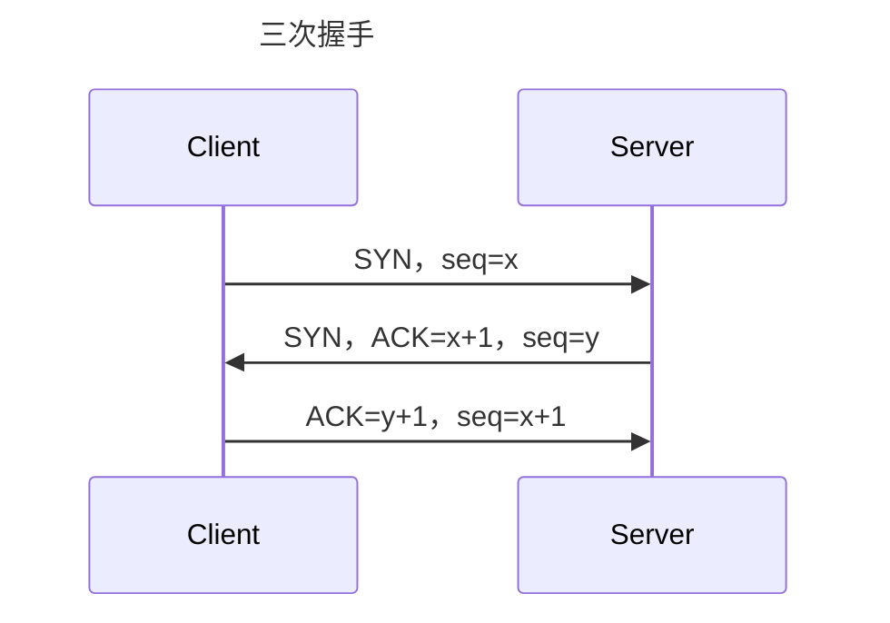

# TCP/IP简介
TCP/IP是全球广泛使用的一组通信协议，包含了多个层次，在网络通信中扮演着重要的角色。

TCP/IP协议族可分为四个层次：应用层（Application）、传输层（Transport）、网络层（Internet）和数据链路层（Link）。

在应用层中，定义了各种网络应用程序，例如FTP、Telnet、SMTP、HTTP等。对于每种应用程序，都有相应的规则。这些规则称之为协议。

在传输层中，主要涉及两个协议：Transmission Control Protocol (TCP) 和 User Datagram Protocol (UDP)。

TCP 提供面向连接、可靠的数据传输服务，它能够把应用程序交给它的数据切割成合适大小的数据块，并且保证所有的数据块能够顺序的到达目标。如果通信的任何时候出现问题，TCP会停止并重新发送数据。

UDP 是一个简单的面向数据报传输的协议，不需要维护连接状态，因此它具有较高的传输速度和较小的开销，但无法确保数据传输的可靠性。

在网络层中，主要涉及的协议是 Internet Protocol (IP)，它定义了计算机在网络上如何寻址以及路由的规则和方法。IP通过一定的寻址方式，将数据包送到目标主机。

在数据链路层中，主要涉及的是一些物理层面的规定和标准，主要功能是将IP数据报封装成帧并进行传输。数据链路层有两个子层：逻辑链路控制（LLC）和介质访问控制（MAC）。

综上所述，TCP/IP协议族是互联网的基础协议，其规定了应用程序、传输、网络和数据链路四个层次，并且涉及到数据传输、寻址和路由的相关规则。
# 详细描述一下TCP/IP的分层结构
TCP/IP协议族是一种分层结构的协议，它的分层结构包括四个层次：

1. 应用层（Application Layer）：应用层是TCP/IP体系结构中最高层（最靠近用户的一层），主要负责提供各种网络应用程序，例如电子邮件（SMTP）、文件传输（FTP）、万维网浏览器（HTTP）等。这些应用程序都是基于TCP/IP协议的，在应用层定义了数据格式和通讯规则。

2. 传输层（Transport Layer）：传输层的功能是提供可靠的、面向流的端到端数据传输服务。在TCP/IP协议中，传输层有两种协议：TCP和UDP。TCP提供面向连接的数据传输服务，对数据进行分段、排序、确认传递等操作，以保证数据的可靠性；而UDP则为无连接的传输协议，实现简单，具有高效的传输速率。

3. 网络层（Internet Layer）：网络层负责将位于不同网络的计算机之间的数据包进行处理和转发，实现跨越多个物理网络的数据传输和路由。在TCP/IP协议中，主要使用Internet Protocol (IP)协议，通过IP地址来寻址和识别网络节点。

4. 数据链路层（Link Layer）：数据链路层主要负责将网络层传递下来的数据帧传输到物理层进行传输。在TCP/IP协议中，数据链路层根据不同的物理传输方式定义了以太网、FDDI、ATM等多种数据链路层协议。

总体来说，每一层都提供某个特定的功能，并与其上下两层进行交互和协调，实现了计算机之间的通信。TCP/IP分层结构的优点是通过划分各个不同的层次，使得各层的功能明确、隔离，并且易于扩展和维护，在应对不同的网络需求和变化时更加灵活。
# 简述TCP/IP建立连接的过程
TCP/IP建立连接过程就是三次握手的过程，其详细步骤如下：

1. 客户端向服务器发送一个SYN报文，SYN置为1，初始序列号为一个随机数x。

2. 服务器收到SYN报文后，向客户端回复一个SYN报文，SYN置为1，确认号置为x+1，初始序列号为一个随机数y。

3. 客户端收到服务器的SYN报文后，发出一个ACK确认报文，确认号置为y+1，序列号为x+1。

该过程中，前两步是建立连接的过程，第三步则是为了确认建立连接的过程。

此时，连接已经建立起来，双方开始进行数据的传输。在网络传输过程中，一旦遇到丢失的数据包或出现错误的数据包，TCP协议会根据其具体情况进行重传、滑动窗口等措施，以保证通信数据的可靠性和高效性。当通信结束时，可以通过四次挥手的方式断开连接。

以下是示意图：

