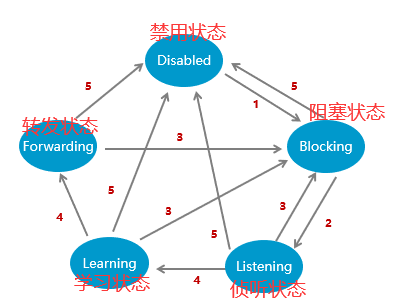
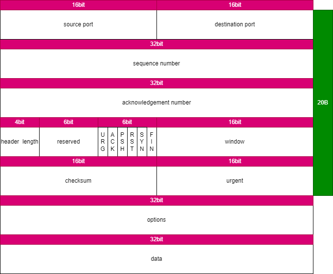
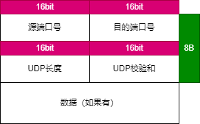
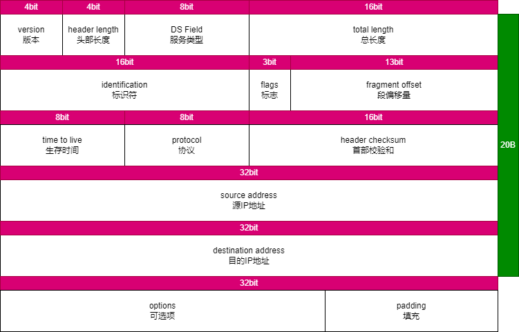
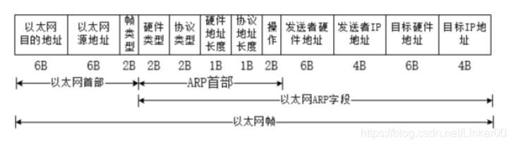

# 广播风暴是什么？
广播风暴是指网络中某个节点发送大量广播消息，导致整个网络中的节点都收到这些消息，从而造成网络拥堵和性能下降的现象。
为了避免广播风暴，可以采取以下措施：
1. 网络拓扑优化：通过调整网络拓扑结构，减少广播消息的传输范围，降低广播风暴的可能性。
2. 控制广播域：通过设置VLAN、子网划分等手段，限制广播消息的传播范围，减少广播风暴的影响。
3. 配置网络设备：通过配置交换机等网络设备，设置广播抑制、广播限制等功能，限制广播消息的传输速率和数量。
4. 优化网络应用：通过优化网络应用的广播策略，减少广播消息的发送频率和数量，降低广播风暴的可能性。
5. 预防网络攻击：广播风暴也可能是一些恶意攻击的手段之一，因此需要采取网络安全措施，预防网络攻击。
# 请列举出可能引发广播风暴的所有网络协议，并详细介绍各个协议
以下是可能引发广播风暴的所有网络协议，并对各个协议进行详细介绍：

1. ARP（Address Resolution Protocol）协议
ARP协议用于将IP地址转换成MAC地址。当主机需要与另一个主机通信时，会先向本地的ARP缓存中查找对应的MAC地址，如果没有找到，则会发送一个ARP请求，在本地广播中寻找目标主机的MAC地址，所有接收到该请求的主机都会响应该请求，将自己的MAC地址返回给源主机。如果网络中有大量主机，且每个主机都需要进行这种广播请求，就会产生广播风暴。

2. DHCP（Dynamic Host Configuration Protocol）协议
DHCP协议用于动态分配IP地址、网关、子网掩码等信息。当主机加入网络时，会向DHCP服务器发出请求以获取IP地址等信息。DHCP服务器会在本地广播中发布DHCP提供消息，向该网络中的所有主机广播，所有接收到该广播的主机都会响应该消息，导致网络拥堵，性能下降。

3. RIP（Routing Information Protocol）协议
RIP协议用于路由选择，当网络结构变化时，路由器会向周围的所有节点广播更新信息，所有接收到该更新信息的节点都会进行相应的操作，包括更新路由表、发送自己的路由信息等。这些广播消息可能会在网络中不断传递，导致广播风暴。

4. IGMP（Internet Group Management Protocol）协议
IGMP协议用于管理多播组。当一个主机想加入或离开一个多播组时，会通过IGMP协议向组播路由器发送报文，组播路由器接收到报文后会向其他主机广播此消息，所有接收到该消息的主机都会进行相应的操作，包括加入或离开多播组等。如果此时网络中有大量主机加入或离开多播组，就容易产生广播风暴。

5. OSPF（Open Shortest Path First）协议
OSPF协议用于动态路由选择。当网络结构发生变化时，路由器会向周围的节点发送链路状态广播（LSA），所有接收到该消息的节点都会保存链路状态并更新自己的路由表。如果网络规模很大，而且网络拓扑结构复杂，则每个节点处理这些LSA信息的时间会很长，可能会导致广播风暴。

6. STP（Spanning Tree Protocol）协议
STP协议用于环路消除，保证网络拓扑结构无环。当网络中出现环路时，STP协议会选择某些接口进行阻塞，使得网络无环。在阻塞接口发生故障时，STP协议会重新计算网络拓扑结构，导致广播风暴。

7. VTP（Virtual Trunking Protocol）协议
VTP协议用于交换VLAN信息。当一个VLAN配置改变时，VTP服务器会向其它所有的VTP客户端广播这个变化，所有接收到该广播的设备都会更新自己的VLAN数据库，如果网络中有很多设备，可能会引起广播风暴。

8. PIM（Protocol Independent Multicast）协议
PIM协议是一种组播路由协议，用于动态建立、维护和撤销多播树。当主机加入或离开一个多播组时，会通过PIM协议向组播路由器发送相应的消息，组播路由器接收到消息后会向其他主机广播此消息，如果此时网络中有大量主机加入或离开多播组，就容易产生广播风暴。

9. HSRP（Hot Standby Router Protocol）协议
HSRP协议用于提供冗余的路由器，保证网络的高可用性。当主备路由器状态发生变化时，所有接收到该变化信息的节点都会进行相应的操作，包括选择新的主备路由器等，这些操作可能会在网络中不断传递，导致广播风暴。

10. GLBP（Gateway Load Balancing Protocol）协议
GLBP协议也是一种提供冗余的网关协议，可以实现多个网关共同工作。当一个网关失效时，所有接收到该信息的节点都会重新选择新的网关，这些操作可能会在网络中不断传递，导致广播风暴。

11. DVMRP（Distance Vector Multicast Routing Protocol）协议
DVMRP协议是一种组播路由协议，用于建立和维护多播树。当主机加入或离开一个多播组时，会通过DVMRP协议向组播路由器发送相应的消息，组播路由器接收到消息后会向其他主机广播此消息，如果此时网络中有大量主机加入或离开多播组，就容易产生广播风暴。

12. CARP（Common Address Redundancy Protocol）协议
CARP协议用于提供冗余的IP地址，保证网络的高可用性。当主备IP地址状态发生变化时，所有接收到该变化信息的节点都会进行相应的操作，包括选择新的主备IP地址等，这些操作可能会在网络中不断传递，导致广播风暴。

13. LLDP（Link Layer Discovery Protocol）协议
LLDP协议用于发现和管理网络中的设备。当一个设备加入或离开网络时，会通过LLDP协议向周围的设备广播此消息，所有接收到该消息的设备都会进行相应的操作，可能会导致广播风暴。

14. CDP（Cisco Discovery Protocol）协议
CDP是思科公司开发的一种发现和管理网络中的设备的协议。当一个设备加入或离开网络时，会通过CDP协议向周围的设备广播此消息，所有接收到该消息的设备都会进行相应的操作，可能会导致广播风暴。

15. NDP（Neighbor Discovery Protocol）协议
NDP协议用于网络层和链路层之间的交互，可以实现IPv6的邻居发现、地址解析等功能。当一个设备需要查找对应的MAC地址时，会通过NDP协议向本地广播请求，所有接收到该请求的设备都会响应该请求，可能会导致广播风暴。

需要注意的是，虽然这些协议都有可能导致广播风暴，但并不是所有情况下都会出现广播风暴。具体情况还需根据网络拓扑结构、设备性能、网络负载等因素来判断。
# 路由器收到包后重新封装时，源地址和目的地址分别是什么？
路由器收到包后重新封装时，源地址是上一个路由器的IP地址或者是源主机的IP地址，目的地址是下一个路由器的IP地址或者是目的主机的IP地址。
# 某个网络设备工作在某个层是什么意思？
当说一个网络设备工作在某个层时，通常指该设备遵循了OSI（开放系统互连）参考模型或TCP/IP（传输控制协议/互联网协议）参考模型中的某一层规范。这意味着该设备能够处理该层的协议和数据，以便在网络中进行通信。例如，一个路由器可以在网络层工作，处理IP数据包，并根据目标IP地址将数据包路由到正确的目的地。另一个例子是交换机，它可以在数据链路层工作，处理MAC地址，并根据MAC地址将数据包转发到正确的端口。
# 三层交换机和路由器有什么区别？
三层交换机和路由器都是网络设备，它们的基本功能都是进行数据转发，但是它们之间存在以下区别：

1. 工作层次不同：三层交换机工作在 OSI 模型的第二层，也就是数据链路层，而路由器工作在第三层，也就是网络层。

2. 转发方式不同：三层交换机的转发方式是通过 MAC 地址进行转发的，而路由器则是通过 IP 地址进行转发的。

3. 转发范围不同：三层交换机只能在其所在的子网内进行数据转发，而路由器可以跨越多个子网进行数据转发。

4. 处理方式不同：三层交换机主要是通过建立 MAC 地址表进行数据转发，而路由器则需要进行路由表的建立和路由算法的实现，更注重对网络流量的控制和管理。

综上所述，三层交换机和路由器虽然在某些方面有类似的功能，但它们的设计和工作方式具有显著的差异，适用于不同的网络场景。
# 三层交换机可以充当路由器使用吗？
是的，三层交换机可以充当路由器使用。三层交换机在网络层拥有路由功能，因此可以实现不同网络之间的通信。但是，三层交换机的路由功能相对于专门的路由器可能会有一些限制，例如更少的路由表容量、不支持某些高级路由协议等。所以，在设计网络时需要根据实际需求和网络规模选择合适的设备。
# 给定一个ip地址，如何计算子网？
1. 子网掩码必须和IP地址成对出现，否则没有意义
2. 子网掩码是用于给IP地址划分网络地址与主机地址的
3. 子网掩码1对应的IP地址，代表网络位；和子网掩码0对应的IP地址，代表主机位
4. 子网中只要1是连续的，就是合理的子网掩码
5. 若网络位为a，主机位为b，则有：$$ a+b=32 $$
可用的主机地址数量为：$$ 2^b-2$$
# 常见应用层协议的端口
|  协议  |                端口                |
| :----: | :--------------------------------: |
| Telnet |                 23                 |
|  ssh   |                 22                 |
|  ftp   | 20（传输数据），21（传输控制信息） |
|  tftp  |                 69                 |
|  http  |                 80                 |
|  smtp  |                 25                 |
|  dns   |                 53                 |
|  dhcp  |    67（服务器端）,68（客户端）     |
# 传输层pdu里源端口是2048，目的端口是80，此pdu由a发往b，请问，b向a回信时，传输层pdu里源，目的端口分别是多少？

如果A主机向B主机发送源端口为2048，目的端口为80的PDU，那么当B主机需要向A主机回复时，PDU的源端口号将设置为80，目的端口号将设置为2048。因为在TCP/IP协议中，当建立一个TCP连接时，客户端和服务器端的源、目的端口都会互换。因此，B主机会将响应的PDU的源端口设置为80，目的端口设置为2048。
# 两条等价路由的cost值可否不一样

在路由协议中，两条等价路由的cost值也可以不一样。两条路由信息的cost值是路由协议根据不同的算法和计算条件来确定的，通常根据链路的带宽、延迟、可靠性等因素计算得出，而且cost值不一定是唯一的决定因素。如果两条路由的其他信息完全相同，但cost值不同，那么路由协议会根据这些信息的综合考虑来选择其中一个作为最优路径。在某些情况下，例如当两条等价路由的cost值不同，但是其中一条路由连接的路径更短或更可靠，则该路由可能被选择为最优路径。因此，两条等价路由的cost值不一样也并不影响它们的等价性。
# 静态路由的配置规则

1. 路由器隔离广播域，只关心直连网段
2. 想要访问目标网段不是直连网段的网络设备，就要配置此网段的静态路由
3. 0.0.0.0/0是缺省路由，表示任意地址
4. 配置静态路由时，如果涉及到路由汇总，最好以实际空间为准，若取得的空间太大，可能导致环路

路由汇总产生三层环路的根本问题是汇总路由范围过大。当下级路由器发送的数据包目的IP不在自己网段，并且源IP和目的IP网段都在汇总路由网段时，这个数据包会在两台路由器之间形成环路。可以通过在发送数据的路由器配置黑洞路由来规避，目标网段是上游的汇总地址，下一跳是null0；还有，配置静态路由时，尽量不要只配置一条缺省路由；做路由汇总时，要使网络地址最小
# OSPF关键概念
## 3张表
1. 邻居表
2. LSDB表
3. ospf路由表
## 5种报文
1. Hello
2. DD
3. LSR
4. LSU
5. LSAck
## 7种状态
1. Down：没有启用OSPF的状态机；邻居失效后变为该状态。

2. Init：初始化状态，第一次收到对端发来的HELLO包（包含对瑞ID）时，将对端的状态设置为init。

3. 2-way：邻居状态，相互间周期发送hello的状态（双方建立会话）。

4. Exstart：交换信息的初始化状态，发送DBD（包含本地的LSA的摘要信息）报文，选举主从路由器（利用HELLO报文中的ID和优先权来进行选举，不允许抢占，DR没了，BDR才能上）。

5. Exchange：交换信息的状态，该状态下，互相发送DBD，告知对端本地所有的LSA的目录；同时，可以发送LSR，LSU，LSACK来学习对端的LSA.

6. Loading：加载状态（没有学习完的状态），发送LSR，LSU，LSACK，专门学习对端的LSA的详细信息。

7.  Full：邻接状态（学习完的状态）
# OSPF是怎样防环的

在 OSPF 中，防止环路的方法主要包括两个方面：
1. 路由器ID 的选取。OSPF 中每个路由器都需要有一个唯一的路由器 ID（Router ID）来标识自己，并通过该 ID 来维护邻居关系和交换信息。在 OSPF 中，采用一种叫做 DR/BDR（Designated Router/Bbackup Designated Router）的机制来避免因多个路由器之间互相连接而造成的网络环路。当一个区域中存在多个路由器互相连接时，该区域内的所有路由器会选举出一个 DR 和一个 BDR，并与之建立邻居关系，其他路由器则作为邻居。在 OSPF 中，只有 DR 和 BDR 才能向其他路由器发送 LSA（链路状态广告），防止单播洪泛，从而避免可能产生的环路问题。

2. SPF 算法的计算。OSPF 通过 SPF（Shortest Path First）算法计算最短路径，并将其转化为树形结构，以避免环路的产生。SPF 算法基于 Dijkstra 算法，通过构建相应的图模型，计算每个节点到其他节点的最短路径，同时设置相应的开销值，避免出现环路问题。通过 SPF 算法的计算，可以有效地保证网络的稳定性，并实现高效、可靠的数据传输。

综上所述，OSPF 通过路由器 ID 和 SPF 算法的结合来防止环路的产生。同时，OSPF 还采用了多种机制来保证网络的稳定性和可靠性，例如邻居关系的建立和维护、状态机的控制等，使其成为一种广泛应用于大型网络中的高性能和高可靠性的动态路由协议。
# OSPF是如何进行网络宣告的？请举例说明

OSPF（Open Shortest Path First）是一种开放的、链路状态的路由协议，它通过建立拓扑图来计算并选择最短路径。在OSPF中，网络宣告是指向OSPF进程中注入网络信息的过程，以便路由器可以为目标网络提供转发服务。以下是OSPF进行网络宣告的方法和示例：

1. 在接口级别上进行宣告
当一个接口被配置为运行OSPF时，它会自动发布该接口所连接到的网络的信息，该信息包含到达该网络的成本及其相邻的OSPF路由器地址。

例如，假设我们有两个路由器R1和R2，它们之间通过一个具有IP地址192.168.1.0/24的链路直接相连。在R1上配置该接口并启用OSPF：

```
interface GigabitEthernet 0/1
ip address 192.168.1.1 255.255.255.0
ip ospf 1 area 0
```
2. 在区域级别上进行宣告
当一个OSPF区域内存在多个子网时，也可以在该区域级别上声明这些子网，以避免为每个子网都配置一个单独的路由条目。

例如，假设我们在一个OSPF区域中有多个子网，如下所示：
```
10.0.1.0/24
10.0.2.0/24
10.0.3.0/24
```
我们可以在该区域级别上进行宣告，方法是在路由器配置模式下将这些网络添加到区域中：
```
router ospf 1
network 192.168.1.0 0.0.0.255 area 100
```
# ospf进行宣告网络时，反掩码怎么计算
在 OSPF 中，反掩码（Wildcard Mask）通常用于路由器进行网络宣告和过滤。其计算方法如下：

将子网掩码中的每一位 0 取反为 1，1 取反为 0，得到的结果就是反掩码。

例如：一个 IP 地址为 `192.168.10.0/24 `的子网掩码为 `255.255.255.0`，则其反掩码为 `0.0.0.255`。这是因为，在子网掩码中，前三个 8 位二进制数都是 1，即 `11111111`，对应于十进制中的 255，而最后一个 8 位二进制数是 0，即 `00000000`，在反掩码中就要取反即可，变成了 `11111111`，对应于十进制中的 255。

当 OSPF 路由器宣告网络时，需要指定网络地址和反掩码。比如，如果有一个分配给某个区域的网络地址为 `172.16.0.0/16`，那么这个 OSPF 路由器可以通过以下命令来宣告该网络：

```
router ospf 1
network 172.16.0.0 0.0.255.255 area 0
```
其中，“network” 表示要宣告的网络地址，后面的 “0.0.255.255” 就是上述例子中计算出来的反掩码，表示该网络所有可能的主机位。在 OSPF 中，宣告一个网络时，需要指定该网络所属的区域 ID（Area ID），上述例子中的 “area 0” 就表示该网络属于区域 0。

ospf内有三张十分重要的表项一定要清楚明白 邻居表、LSDB表和OSPF路由表
# 以太网的三种接口类型以及转发方式
## Access

1. Access 接口特点：
仅允许 VLAN ID 与接口 PVID 相同的数据帧通过。
2. Access 接口接收数据帧：
* 当 Access 接口从链路上收到一个 Untagged 帧，交换机会在这个帧中添加上 VID 为 PVID 的Tag，然后对得到的 Tagged 帧进行转发操作（泛洪、转发、丢弃）。

* 当 Access 接口从链路上收到一个 Tagged 帧，交换机会检查这个帧的 Tag 中的 VID 是否与PVID 相同。如果相同，则对这个 Tagged 帧进行转发操作；如果不同，则直接丢弃这个Tagged 帧。
3. Access 接口发送数据帧：
当一个 Tagged 帧从本交换机的其他接口到达一个 Access 接口后，交换机会检查这个帧的Tag 中的 VID 是否与 PVID 相同：如果相同，则将这个 Tagged 帧的 Tag 进行剥离，然后将得到的 Untagged 帧从链路上发送出去；如果不同，则直接丢弃这个 Tagged 帧。

配置方式：
```
//创建vlan
vlan 10

//进入接口
interface g0/0/0

//定义接口类型
port link-type access

//将接口加入vlan10(设置PVID)
port default vlan 10
```
## Trunk

对于 Trunk 接口，除了要配置 PVID 外，还必须配置允许通过的 VLAN ID 列表，其中 VLAN 1 是默认存在的。

1. Trunk 接口特点：
Trunk 接口仅允许 VLAN ID 在允许通过列表中的数据帧通过。Trunk 接口可以允许多个 VLAN 的帧带 Tag 通过，但只允许一个 VLAN 的帧从该类接口上发出时不带 Tag（即剥除 Tag）。
2. Trunk 接口接收数据帧：
* 当 Trunk 接口从链路上收到一个 Untagged 帧，交换机会在这个帧中添加上 VID 为 PVID 的Tag，然后查看 PVID 是否在允许通过的 VLAN ID 列表中。如果在，则对得到的 Tagged 帧进行转发操作；如果不在，则直接丢弃得到的 Tagged 帧

* 当 Trunk 接口从链路上收到一个 Tagged 帧，交换机会检查这个帧的 Tag 中的 VID 是否在允许通过的 VLAN ID 列表中。如果在，则对这个 Tagged 帧进行转发操作；如果不在，则直接丢弃这个Tagged 帧。
3. Trunk 接口发送数据帧：
* 当一个 Tagged 帧从本交换机的其他接口到达一个 Trunk 接口后，如果这个帧的 Tag 中的VID 不在允许通过的 VLAN ID 列表中，则该 Tagged 帧会被直接丢弃。

* 当一个 Tagged 帧从本交换机的其他接口到达一个 Trunk 接口后，如果这个帧的 Tag 中的VID 在允许通过的 VLAN ID 列表中，则会比较该 Tag 中的 VID 是否与接口的 PVID 相同：如果相同，则交换机会对这个 Tagged 帧的 Tag 进行剥离，然后将得到的 Untagged 帧从链路上发送出去；如果不同，则交换机不会对这个 Tagged 帧的 Tag 进行剥离，而是直接将它从链路上发送出去

* 注意：在trunk列表中，只要帧的vid在允许列表中，这个帧就必定会被发出

配置方式：
```
//配置接口
port link-type trunk

//设置允许列表
port trunk allow-pass vlan {vlan-id1 [to vlan-id2] | all}

//(可选)配置trunk接口的缺省vlan
port trunk pvid vlan vlan-id
```
## Hybrid

对于 Hybrid 接口，除了要配置 PVID 外，还存在两个允许通过的 VLAN ID 列表，一个是Untagged VLAN ID 列表，另一个是 Tagged VLAN ID 列表，其中 VLAN 1 默认在Untagged VLAN 列表中。这两个允许通过列表中的所有 VLAN 的帧都是允许通过这个Hybrid 接口的。
1. Hybrid 接口特点：
* Hybrid 接口仅允许 VLAN ID 在允许通过列表中的数据帧通过。

* Hybrid 接口可以允许多个 VLAN 的帧带 Tag 通过，且允许从该类接口发出的帧根据需要配置某些 VLAN 的帧带 Tag、某些 VLAN 的帧不带 Tag。

* 与 Trunk 最主要的区别就是，能够支持多个 VLAN 的数据帧，不带标签通过。
2. Hybrid 接口接收数据帧：
* 当 Hybrid 接口从链路上收到一个 Untagged 帧，交换机会在这个帧中添加上 VID 为 PVID 的Tag，然后查看 PVID 是否在 Untagged 或 Tagged VLAN ID 列表中。如果在，则对得到的Tagged 帧进行转发操作；如果不在，则直接丢弃得到的 Tagged 帧。

* 当 Hybrid 接口从链路上收到一个 Tagged 帧，交换机会检查这个帧的 Tag 中的 VID 是否在Untagged 或 Tagged VLAN ID 列表中。如果在，则对这个 Tagged 帧进行转发操作；如果不在，则直接丢弃这个 Tagged 帧。
3. Hybrid 接口发送数据帧：
* 当一个 Tagged 帧从本交换机的其他接口到达一个 Hybrid 接口后，如果这个帧的 Tag 中的VID 既不在 Untagged VLAN ID 列表中，也不在 Tagged VLAN ID 列表中，则该 Tagged 帧会被直接丢弃。

* 当一个 Tagged 帧从本交换机的其他接口到达一个 Hybrid 接口后，如果这个帧的 Tag 中VID 在 Untagged VLAN ID 列表中，则交换机会对这个 Tagged 帧的 Tag 进行剥离，然后将得到的 Untagged 帧从链路上发送出去

* 当一个 Tagged 帧从本交换机的其他接口到达一个 Hybrid 接口后，如果这个帧的 Tag 中的VID 在 Tagged VLAN ID 列表中，则交换机不会对这个 Tagged 帧的 Tag 进行剥离，而是直接将它从链路上发送出去

配置方式：
```
//配置接口
port link-type hybrid

//在接口视图下，配置 Hybrid 类型接口加入的 VLAN，这些 VLAN 的帧以 Untagged 方式通过接口
port hybrid untagged vlan  vlan {vlan-id1 [to vlan-id2] | all}

//在接口视图下，配置 Hybrid 类型接口加入的 VLAN，这些 VLAN 的帧以 Tagged 方式通过接口
port hybrid tagged  vlan {vlan-id1 [to vlan-id2] | all}

//(可选)配置trunk接口的缺省vlan
port hybrid pvid vlan vlan-id
```
# 交换机内部帧都是带标签的吗

是
# 交换机连接终端的接口可不可以配置成trunk口？如果这样配置了，会有什么后果

交换机连接终端的接口可以配置成Trunk口，但这通常是不建议的，并且可能会导致一些问题。

如果交换机接口配置为Trunk口并连接到终端设备（如计算机），以下是可能发生的后果：

1. VLAN混淆：Trunk口传递多个VLAN的数据，而终端设备通常只属于一个VLAN。如果Trunk口直接连接到终端设备，设备可能无法正确识别和处理来自其他VLAN的数据，导致通信问题或功能受限。

2. 安全性问题：将接口配置为Trunk口会公开所有VLAN的数据流量，包括敏感信息的流动。这增加了安全风险，因为终端设备可能接收到本不应该访问的其他VLAN的数据。

3. 配置错误导致的问题：配置Trunk口需要正确的VLAN配置。如果错误配置了Trunk口，可能会导致网络中断、无法通信或其他网络故障问题。

因此，通常建议将交换机连接终端的接口配置为Access口，以确保每个接口只属于一个VLAN并能够正常工作。仅在特定情况下，当确实需要将多个VLAN传递给终端设备时，才应将接口配置为Trunk口，并进行相应的配置和管理。
# PVID和vlan id有什么区别
PVID是端口默认VLAN ID（Port VLAN ID），是交换机中针对Access端口的一个属性。当一个端口被配置为Access模式时，交换机将通过PVID确定通过该端口传输的数据帧的VLAN ID。也可以说，PVID是用来标识Access端口的默认VLAN ID。

而VLAN ID则是虚拟局域网的标识符，类似于分隔不同广播域的虚拟障壁。不同VLAN的设备彼此间的通信需要经过路由器，而同一VLAN内的设备可以直接互相通信。每个VLAN都有一个唯一的VLAN ID。交换机中的端口可以配置到不同的VLAN中，不同VLAN的设备可以通过交换机相互通信。VLAN ID是用来标识VLAN的唯一标识符。

因此，PVID标识Access端口的默认VLAN ID，而VLAN ID则用于标识交换机上的虚拟局域网的唯一标识符。
# STP相关
## STP关键概念
1. 两种BPDU：配置BUPU，TCN BPDU
2. 三个重要参数：桥ID，RPC，端口ID
3. 4个步骤：根桥，根端口，指定端口，预备端口
4. 5种状态：disabled，blocking/discarding，listening，learning，forwarding
## STP中的角色
1. 交换机
**交换机分为根桥（Root Bridge）和非根桥**，每个交换机都有自己唯一的身份标识，称为桥ID
1. 端口
分为指定端口，根端口和预备端口
* DP：指定端口，负责发送BPDU。每个网段有且只能有一个指定端口。一般情况下，根桥的每个端口总是指定端口
* RP：根端口，负责接收BPDU。根端口是非根交换机去往根桥路径最优的端口。在一个运行 STP 协议的交换机上最多只有一个根端口，但根桥上没有根端口
* 预备端口：如果一个端口既不是指定端口也不是根端口，则此端口为预备端口。预备端口将被阻塞
## 二层网络涉及到的参数
1. 桥ID：在 STP 中，每一台交换机都有一个标示符，叫做 Bridge ID 或者桥 ID，桥 ID 由 16 位的桥优先级（Bridge Priority）和 48 位的 MAC 地址构成。在 STP 网络中，桥优先级是可以配置的，取值范围是 0～65535，默认值为 32768,可以修改但是修改值必须为 4096 的倍数。**优先级最高的设备（数值越小越优先）会被选举为根桥。**如果优先级相同，则会比较 MAC 地址，MAC 地址越小则越优先
2. cost：
* 交换机的每个端口都有一个端口开销（Port Cost）参数，此参数表示该端口在 STP 中的开销值。默认情况下端口的开销和端口的带宽有关，带宽越高，开销越小。
* 华为交换机支持多种 STP 的路径开销计算标准，提供多厂商场景下最大程度的兼容性。缺省情况下，华为交换机使用 IEEE 802.1t 标准来计算路径开销
1. Port ID
运行 STP 交换机的每个端口都有一个端口 ID，端口 ID 由端口优先级和端口号构成。端口优先级取值范围是 0 到 240，步长为 16，即取值必须为 16 的整数倍。缺省情况下，端口优先级是 128。端口 ID 可以用来确定端口角色
## BPDU
为了计算生成树，交换机之间需要交换相关的信息和参数，这些信息和参数被封装在 BPDU中。

BPDU 有两种类型：配置 BPDU 和 TCN BPDU。

配置 BPDU 包含了桥 ID、路径开销和端口 ID 等参数。STP 协议通过在交换机之间传递配置BPDU 来选举根交换机，以及确定每个交换机端口的角色和状态。在初始化过程中，每个桥都主动发送配置 BPDU。在网络拓扑稳定以后，只有根桥主动发送配置 BPDU，其他交换机在收到上游传来的配置 BPDU 后，才会发送自己的配置 BPDU。

TCN BPDU 是指下游交换机感知到拓扑发生变化时向上游发送的拓扑变化通知
## STP选举过程
1. 选举一个根桥
STP 交换机初始启动之后，都会认为自己是根桥，并在发送给其他交换机的 BPDU 中宣告自己为根桥。因此，此时 BPDU 中的根桥 ID 为各自设备的网桥 ID。
  * 当交换机收到网络中其他设备发送来的 BPDU 后，会比较 BPDU 中的根桥 ID 和自己的 BID。
  * 交换机不断交互 BPDU，同时对 BID 进行比较，最终选举一台 BID 最小的交换机作为根桥，其他的则为非根桥。
  * 注意：根桥的角色可抢占。当有更优的 BID 的交换机加入网络时，网络会重新进行 STP 计算，选出新的根桥。

2. 选举根端口
  * 交换机有多个端口接入网络，各个端口都会收到 BPDU 报文，报文中会携带“RootID、RPC、BID、PID”等关键字段，端口会针对这些字段进行 PK。
  * 首先比较根路径开销（RPC），STP 协议把根路径开销作为确定根端口的重要依据。RPC 值越小，越优选，因此交换机会选 RPC 最小的端口作为根端口。
  * 当 RPC 相同时，比较上行交换机的 BID，即比较交换机各个端口收到的 BPDU 中的 BID，值越小，越优选，因此交换机会选上行设备 BID 最小的端口作为根端口。
  * 当上行交换机 BID 相同时，比较上行交换机的 PID，即比较交换机各个端口收到的 BPDU 中的 PID，值越小，越优先，因此交换机会选上行设备 PID 最小的端口作为根端口。
  * 当上行交换机的 PID 相同时，则比较本地交换机的 PID，即比较本端交换机各个端口各自的PID，值越小，越优先，因此交换机会选端口 PID 最小的端口作为根端口
  * 除根桥外每台交换机中都有且只有一个根端口
3. 选举指定端口
  * 指定端口也是通过比较 RPC 来确定的，选择 RPC 最小的作为指定端口，如果 RPC 相同，则比较 BID 和 PID。
  * 首先比较根路径开销（RPC），值越小，越优选，因此交换机会选 RPC 最小的端口作为指定端口。
  * 若 RPC 相等，则比较链路两端交换机的 BID，值越小，越优选，因此交换机会选 BID 最小的交换机的端口作为指定端口。
  * 若 BID 相等，则比较链路两端端口的 PID，值越小，越优选，因此交换机会选 PID 最小的交换机的端口作为指定端口。
  * * 注意：一般情况下，根桥上不存在任何根端口，只存在指定端口。
4. 选举预备端口
* 什么是非指定端口（预备端口）？
  * 在确定了根端口和指定端口之后，交换机上所有剩余的非根端口和非指定端口统称为预备端口。
  * STP 会对这些非指定端口进行逻辑阻塞，即这些端口不能转发由终端计算机产生并发送的帧（用户数据帧）。
  * 一旦非指定端口被逻辑阻塞后，STP 树（无环路工作拓扑）就生成了。
* 注意：
  * 非指定端口可以接收并处理 BPDU。
  * 根端口和指定端口既可以接收和发送 BPDU，也可以转发用户数据帧
## STP选举的比较过程
根桥>根端口>指定端口>预备端口，选举的优先级：根桥ID>RPC>桥ID>port ID
# STP端口的五种状态
## 状态
1. Disabled：禁用状态。端口既不处理和转发BPDU报文，也不转发用户流量。端口会在这种状态下停留10秒钟时间。
2. Blocking/Discarding：阻塞状态。端口仅仅能接收并处理BPDU，不能转发BPDU，也不能转发用户流量。此状态是预备端口的最终状态。在默认情况下，端口会在这种状态下停留20秒钟时间。
3. Listening：侦听状态。端口可以转发BPDU报文，但不能转发用户流量。在默认情况下，该端口会在这种状态下停留15秒钟的时间。
4. Learning：学习状态。端口可根据收到的用户流量构建MAC地址表，但不转发用户流量。增加Learning状态是为了防止临时环路。在默认情况下，端口会在这种状态下停留15秒钟时间。
5. Forwarding：转发状态。端口既可转发用户流量也可转发BPDU报文，只有根端口或指定端口才能进入Forwarding状态。在默认情况下，端口会在这种状态下停留15秒钟时间
## 状态迁移机制



* STP在启动的时候，端口状态由Disabled转为Blocking，此时端口指定接收分析BPDU，不能发送；
* 如果Blocking状态端口被选为根端口或者指定端口，会进入Listening状态，此时端口接收并发送BPDU，这种状态会持续一个Forward Delay时间（缺省15s）；
* 没有意外情况回到Blocking，端口会进入Learning状态，并持续一个Forward Delay时间（缺省15s），此时端口可以收发BPDU，同时构建MAC地址表，为转发用户数据帧做准备；
* 没有意外，端口进入Forwarding状态，开始用户数据帧转发工作；
* 状态迁移过程中，一旦端口被关闭或者出现链路故障，进入禁用状态；
* 状态迁移过程中，一旦端口不再是根端口或者指定端口，进入阻塞状态；
# 常见协议的结构
1. TCP



2. UDP



3. IP



4. ARP


5. BPDU


# 为什么浮动路由不能自动切换？
浮动路由是备份路由，主要用于在主路由故障时接替主路由，成为新的主路由。当主路由恢复正常时，浮动路由将自动失效，恢复到备份状态。但是，浮动路由不能自动切换的问题通常与配置有关。如果浮动路由的优先级设置不正确或者其他原因导致浮动路由优先级不高于主路由，那么主路由恢复时，浮动路由就不会自动切换回备份状态。此外，网络拓扑结构的复杂度、网络设备的配置、网络负载均衡等都可能会影响浮动路由的自动切换。因此，在配置浮动路由时，需要根据具体情况进行合理的优先级、距离、权值设置，并进行充分的测试和验证，以确保其可靠性和稳定性。
# pvid相同=下台设备不是交换机=access接口=此接口的下台设备不需要标签，这种说法正确吗？
该说法部分正确，部分不正确。下面逐一解释：

* PVID相同：PVID是端口的默认VLAN标识，当端口接收到的数据包没有标签时，交换机会根据端口的PVID把数据包打上相应的VLAN ID标签，从而在交换机内进行转发和管理。因此，如果两个接口的PVID相同，表示它们处于同一个VLAN中，数据包可以自由转发，而无需进行VLAN ID的标记或转换。
* 下台设备不是交换机：如果下台设备是交换机，那么它通常需要配置为Trunk模式，以允许多个VLAN的数据流通过。在此情况下，下台设备需要标记VLAN ID，而不是由交换机自动打上标记。
* Access接口：Access接口通常用于连接普通终端设备，例如PC、服务器等，并将其划分到一个特定的VLAN中，因此这些终端设备不需要标记VLAN ID。
* 此接口的下台设备不需要标签：如果该接口连接的下台设备是一个普通终端设备，并且配置为Access模式，那么该说法是正确的。但是，如果下台设备是交换机，则需要将该端口配置为Trunk模式，并打上相应的VLAN ID标记，以允许多个VLAN之间的数据流通。
需要注意的是，上述说法是建立在一定的前提和条件下的，具体情况可能因网络拓扑结构、设备配置、服务需求等方面的不同而有所不同。
# ACL
## ACL入方向和出方向调用策略的区别是什么？
ACL（Access Control List）是一种用于网络设备（如路由器、防火墙）上的访问控制机制，它可以根据预定义的规则允许或禁止数据包通过。在配置 ACL 时，可以选择将其应用于接口的入方向（inbound）或出方向（outbound），以实现不同的访问控制策略。

区别如下：

* 入方向（inbound）：当 ACL 应用于接口的入方向时，它会检查进入该接口的数据包。换句话说，ACL 将过滤从外部流向内部的数据包。这种方式适用于保护内部网络免受外部的未经授权或有害的访问。入方向的 ACL 可用于限制来自外部网络的特定源IP地址或协议类型的数据包，以及阻止具有特定端口号的访问。

* 出方向（outbound）：当 ACL 应用于接口的出方向时，它会检查离开该接口的数据包。换句话说，ACL 将过滤从内部流向外部的数据包。这种方式适用于控制内部网络中主机对外部网络的访问权限。出方向的 ACL 可以用于阻止内部网络中的特定源IP地址或协议类型的数据包，或者限制特定端口号的访问。

总结来说，入方向的 ACL 主要用于保护内部网络免受外部网络的不良影响，而出方向的 ACL 主要用于限制内部网络对外部网络的访问。具体应该根据网络安全需求和实际情况选择合适的方向进行 ACL 配置。

站在路由器角度看，只要方向指向路由器的就是进（inbound），反之，从路由器出去的就是出方向（outbound）
## ACL编号范围
基本ACL:编号范围为2000-2999，匹配规则：源IP地址等

高级ACL：编号范围为3000-3999，匹配规则：源IP地址、目的IP地址、 源端口、目的端口等
### ACL配置

```
//创建ACL
acl 3000

//创建规则
rule 5 deny ip source 192.168.1.1 0destination 192.168.2.1 0

//将规则应用到接口，此处是应用到g0/0/1接口的入方向
int g0/0/1
traffic-filter inbound acl 3000
```
# NAT
NAT（Network Address Translation，网络地址转换）是一种在IP网络中将私有IP地址与公共IP地址之间进行映射转换的技术。通过NAT，可以使得多个设备共享同一个公共IP地址，从而解决IPv4地址资源紧缺的问题。

NAT的基本原理是在路由器或防火墙中维护一个地址转换表（NAT表），记录着内部私有IP地址和对应的公共IP地址之间的映射关系。当内部网络中的设备发起对外部网络的通信时，源IP地址会被替换为公共IP地址，并更新NAT表；而外部网络返回的数据包经过路由器/防火墙时，会根据NAT表中的映射关系将目标IP地址修改为对应的内部私有IP地址，然后再转发给内部设备。

NAT技术常见的几种形式包括：

* 静态NAT：将内部设备的特定私有IP地址一对一映射到一个公共IP地址。
* 动态NAT：动态地将内部设备的私有IP地址映射到一个可用的公共IP地址，以实现多个内部设备共享公共IP地址。
* PAT（Port Address Translation）/NAPT（Network Address and Port Translation）：在映射时同时使用端口号来区分不同的内部设备，实现多对一的映射关系，这样更多的内部设备可以使用同一个公共IP地址。
* NAT Server：动态NAT Server（也称为端口映射或DNAT）是指将外部网络请求映射到网络内部的一个地址上

NAT技术的优点包括有效利用IPv4地址资源、提供了一定的网络安全性保护（隐藏内部私有地址）、简化了网络配置等。但同时也存在一些限制和注意事项，如可能导致端口转发困难、对某些应用协议的特殊处理等。

请注意，由于目前已经出现了IPv6技术并且大规模推广，IPv6不再面临IPv4地址短缺的问题，因此在IPv6网络中使用NAT的需求相对较少。以上是关于NAT的基本概念和常见形式的简要说明，实际应用中还涉及到更多的细节和配置选项。

# RSTP中，P/A机制下，AP如何产生

1. 非根桥端口之间互发BPDU，进行P/A
2. 交换机发现，自己接口收到的BPDU是次优的，不会回复A置位
3. 对端交换机在等待2个Forward Delay（30s）后，将自己的端口设置为DP，状态为Forwarding，自己的端口设置为AP，状态为discarding
# MSTP绑定

* 绑定哪个VLAN，这棵树就只能允许哪个VLAN通过，阻止其他VLAN通过
* 每个生成树的根桥不能是同一个交换设备
# 链路聚合

LACPDU默认优先级为32768
# super-vlan和mux-vlan的区别
层级不同：s用于在交换机上充当多个vlan的网关，节省地址，属于三层；m用于在交换机上隔离端口，是二层技术，典型应用场景是多个互相隔离的vlan访问同一服务器
# VRRP

多虚一，虚拟出一台路由器

虚拟出的路由器有一个MAC地址，格式通常为：`0000-5e00-01xx`，其中xx为VRID

选举时先看接口优先级，再看接口IP地址，均为越大越优先

master故障后，backup会在3秒后成为master

master具有抢占性

VRRP不关心除关联接口外外联接口的状态，如果外联接口出现故障，不会自动切换角色，要想解决这个问题，就要配置跟踪外联接口，一旦出现故障，自动切换角色

故障解除时，由于OSPF收敛慢的特性，VRRP角色切换后，网关并不能正常工作，这时就需要配置延时抢占，等待OSPF收敛完成，再进行角色切换

VRRP一般都是在网关侧运行，为了解决PC无法自动切换网关的问题

VRRP网关跟随STP，意思是VRRP虚拟出的网关的master必须是STP的根桥，以避免产生二层次优路径